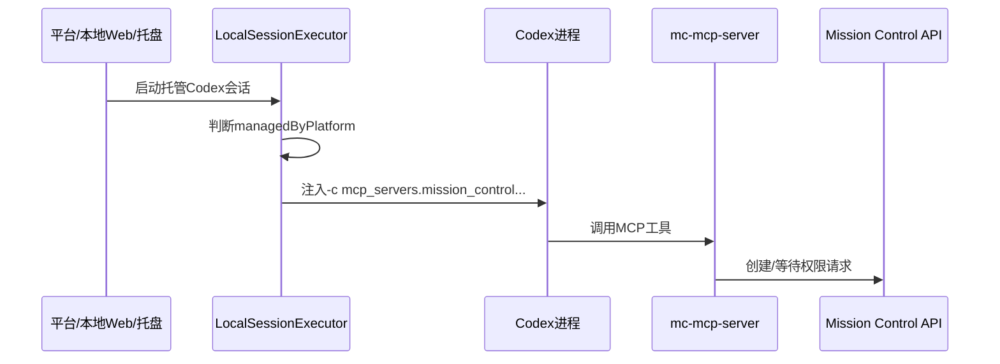
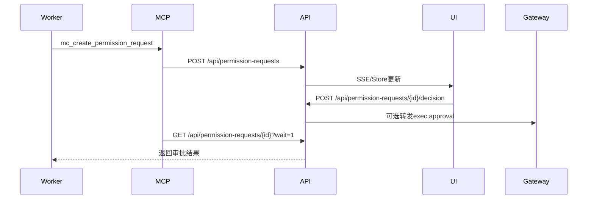

# Agent 指挥仓主需求文档

## 1. 文档控制

| 项 | 内容 |
|----|------|
| 文档状态 | 生产灰度版 |
| 文档版本 | V1.0 |
| 适用产品版本 | 2.1.8 |
| 更新时间 | 2026-06-15 |
| 核心来源 | 历史 PRD、人工值守 PRD、架构设计、测试报告、2.0.3/2.0.4/2.0.5/2.1.1/2.1.2/2.1.3/2.1.4/2.1.5/2.1.6/2.1.7/2.1.8 release notes、当前代码实现 |

本文档是 Agent 指挥仓的唯一主需求文档。历史专题 PRD、架构设计、任务拆解、测试用例和发布说明只作为证据来源；产品最新完整需求以本文档为准。

## 2. 产品介绍

Agent 指挥仓是面向企业和专业团队的通用智能体中枢平台，用于统一接入、观测、调度和审计分布在不同机器上的 Codex、Claude、Hermes、OpenClaw 等智能体运行时。

产品定位是“中心化控制与审计 + 边缘化执行”。中心服务端负责统一视图、策略、授权、审计和调度；本地 Web/托盘/Edge 客户端负责本机智能体发现、会话读写、CLI 执行、托管会话启动和状态回传。

目标客群包括：

- 已经在研发、运维、交付中使用 CLI 智能体的企业团队。
- 需要统一管理多台机器、多种智能体、多条任务流水线的团队。
- 需要可审计提权、人工值守、订阅授权控制的企业客户。
- 需要私有化部署和本地执行能力的高安全要求客户。

核心场景：

- 管理员在中心端查看所有边缘节点和智能体状态。
- 操作者通过平台或本地 Web 启动托管 Codex 会话。
- Worker Agent 在执行敏感命令前发起权限请求。
- 人或值守 Agent 在平台上作出审批，Worker 继续执行。
- 已安装托盘客户端通过更新清单发现新版本并升级。
- 生产部署通过 Docker 镜像更新服务端和内置下载资产。
- 发布前系统必须校验服务端、本地 Web、托盘、下载页和下载包版本一致，避免页面显示版本与实际安装包不一致。

客户痛点：

- 多个智能体分散在不同机器和窗口，状态不可见。
- CLI 智能体遇到权限确认、命令风险、交互问题时容易挂起。
- 人工审批和自动执行混在聊天文本里，不可审计。
- 不同用户下载客户端后容易因 token 或配置混用误连账号。
- 镜像、托盘、Web 客户端版本不一致，运维难以判断。
- 发布资产存在但 `.next/static/chunks` 或 checksum 不匹配时，本地 Web 会退化为无样式页面，必须在发布前阻断。
- 首次安装或升级 runtime 时间较长时，如果只显示“正在启动边缘服务”，用户无法判断正在下载、校验、解压还是启动，容易误认为卡死。
- 企业订阅能力和高危功能缺少统一授权边界。

## 3. 商业模式与授权模型

产品支持 SaaS、私有化部署、Docker 镜像部署、本地 Web 客户端、托盘客户端、Edge 客户端和混合部署。

售卖方式：

- 企业订阅：按企业/租户购买基础平台能力。
- 功能增值包：人工值守、本地 CLI 提权、托管客户端、审计留痕等高级能力按订阅开通。
- 私有化交付：提供服务端镜像、客户端安装包、升级流程和授权平台对接。

授权方式：

- 授权对象包括租户、实例、用户、Agent、客户端节点和功能能力。
- 授权平台下发 app、service、instance、features、entitlements、expiresAt 等信息。
- 功能入口和执行前都必须做授权检查。人工值守和本地 CLI 提权必须受订阅控制。
- 到期或未授权时，UI 不展示或禁用入口，服务端 API 必须拒绝执行。
- 在线授权以用户中心实时校验结果为准。本地离线授权只允许在用户中心不可达或接口异常时作为降级缓存，不得覆盖用户中心明确返回的未订阅、过期、实例不匹配、用户不存在或无租户结果。
- 每次登录或打开授权状态页都必须触发服务端在线刷新，避免授权时间和权益显示使用过期缓存。

规格建议：

- 基础版：智能体发现、状态监控、基础任务与会话管理。
- 专业版：多节点桥接、托管会话、审计、版本更新。
- 企业版：人工值守、本地 CLI 提权、权限请求、审批流、私有化部署和高级审计。

## 4. 产品形态与部署

系统包含以下产品形态：

- 中心服务端 `mission-control`：Docker 镜像部署，提供平台 UI、API、数据库、Bridge 接入、审计和发布资产。
- 本地 Web/Edge 客户端 `mission-control-client`：运行在用户机器，负责本地发现、会话读写、CLI 启动、Bridge 同步。
- 托盘客户端 `mission-control-tray`：提供后台运行、安装配置、更新提醒和本地服务入口。
- MCP 服务器脚本 `mc-mcp-server.cjs`：托管 Codex 会话的进程级工具出口。

发布版本必须保持服务端、Web/Edge 客户端、托盘客户端的版本语义一致。服务端镜像若展示或发布客户端下载版本，必须包含对应客户端产物或在 release notes 中明确延期。

发布前必须运行版本表面校验，覆盖版本源、下载页、下载 API、托盘更新清单、Edge runtime 清单、主文档版本、release notes、下载包存在性、SHA-256 和 runtime 静态资源完整性。校验失败不得提交发布 commit，不得推送生产镜像。

## 5. 用户角色与权限

| 角色 | 权限边界 |
|------|----------|
| 租户管理员 | 管理订阅、授权、节点、Agent、审批策略和审计 |
| 平台操作者 | 查看智能体、会话、任务，处理权限请求 |
| 值守 Agent | 根据策略辅助判断低/中风险请求，不能批准高/关键风险 |
| Worker Agent | 执行业务任务，必要时通过 MCP/API 发起权限请求 |
| 边缘客户端 | 执行本机发现、会话读写、CLI 启动和 Bridge 回传 |
| 服务端调度器 | 维护中心策略、审批状态、审计和跨节点调度 |
| 授权平台 | 管理订阅能力、到期时间、功能开关和实例授权 |

## 6. 核心业务对象

- 租户：企业级隔离和授权主体。
- 用户：登录平台并执行管理、审批或操作的账号。
- 授权实例：授权平台里的业务实例，决定功能可用性。
- 客户端节点：运行本地 Web/托盘服务的机器。
- Agent：被管理的智能体，包括普通 Worker 和值守 Agent。
- 会话：CLI 或平台任务的上下文载体。
- 任务：平台调度或用户发起的工作单元。
- 权限请求：Worker 在敏感操作前发起的可审计审批对象。
- 审批选项：批准、拒绝、转人工等可执行选项。
- 发布产物：Docker 镜像、托盘安装包、Edge runtime、更新清单。

## 7. 功能特性总览

| 特性 | 描述 | 状态 |
|------|------|------|
| 多智能体接入 | 发现和管理 Codex、Claude、Hermes、OpenClaw 等智能体 | 已发布 |
| 中心-边缘桥接 | 本地客户端向中心同步 Agent、会话和执行状态 | 已发布 |
| 托管 Codex 会话 | 平台/本地 Web/托盘启动的 Codex 会话受平台管理 | 灰度 |
| MCP 自动注入 | 托管 Codex 启动时自动注入 Mission Control MCP 工具 | 灰度 |
| 权限请求 | Worker 可创建、等待、接收审批结果 | 灰度 |
| 人/值守审批 | 人类操作者和值守 Agent 可通过平台决策 | 灰度 |
| 本地 CLI 提权 | 订阅控制下的本地命令提权和审计 | 灰度 |
| 执行审批转发 | 平台权限请求可映射到 Gateway exec approval | 灰度 |
| 托盘/Edge 更新 | 新下载和已安装客户端通过版本/清单获得升级 | 待完整发布验证 |

## 8. 功能特性详情

### 8.1 多智能体接入与管理

特性描述：系统统一展示不同来源的 Agent，记录 framework、node_id、parent_id、status、source 等字段。

客户价值：管理员可以在一个中心视图里知道哪些机器、哪些智能体、哪些会话正在运行。

功能点清单：

- 本地 Agent 扫描。
- 运行时探测。
- 会话解析。
- Agent 心跳。
- Agent 详情、诊断、记忆、任务关联。

使用步骤：

1. 安装本地客户端。
2. 登录并连接中心服务端。
3. 客户端扫描本机智能体和会话。
4. 中心端查看同步后的节点和 Agent。

实现逻辑：

- 本地客户端扫描文件和运行时。
- Bridge 将本地状态同步到中心。
- 中心端存储索引并在 UI 中聚合展示。

### 8.2 托管 Codex 会话与 MCP 自动注入

特性描述：由平台、本地 Web 或托盘客户端启动的 Codex 会话会在启动参数中注入 Mission Control MCP 服务器。

客户价值：用户无需手动安装 MCP，Worker Agent 在需要人工确认或权限审批时有标准出口。

功能点清单：

- 识别平台托管会话。
- 生成进程级 Codex MCP `-c mcp_servers...` 参数。
- 注入 `MC_URL`、`MC_MANAGED_SESSION`、`MC_AGENT_ID`、`MC_AGENT_NAME` 等环境变量。
- 不修改用户全局 Codex 配置。
- 用户自己在终端启动的 Codex 保持不接管。

使用步骤：

1. 用户从平台、本地 Web 或托盘客户端启动 Codex。
2. 客户端为该进程附加 MCP 配置参数。
3. Codex 会话内可调用 `mc_create_permission_request` 等工具。
4. 审批完成后 Worker 继续执行。

实现逻辑：



### 8.3 权限请求与审批

特性描述：Worker Agent 遇到敏感命令、提权、确认选项时，通过平台创建权限请求。平台保存请求、展示给操作者或值守 Agent，并把结果回传给 Worker。

客户价值：把“是否允许执行”从聊天文本中抽离出来，形成可审计、可追踪、可自动化的决策链路。

功能点清单：

- 创建权限请求。
- 查询权限请求。
- 等待审批结果。
- 人工审批。
- 值守 Agent 审批低/中风险请求。
- 高/关键风险禁止值守 Agent 批准。
- 审批结果转发到 Gateway exec approval。
- 审计上下文补偿记录。

使用步骤：

1. Worker 判断需要审批。
2. Worker 调用 MCP 创建权限请求。
3. 平台 UI 显示 pending 请求。
4. 人或值守 Agent 选择批准/拒绝/转人工。
5. Worker 得到结果后继续或停止。

实现逻辑：



验收标准：

- 请求必须包含标题、说明、风险、选项和上下文。
- 决策只能作用于 pending 请求。
- 值守 Agent 不能批准 high/critical 风险。
- 决策必须记录 decider、reason、selected option、decided_at。
- Gateway 转发失败时必须在上下文记录 `gateway_exec_forward.status=failed`。

### 8.4 本地 CLI 提权

特性描述：对需要更高权限的本地 CLI 操作提供订阅控制、授权检查、审计上下文和 UI 开关。

客户价值：企业可以把高风险本地操作纳入授权和审计，不再依赖用户口头确认。

功能点清单：

- 授权平台控制 `enableLocalCliElevation`。
- UI 根据授权展示/禁用提权能力。
- 本地操作记录审批来源和执行上下文。
- 与权限请求链路共享风险和审计模型。
- 2.0.4 起，提权入口和授权设置页显示必须使用在线校验结果；用户中心显示为 `enableLocalCliElevation: true` 时，业务端刷新后应显示“本地 CLI 提权：是”。

### 8.5 人工值守

特性描述：人工值守是企业版高级能力，用于监控 Worker 会话、识别需要确认的情况，并通过平台权限请求或会话继续接口让任务恢复。

客户价值：降低长任务无人看守导致的停滞，同时保留高风险操作的人类决策权。

功能点清单：

- 创建值守 Agent。
- 绑定 Worker 和值守 Agent。
- 监听 Worker transcript 或权限请求。
- 根据风险策略转人工或辅助决策。
- 记录审计和干预结果。

当前边界：

- 2.0.3 重点交付权限请求和托管 Codex MCP 出口。
- 2.0.4 重点修复授权订阅一致性，避免离线缓存覆盖服务端真实订阅。
- 高/关键风险请求仍需人类批准。
- 任意终端启动的 Codex 暂不接管。

## 9. 非功能需求

性能：

- 权限请求创建和查询应为轻量数据库操作。
- 等待审批采用轮询/事件组合，避免长时间阻塞主线程。

稳定性：

- Bridge 离线时必须提示不可用。
- Gateway 审批转发失败不能丢失平台审批结果。
- MCP 请求超时必须返回明确错误。

安全合规：

- 不在文档、镜像、日志中写入 GitHub PAT、registry 密码或本地密钥。
- 功能开关和授权校验必须在 UI 和 API 双层执行。
- 授权订阅、到期时间和增值权益以服务端在线校验为准；本地缓存必须带来源语义，异常降级时 UI/API 返回 `source=offline`。
- 审批行为必须可追溯到人或值守 Agent。

中英文：

- 产品长期需要支持中英文 UI 和文档；当前主文档以中文为准。

第三方对接：

- 授权平台：控制订阅和功能开关。
- GitHub：源代码提交和发布前追溯。
- 阿里云 ACR：生产镜像仓库。
- Codex/Claude/OpenClaw/Hermes：智能体运行时。
- MCP：托管 Codex 的工具出口。

## 10. 运维、升级与回滚

生产镜像路径：

```text
crpi-c9b9bml2ajb23n5d.cn-shenzhen.personal.cr.aliyuncs.com/1sheng/agentcenter:<version>
crpi-c9b9bml2ajb23n5d.cn-shenzhen.personal.cr.aliyuncs.com/1sheng/agentcenter:latest
```

升级要求：

- 发布前必须更新三份核心主文档。
- 发布前必须提交并推送 GitHub。
- 服务端、客户端版本应保持一致。
- 托盘/Edge 客户端更新需要对应安装包和更新清单。
- 已安装用户的本地 Web runtime 更新必须由服务端 `edge-runtime` manifest 发布更高 `client_version` 触发；不得把变更代码复用旧 runtime 版本发布，否则托盘会判断已安装版本为最新，旧用户不会收到修复。
- 首次启动、重新连接和已配置后台启动期间，托盘配置页必须展示 runtime 下载进度、下载大小、校验、解压、替换、验证和启动步骤，避免用户面对长时间无反馈。
- 当中心 manifest 明确要求升级到新 runtime 时，下载或安装失败不得继续沿用旧 runtime；必须展示失败原因，让用户重试或等待服务端产物修复。

回滚方式：

- 1Panel/Compose 使用上一版本镜像标签重新拉取并重建容器。
- 若数据库迁移已执行，需要根据迁移兼容性评估是否仅回滚镜像。
- 权限请求新增表为向前兼容表，回滚镜像时保留数据。

## 11. 需求状态与路线图

已发布或灰度：

- 多智能体中心视图。
- 中心-边缘桥接。
- 托管 Codex MCP 注入。
- 权限请求和审批。
- Gateway exec approval 转发补偿。
- 本地 CLI 提权授权控制。
- 在线授权强制刷新和离线缓存降级规则。
- 2.1.3 本地提权授权上下文修复：Edge 安装令牌 `edge.enroll_token` 与 Bridge 令牌 `gateway.token` 分离，本地 Web 向中心校验提权能力时传递用户级 scoped enroll token，中心按真实用户/租户在线订阅校验 `enableLocalCliElevation`。
- 2.1.3 Bridge WebSocket 生产鉴权强化：默认必须配置并校验 Bridge token，只有显式 `MC_BRIDGE_ALLOW_ANONYMOUS=1` 才允许匿名桥接。
- 2.1.4 本地 Web 大会话性能修复：Codex 会话列表扫描不得整文件读取大 JSONL，只允许读取元数据窗口和尾部窗口；打开 300MB+ 会话 transcript 必须保持分页读取，避免刚安装客户端出现 `Failed to fetch`。
- 2.1.4 runtime 打包清理：Edge runtime zip 不得包含 `.dev-server.log`、`.standalone-server.log`、pid、`.DS_Store`、`__MACOSX` 或 `.next/cache` 等开发/资源文件。
- 2.1.5 本地会话提交状态修复：本地 Web 向 Codex/Claude 会话提交 prompt 后，必须立即恢复输入按钮可用；后台等待态只能作为提示，不得阻塞下一次输入；当 transcript 已出现本轮 assistant 回复时，必须清理乐观 user message 和等待态，避免“已回复但仍计时/不可发送”。
- 2.1.6 安装升级可靠性修复：托盘启动本地 Web 时必须校验 5101 上运行的版本是否等于已安装 runtime 版本；若旧健康进程残留占用端口，必须自动回收后启动当前 runtime，避免升级后仍打开旧前端或出现 client-side exception。
- 2.1.6 提权体验修复：本地 CLI 提权按钮是会话级偏好，选中后发送消息、刷新页面或切换会话再返回都必须保持，不得在每次发送后自动关闭导致用户反复切换权限。
- 2.1.7 托盘首次启动体验修复：配置页必须展示 runtime 下载百分比、下载大小和安装阶段；升级失败时不得静默沿用旧 runtime，版本不匹配错误必须展示为可读的当前版本/目标版本。
- 2.1.8 托盘升级进程治理修复：runtime 更新后必须校验 5101 健康接口版本等于已安装版本；旧版本健康进程残留时必须自动回收并重启当前 runtime；窗口关闭只隐藏并保留后台服务，只有菜单栏明确退出才停止 5101。

后续规划：

- 已安装托盘客户端自动下载、替换和提示闭环持续完善；发布验证必须在服务端新镜像部署后，通过真实 `/api/releases/edge-runtime-manifest` 下载 runtime，而不能只用本机临时 manifest 覆盖验证。
- 企业模式显式接管用户终端 Codex。
- 更细粒度的值守 Agent 策略。
- 授权平台能力包标准化。

## 12. 附录

关键来源文档：

- `文档/01-PRD/PRD-通用智能体中枢平台.md`
- `文档/01-PRD/PRD-人工值守.md`
- `文档/03-架构设计/框架设计-人工值守.md`
- `mission-control/docs/releases/2.0.3.md`
- `mission-control-client/docs/releases/2.0.3.md`
- `mission-control/docs/releases/2.0.4.md`
- `mission-control-client/docs/releases/2.0.4.md`
