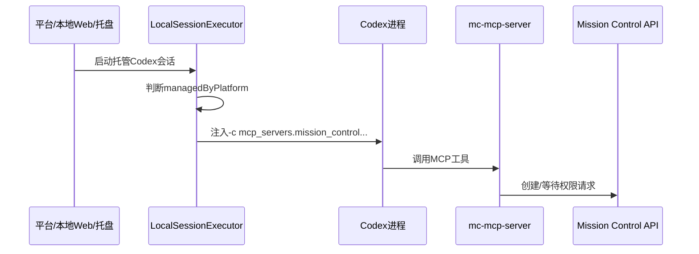
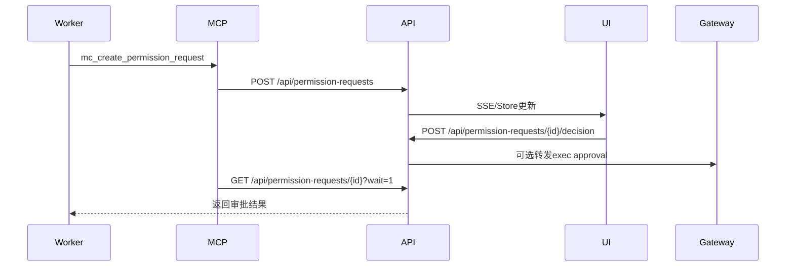

# Agent 指挥仓主需求文档

## 1. 文档控制

| 项 | 内容 |
|----|------|
| 文档状态 | 生产灰度版 |
| 文档版本 | V2.0 |
| 适用产品版本 | 2.1.73 |
| 更新时间 | 2026-07-23 |
| 核心来源 | 历史 PRD、人工值守 PRD、值守目标监督与受控记忆 PRD、上游 v2.2.0 安全回迁评估、架构设计、测试报告、2.0.3～2.1.71 release notes、当前代码实现 |

本文档是 Agent 指挥仓的唯一主需求文档。历史专题 PRD、架构设计、任务拆解、测试用例和发布说明只作为证据来源；产品最新完整需求以本文档为准。

## 2. 产品介绍

Agent 指挥仓是面向企业和专业团队的通用智能体中枢平台，用于统一接入、观测、调度和审计分布在不同机器上的 Codex、Claude、Hermes、OpenClaw 等智能体运行时。

产品定位是“中心化控制与审计 + 边缘化执行”。中心服务端负责统一视图、策略、授权、审计和调度；本地 Web/托盘/Edge 客户端负责本机智能体发现、会话读写、CLI 执行、托管会话启动和状态回传。

目标客群包括：

- 已经在研发、运维、交付中使用 CLI 智能体的企业团队。
- 需要统一管理多台机器、多种智能体、多条任务流水线的团队。
- 需要可审计提权、人工值守、订阅授权控制的企业客户。
- 需要私有化部署和本地执行能力的高安全要求客户。

核心场景：

- 管理员在中心端查看所有边缘节点和智能体状态。
- 操作者通过平台或本地 Web 启动托管 Codex 会话。
- Worker Agent 在执行敏感命令前发起权限请求。
- 人或值守 Agent 在平台上作出审批，Worker 继续执行。
- 已安装托盘客户端通过更新清单发现新版本并升级。
- 生产部署通过 Docker 镜像更新服务端和内置下载资产。
- 发布前系统必须校验服务端、本地 Web、托盘、下载页和下载包版本一致，避免页面显示版本与实际安装包不一致。

客户痛点：

- 多个智能体分散在不同机器和窗口，状态不可见。
- CLI 智能体遇到权限确认、命令风险、交互问题时容易挂起。
- 人工审批和自动执行混在聊天文本里，不可审计。
- 不同用户下载客户端后容易因 token 或配置混用误连账号。
- 镜像、托盘、Web 客户端版本不一致，运维难以判断。
- 发布资产存在但 `.next/static/chunks` 或 checksum 不匹配时，本地 Web 会退化为无样式页面，必须在发布前阻断。
- 首次安装或升级 runtime 时间较长时，如果只显示“正在启动边缘服务”，用户无法判断正在下载、校验、解压还是启动，容易误认为卡死。
- 人工值守依赖中心端保留边缘 Agent 的 `framework` 和 `session_key` 元数据；状态同步不得因旧客户端或手工状态推送只包含精简字段而清空会话映射信息。
- 人工值守绑定创建或同步时必须持久化 Worker 会话类型 `worker_session_kind`，并随绑定同步到服务端；编排器不得只依赖临时 `sync_sessions` 或 Agent framework 推断，否则会在会话表短暂缺失时跳过值守。
- 企业订阅能力和高危功能缺少统一授权边界。

## 3. 商业模式与授权模型

产品支持 SaaS、私有化部署、Docker 镜像部署、本地 Web 客户端、托盘客户端、Edge 客户端和混合部署。

售卖方式：

- 企业订阅：按企业/租户购买基础平台能力。
- 功能增值包：人工值守、本地 CLI 提权、托管客户端、审计留痕等高级能力按订阅开通。
- 私有化交付：提供服务端镜像、客户端安装包、升级流程和授权平台对接。

授权方式：

- 授权对象包括租户、实例、用户、Agent、客户端节点和功能能力。
- 授权平台下发 app、service、instance、features、entitlements、expiresAt 等信息。
- 功能入口和执行前都必须做授权检查。人工值守和本地 CLI 提权必须受订阅控制。
- 到期或未授权时，UI 不展示或禁用入口，服务端 API 必须拒绝执行。
- 在线授权以用户中心实时校验结果为准。本地离线授权只允许在用户中心不可达或接口异常时作为降级缓存，不得覆盖用户中心明确返回的未订阅、过期、实例不匹配、用户不存在或无租户结果。
- 每次登录或打开授权状态页都必须触发服务端在线刷新，避免授权时间和权益显示使用过期缓存。

规格建议：

- 基础版：智能体发现、状态监控、基础任务与会话管理。
- 专业版：多节点桥接、托管会话、审计、版本更新。
- 企业版：人工值守、本地 CLI 提权、权限请求、审批流、私有化部署和高级审计。

## 4. 产品形态与部署

系统包含以下产品形态：

- 中心服务端 `mission-control`：Docker 镜像部署，提供平台 UI、API、数据库、Bridge 接入、审计和发布资产。
- 本地 Web/Edge 客户端 `mission-control-client`：运行在用户机器，负责本地发现、会话读写、CLI 启动、Bridge 同步。
- 托盘客户端 `mission-control-tray`：提供后台运行、安装配置、更新提醒和本地服务入口。
- MCP 服务器脚本 `mc-mcp-server.cjs`：托管 Codex 会话的进程级工具出口。

发布版本必须保持服务端、Web/Edge 客户端、托盘客户端的版本语义一致。服务端镜像若展示或发布客户端下载版本，必须包含对应客户端产物或在 release notes 中明确延期。

发布前必须运行版本表面校验，覆盖版本源、下载页、下载 API、托盘更新清单、Edge runtime 清单、主文档版本、release notes、下载包存在性、SHA-256 和 runtime 静态资源完整性。校验失败不得提交发布 commit，不得推送生产镜像。

## 5. 用户角色与权限

| 角色 | 权限边界 |
|------|----------|
| 租户管理员 | 管理订阅、授权、节点、Agent、审批策略和审计 |
| 平台操作者 | 查看智能体、会话、任务，处理权限请求 |
| 值守 Agent | 根据策略辅助判断低/中风险请求，不能批准高/关键风险 |
| Worker Agent | 执行业务任务，必要时通过 MCP/API 发起权限请求 |
| 边缘客户端 | 执行本机发现、会话读写、CLI 启动和 Bridge 回传 |
| 服务端调度器 | 维护中心策略、审批状态、审计和跨节点调度 |
| 授权平台 | 管理订阅能力、到期时间、功能开关和实例授权 |

## 6. 核心业务对象

- 租户：企业级隔离和授权主体。
- 用户：登录平台并执行管理、审批或操作的账号。
- 授权实例：授权平台里的业务实例，决定功能可用性。
- 客户端节点：运行本地 Web/托盘服务的机器。
- Agent：被管理的智能体，包括普通 Worker 和值守 Agent。
- 会话：CLI 或平台任务的上下文载体。
- 任务：平台调度或用户发起的工作单元。
- 权限请求：Worker 在敏感操作前发起的可审计审批对象。
- 审批选项：批准、拒绝、转人工等可执行选项。
- 发布产物：Docker 镜像、托盘安装包、Edge runtime、更新清单。

## 7. 功能特性总览

| 特性 | 描述 | 状态 |
|------|------|------|
| 多智能体接入 | 发现和管理 Codex、Claude、Hermes、OpenClaw 等智能体 | 已发布 |
| 中心-边缘桥接 | 本地客户端向中心同步 Agent、会话和执行状态 | 已发布 |
| 托管 Codex 会话 | 平台/本地 Web/托盘启动的 Codex 会话受平台管理 | 灰度 |
| MCP 自动注入 | 托管 Codex 启动时自动注入 Mission Control MCP 工具 | 灰度 |
| 权限请求 | Worker 可创建、等待、接收审批结果 | 灰度 |
| 人/值守审批 | 人类操作者和值守 Agent 可通过平台决策 | 灰度 |
| 本地 CLI 提权 | 订阅控制下的本地命令提权和审计 | 灰度 |
| 执行审批转发 | 平台权限请求可映射到 Gateway exec approval | 灰度 |
| 托盘/Edge 更新 | 新下载和已安装客户端通过版本/清单获得升级 | 待完整发布验证 |
| 三端可靠通信 | 云端 Relay、本地 Mailbox、托盘 Supervisor 共同保证人工值守和会话续写离线可恢复 | 灰度 |

## 8. 功能特性详情

### 8.1 多智能体接入与管理

特性描述：系统统一展示不同来源的 Agent，记录 framework、node_id、parent_id、status、source 等字段。

客户价值：管理员可以在一个中心视图里知道哪些机器、哪些智能体、哪些会话正在运行。

功能点清单：

- 本地 Agent 扫描。
- 运行时探测。
- 会话解析。
- Agent 心跳。
- Agent 详情、诊断、记忆、任务关联。

使用步骤：

1. 安装本地客户端。
2. 登录并连接中心服务端。
3. 客户端扫描本机智能体和会话。
4. 中心端查看同步后的节点和 Agent。

实现逻辑：

- 本地客户端扫描文件和运行时。
- Bridge 将本地状态同步到中心。
- 中心端存储索引并在 UI 中聚合展示。

### 8.2 托管 Codex 会话与 MCP 自动注入

特性描述：由平台、本地 Web 或托盘客户端启动的 Codex 会话会在启动参数中注入 Mission Control MCP 服务器。

客户价值：用户无需手动安装 MCP，Worker Agent 在需要人工确认或权限审批时有标准出口。

功能点清单：

- 识别平台托管会话。
- 生成进程级 Codex MCP `-c mcp_servers...` 参数。
- 注入 `MC_URL`、`MC_MANAGED_SESSION`、`MC_AGENT_ID`、`MC_AGENT_NAME` 等环境变量。
- 不修改用户全局 Codex 配置。
- 用户自己在终端启动的 Codex 保持不接管。

使用步骤：

1. 用户从平台、本地 Web 或托盘客户端启动 Codex。
2. 客户端为该进程附加 MCP 配置参数。
3. Codex 会话内可调用 `mc_create_permission_request` 等工具。
4. 审批完成后 Worker 继续执行。

实现逻辑：



### 8.3 权限请求与审批

特性描述：Worker Agent 遇到敏感命令、提权、确认选项时，通过平台创建权限请求。平台保存请求、展示给操作者或值守 Agent，并把结果回传给 Worker。

客户价值：把“是否允许执行”从聊天文本中抽离出来，形成可审计、可追踪、可自动化的决策链路。

功能点清单：

- 创建权限请求。
- 查询权限请求。
- 等待审批结果。
- 人工审批。
- 值守 Agent 审批低/中风险请求。
- 高/关键风险禁止值守 Agent 批准。
- 审批结果转发到 Gateway exec approval。
- 审计上下文补偿记录。

使用步骤：

1. Worker 判断需要审批。
2. Worker 调用 MCP 创建权限请求。
3. 平台 UI 显示 pending 请求。
4. 人或值守 Agent 选择批准/拒绝/转人工。
5. Worker 得到结果后继续或停止。

实现逻辑：



验收标准：

- 请求必须包含标题、说明、风险、选项和上下文。
- 决策只能作用于 pending 请求。
- 值守 Agent 不能批准 high/critical 风险。
- 决策必须记录 decider、reason、selected option、decided_at。
- Gateway 转发失败时必须在上下文记录 `gateway_exec_forward.status=failed`。

### 8.4 本地 CLI 提权

特性描述：对需要更高权限的本地 CLI 操作提供订阅控制、授权检查、审计上下文和 UI 开关。

客户价值：企业可以把高风险本地操作纳入授权和审计，不再依赖用户口头确认。

功能点清单：

- 授权平台控制 `enableLocalCliElevation`。
- UI 根据授权展示/禁用提权能力。
- 本地操作记录审批来源和执行上下文。
- 与权限请求链路共享风险和审计模型。
- 2.0.4 起，提权入口和授权设置页显示必须使用在线校验结果；用户中心显示为 `enableLocalCliElevation: true` 时，业务端刷新后应显示“本地 CLI 提权：是”。

### 8.5 人工值守

特性描述：人工值守是企业版高级能力，用于监控 Worker 会话、识别需要确认的情况，并通过平台权限请求或会话继续接口让任务恢复。

客户价值：降低长任务无人看守导致的停滞，同时保留高风险操作的人类决策权。

功能点清单：

- 创建值守 Agent。
- 绑定 Worker 和值守 Agent。
- 监听 Worker transcript 或权限请求。
- Worker 通过 `mc_create_watch_event` 发起 prompt-only 主动求助时，平台调用绑定值守 Agent 生成回复，并在 `auto_send` 模式下把回复续写回 Worker 会话。
- `mc_create_watch_event` 带 `options` 时仍创建结构化权限请求，prompt-only 求助和审批决策保持不同状态机。
- “你希望/哪个/还是/是否/?”等等待用户回复话术必须能作为人工值守规则信号。
- 值守 Agent 生成回复前可按当前 Worker 上下文检索平台/Edge 记忆库，并把少量相关片段作为辅助判断上下文；记忆只作参考，必须受当前会话、安全策略和人工值守规则约束。
- Worker 绑定必须保存 `worker_session_id` 与 `worker_session_kind`；当 Bridge 同步到新的 `session_key` 时，服务端必须同时更新 session id 和 kind，值守事件上下文必须带上可用的 `session_kind`。
- 值守 Agent judge 返回本地 CLI、认证或模型环境错误时，Edge 必须将其视为 `steward_judge_failed`，不得把错误文本当作值守回复自动代发给 Worker。
- 根据风险策略转人工或辅助决策。
- 记录审计和干预结果。

当前边界：

- 2.0.3 重点交付权限请求和托管 Codex MCP 出口。
- 2.0.4 重点修复授权订阅一致性，避免离线缓存覆盖服务端真实订阅。
- 高/关键风险请求仍需人类批准。
- 任意终端启动的 Codex 暂不接管。

## 9. 非功能需求

性能：

- 权限请求创建和查询应为轻量数据库操作。
- 等待审批采用轮询/事件组合，避免长时间阻塞主线程。

稳定性：

- Bridge 离线时必须提示不可用。
- Gateway 审批转发失败不能丢失平台审批结果。
- MCP 请求超时必须返回明确错误。

安全合规：

- 不在文档、镜像、日志中写入 GitHub PAT、registry 密码或本地密钥。
- 功能开关和授权校验必须在 UI 和 API 双层执行。
- 授权订阅、到期时间和增值权益以服务端在线校验为准；本地缓存必须带来源语义，异常降级时 UI/API 返回 `source=offline`。
- 审批行为必须可追溯到人或值守 Agent。

中英文：

- 产品长期需要支持中英文 UI 和文档；当前主文档以中文为准。

第三方对接：

- 授权平台：控制订阅和功能开关。
- GitHub：源代码提交和发布前追溯。
- 阿里云 ACR：生产镜像仓库。
- Codex/Claude/OpenClaw/Hermes：智能体运行时。
- MCP：托管 Codex 的工具出口。

## 10. 运维、升级与回滚

生产镜像路径：

```text
crpi-c9b9bml2ajb23n5d.cn-shenzhen.personal.cr.aliyuncs.com/1sheng/agentcenter:<version>
crpi-c9b9bml2ajb23n5d.cn-shenzhen.personal.cr.aliyuncs.com/1sheng/agentcenter:latest
```

升级要求：

- 发布前必须更新三份核心主文档。
- 发布前必须提交并推送 GitHub。
- 服务端、客户端版本应保持一致。
- 托盘/Edge 客户端更新需要对应安装包和更新清单。
- 已安装用户的本地 Web runtime 更新必须由服务端 `edge-runtime` manifest 发布更高 `client_version` 触发；不得把变更代码复用旧 runtime 版本发布，否则托盘会判断已安装版本为最新，旧用户不会收到修复。
- 首次启动、重新连接和已配置后台启动期间，托盘配置页必须展示 runtime 下载进度、下载大小、校验、解压、替换、验证和启动步骤，避免用户面对长时间无反馈。
- 当中心 manifest 明确要求升级到新 runtime 时，下载或安装失败不得继续沿用旧 runtime；必须展示失败原因，让用户重试或等待服务端产物修复。

回滚方式：

- 1Panel/Compose 使用上一版本镜像标签重新拉取并重建容器。
- 若数据库迁移已执行，需要根据迁移兼容性评估是否仅回滚镜像。
- 权限请求新增表为向前兼容表，回滚镜像时保留数据。

## 11. 需求状态与路线图

已发布或灰度：

- 多智能体中心视图。
- 中心-边缘桥接。
- 托管 Codex MCP 注入。
- 权限请求和审批。
- Gateway exec approval 转发补偿。
- 本地 CLI 提权授权控制。
- 在线授权强制刷新和离线缓存降级规则。
- 2.1.3 本地提权授权上下文修复：Edge 安装令牌 `edge.enroll_token` 与 Bridge 令牌 `gateway.token` 分离，本地 Web 向中心校验提权能力时传递用户级 scoped enroll token，中心按真实用户/租户在线订阅校验 `enableLocalCliElevation`。
- 2.1.3 Bridge WebSocket 生产鉴权强化：默认必须配置并校验 Bridge token，只有显式 `MC_BRIDGE_ALLOW_ANONYMOUS=1` 才允许匿名桥接。
- 2.1.4 本地 Web 大会话性能修复：Codex 会话列表扫描不得整文件读取大 JSONL，只允许读取元数据窗口和尾部窗口；打开 300MB+ 会话 transcript 必须保持分页读取，避免刚安装客户端出现 `Failed to fetch`。
- 2.1.4 runtime 打包清理：Edge runtime zip 不得包含 `.dev-server.log`、`.standalone-server.log`、pid、`.DS_Store`、`__MACOSX` 或 `.next/cache` 等开发/资源文件。
- 2.1.5 本地会话提交状态修复：本地 Web 向 Codex/Claude 会话提交 prompt 后，必须立即恢复输入按钮可用；后台等待态只能作为提示，不得阻塞下一次输入；当 transcript 已出现本轮 assistant 回复时，必须清理乐观 user message 和等待态，避免“已回复但仍计时/不可发送”。
- 2.1.6 安装升级可靠性修复：托盘启动本地 Web 时必须校验 5101 上运行的版本是否等于已安装 runtime 版本；若旧健康进程残留占用端口，必须自动回收后启动当前 runtime，避免升级后仍打开旧前端或出现 client-side exception。
- 2.1.6 提权体验修复：本地 CLI 提权按钮是会话级偏好，选中后发送消息、刷新页面或切换会话再返回都必须保持，不得在每次发送后自动关闭导致用户反复切换权限。
- 2.1.7 托盘首次启动体验修复：配置页必须展示 runtime 下载百分比、下载大小和安装阶段；升级失败时不得静默沿用旧 runtime，版本不匹配错误必须展示为可读的当前版本/目标版本。
- 2.1.8 托盘升级进程治理修复：runtime 更新后必须校验 5101 健康接口版本等于已安装版本；旧版本健康进程残留时必须自动回收并重启当前 runtime；窗口关闭只隐藏并保留后台服务，只有菜单栏明确退出才停止 5101。
- 2.1.9 会话实时反馈修复：服务端和本地 Web 在 `/chat` 发送会话消息后必须立即显示已提交/已送达状态；若运行时直接返回回复，必须立即显示回复；即使 SSE 已连接也必须保留 transcript 兜底刷新，避免生命周期事件丢失导致回复不可见。
- 2.1.9 CSP 生产兼容修复：生产 CSP 必须避免 `strict-dynamic` 与当前内联脚本注入方式冲突导致前端脚本被浏览器阻断；发布前必须覆盖服务端和本地 Web 的 CSP 单元测试。
- 2.1.9 人工值守闭环增强：默认由值守 Agent 处理一般审批；高风险操作必须进入人工外部审批；Worker 在原会话直接得到人工回复时，必须通过平台接口记录审批完成，形成统一审计。
- 2.1.10 托管 Codex MCP 注入修复：`mcp_servers.mission_control.env` 必须以 TOML inline table 注入，不能以 JSON 字符串注入；否则 Codex 会报 `expected a map` 并导致托管会话无法启动。
- 2.1.10 本地 Edge MCP 工具补齐：本地 `mc-mcp-server.cjs` 必须包含 `mc_create_watch_event` 和 `mc_record_worker_human_reply`，与中心服工具面保持一致，避免平台托管会话依赖的审批出口在本地缺失。
- 2.1.10 托盘自恢复升级：已保存连接地址和令牌的托盘，在本机 5101 端口被旧 runtime 占用且运行版本落后时，必须自动回收本产品旧进程并启动新 runtime，不能要求用户手工 kill。
- 2.1.11 下载页芯片区分：服务端下载页和下载信息 API 必须按 `Apple Silicon` 与 `Intel Mac` 明确展示不同安装包，避免 Intel 用户误下 ARM 包。即使某个芯片的包暂未发布，也必须明确标注“暂未提供”，不能只给一个统一下载按钮。
- 2.1.12 托盘进程回收强化：下载并替换 runtime 后，如果 `5101` 上仍运行旧版本 `next-server`，托盘必须按 PID 实际占用情况做第二轮归属判断。属于 E-Agent Edge 自身旧 runtime 的孤儿进程，必须强制 kill 后再启动新版本；属于其他软件的进程，必须拒绝自动终止并明确展示 PID、进程名和工作目录。
- 2.1.13 进程组级 stop：托盘停止本机 Web 服务时，不能只杀托盘记录的单个 child；必须优先终止该 child 所在进程组，再按 `5101` 端口占用做 owned 进程兜底回收，彻底避免 `caffeinate + next-server` 残留成孤儿旧进程。
- 2.1.17 人工值守闭环修复三项：①任务派发看门狗在判定任务超时前，必须先查该任务对应 agent 是否有 `permission_requests` 处于 pending，避免把正常等待人工审批的会话误判为假死并 requeue/失败；②高危判断必须统一由值守侧预定义规则（`isDangerousPermissionRequest`）裁定，不能信任 worker 自报的 `risk` 字段；③高优先级人工值守事件和权限请求接入既有 webhook 投递系统（`human_watch.event.high`/`permission.requested`/`permission.decided`），账号可订阅后在无人盯面板时也能收到外部告警；同时记录人工最终决策是否采纳值守判官建议（`judge_suggestion_outcome`），作为后续采纳率统计的原始数据，暂不做自动学习。
- 2.1.18 人工值守主动回复闭环：Worker prompt-only `mc_create_watch_event` 必须触发 `/api/human-watch/assist`，中心拉取 Worker transcript、调用绑定值守 Agent judge，并通过 Bridge `session_continue` 续写回 Worker；托管 Codex 继续会话必须注入 `MC_WORKER_SESSION_ID` 和 `MC_SESSION_KIND`，规则默认识别 `awaiting_user_response`。
- 2.1.19 三端可靠通信灰度：`/api/human-watch/assist` 在 `delivery_mode=auto|queue` 或 `queue_if_offline=true` 时必须通过 `edge_messages` 排队，客户端上线后由本地 Mailbox 拉取、调用值守 Agent judge、继续写回 Worker，并通过 ack/fail/dead-letter 留痕；Bridge 只承担唤醒信号，托盘负责启动本地 Web 后触发 drain 和展示 backlog。
- 2.1.30 人工值守记忆辅助判断：中心在调用值守 Agent judge 前，通过 Bridge 请求 Edge 本地记忆检索，失败时回退中心记忆 FTS；检索结果限制条数和字符数，并写入 `human_watch_events.context_json.steward_memory_context` 供审计排查。
- 2.1.31 人工值守判官重复文案修复：值守 Agent 连续多次判断出同样的“继续”等短回复时，Edge 必须按新增 assistant 消息识别为有效回复，不能因文本与上一轮相同误判为 `Judge session returned empty reply`，从而阻断自动代发。
- 2.1.32 人工值守 Judge 长耗时修复：值守 Agent 本地 CLI 响应较慢时，Edge 必须使用专用 10 分钟执行窗口，中心 Bridge 必须等待 11 分钟；同一值守 Agent 已有 Judge 运行时，重复轮询请求必须快速拒绝而不是进入串行队列，避免 60 秒轮询形成排队风暴并最终 `Timed out waiting for steward_judge`。
- 2.1.33 人工值守 Judge 重复短回复修复：长会话固定分页内 assistant 数量可能保持不变，Edge 必须按最新 assistant 时间戳识别新增回复，允许值守 Agent 连续返回相同短文本（如 `继续`）并继续自动代发。
- 2.1.35 人工值守绑定会话类型持久化：`human_watch_bindings` 新增 `worker_session_kind`，创建、更新、Bridge session 同步和历史迁移均写入该字段；编排器和诊断优先使用落库 kind，降低有效 Worker 会话被误判为 `no_session_kind` 的风险。
- 2.1.36 人工值守额度与去重对齐：Edge 新建值守 Agent 的 `binding_defaults` 必须默认 `60` 次/24 小时，并显式写入 `max_interventions_window_seconds=86400`；服务端 `confirmation_text` 规则 fingerprint 必须纳入最后 assistant 内容 hash，防止不同等待确认问题因规则形状相同被误判为 `fingerprint_duplicate`。
- 2.1.37 人工值守判官运行时错误保护：Edge 值守 judge 必须识别 `Missing environment variable`、CLI 命令失败、API/认证失败等运行时错误文本，并以失败留痕而不是自动代发，避免模型环境异常污染 Worker 会话。
- 2.1.39 Edge Bridge 稳定性：托盘周期性同步 bootstrap 时，Edge 仅在 `gateway.server_url`、`gateway.token`、`device.client_id` 等 Bridge 关键配置实际变化时重连；`edge.enrolled_at` 等心跳式字段变化不得中断生产中心到本地 Edge 的 transcript / continue RPC 链路。
- 2.1.40 人工值守快速介入与回答质量：租户级规则必须允许小范围验证配置 `idle_timeout_seconds=5`、`idle_timeout_with_stuck_seconds=5`、`grace_after_prompt_seconds=0`；`回答后说"确认"` / `回复后说"确认"` 类提示必须由值守判官先回答 Worker 的实际问题，再包含确认，不得机械回复“继续下一个问题”或只回复“确认”。
- 2.1.41 可靠队列审计闭环：`human_watch.assist.requested` 经 Edge mailbox ack 成功后，中心必须追加 `intervention_completed success` 干预记录，并用同一 `message_id` / `correlation_id` 串联队列消息与值守回复结果。
- 2.1.42 值守目标监督：用户可向值守 Agent 指定目标；值守生成结构化 DAG 计划，中心校验并在人工批准后按 Worker 能力、节点、会话、负载和风险授权分派现有任务。
- 2.1.42 持续监督：60 秒 watchdog 和单 Goal lease 识别离线、投递失败、权限等待、超时和语义偏离；值守可追问、纠偏、重试、换 Worker、请求重规划或转人工，所有动作 append-only 留痕并受预算限制。
- 2.1.42 独立验收：Worker 自报完成不能直接完成 Goal；每条成功标准必须引用测试、指标、产物或独立评审证据，证据不足转人工。
- 2.1.42 受控记忆：记忆分 preference/fact/episode/procedure，先生成 candidate；人工批准或 procedure 经三个独立成功 Goal 验证后才可进入 approved。检索受作用域、条数、字符数、有效期和效果反馈约束。
- 2.1.43 Worker 可恢复性：当 Edge Bridge 在线且 Agent 有专用会话时，休眠/离线 Agent 可由可靠 session continue 恢复执行；Agent 索引更新时间只作评分提示，不能覆盖实时 Bridge 在线事实。无 session 的主运行时 Agent 仍不得直接接收目标任务。
- 2.1.43 调度隔离：带 goal_id 的监督子任务只能由 Goal Dispatcher 分派，旧任务自动路由必须跳过，避免错误回退到 OpenClaw 或破坏 DAG 依赖。
- 2.1.44 调度隔离强化：带 `metadata.goal_id` 的监督任务必须在 auto-route、assigned dispatch、stale requeue 和 Aegis review 四个阶段全部隔离；auto-route 写入时再以原子 WHERE 条件复核元数据。
- 2.1.44 托盘孤儿进程回收：替换旧 runtime 目录后，即使旧 `next-server` 的 cwd 已无法 canonicalize，只要绝对路径仍属于 E-Agent runtime root，就必须自动回收 5101 端口；相邻目录和其他软件仍不得误杀。
- 2.1.45 双端监督隔离：Server 与 Edge runtime 的 legacy scheduler 都必须在 auto-route、assigned dispatch、stale requeue 和 Aegis review 阶段排除 `metadata.goal_id` 任务，任一端均不得把依赖节点绕过 Goal Dispatcher 执行。
- 2.1.45 持续监督：Bridge 客户端在线时，不得因过期 agent index 的 `offline` 状态误判可恢复 Worker 离线；监督轮询必须在依赖完成后自动激活后继任务，无需人工反复点击分派。
- 2.1.46 中心任务闭环：Worker 必须通过托管 MCP 查询中心 Goal/Task/事件并提交结构化完成证据；不得因 Edge 本机 `tasks` 表为空判断中心任务不存在。中心只接受当前 Goal 已绑定 Worker 与 session 的完成提交。
- 2.1.46 队列隔离：Server 与 Edge 的 `/api/tasks/queue` 在继续当前任务、容量统计和原子认领三个阶段都必须排除 `metadata.goal_id`，监督任务只允许 Goal Dispatcher 激活。
- 2.1.47 中心调度双重隔离：Server 的 auto-route、assigned dispatch、stale requeue、Aegis 和 task queue 必须同时依据 `metadata.goal_id` 与 `supervision_goal_tasks.task_id` 排除监督任务；Docker 和 Edge Runtime 生产构建前必须清理 `.next`，禁止增量 chunk 污染发布。
- 2.1.48 受管 Worker 闭环：可靠 mailbox 继续监督 Worker 会话时必须注入 `managedByPlatform`、Worker ID、session ID 和监督 MCP；legacy 调度在候选查询后、任何状态 mutation 前必须再次按 metadata/关系表拒绝监督任务。
- 2.1.49 结构性闭环保护：依赖未完成的监督任务必须在创建事务内持有专用 hold assignee，使 legacy auto-route 即使绕过 metadata/关系判定也无法选中；监督 MCP 必须提供准确的 read-only/non-destructive/idempotent annotations，保证非交互 Codex 能自动查询并提交证据。
- 2.1.50 权威快照与不可覆盖保护：`mc_get_supervision_goal` 必须返回有界的 schema 2 紧凑快照，始终包含全部任务当前状态、依赖、Worker/session 绑定和最近事件摘要，不得因大 metadata/evidence/action 导致中间截断；legacy scheduler 必须同时识别 `created_by=goal-supervisor`、`metadata.goal_id` 和关系表，并在认领、重排、成功和失败写回时使用原子条件更新。
- 2.1.51 受管值守续话授权：`mc_continue_session` 必须向非交互 Codex 声明非破坏、幂等和平台内闭环 annotations。相同会话与 prompt 由中心指纹去重；该声明仅覆盖已有会话续话，不得放宽终止会话、任意命令或高风险审批。
- 2.1.52 受管身份跨续话继承：由托管 MCP 发起的同 session 续话必须继承 Worker ID、session 和平台受管标记，使下一轮仍可调用监督查询/完成工具；浏览器 cookie 请求和 session 不匹配请求不得伪造该身份。会话列表和 transcript 读取应声明只读 annotations。
- 2.1.53 纠偏消息身份完整性：`retry_task` / `correct_direction` 生成的 `session.continue.requested` payload 必须与初始 dispatch 一样携带 `worker_local_agent_id`，Edge 必须将其注入 `MC_AGENT_ID`，保证纠偏后的同 session Worker 仍可提交受管完成证据。
- 2.1.54 有界权威快照：Worker Goal 读取必须返回完整事件类型聚合和固定最近事件窗口，明确区分历史窗口化与传输截断；正常三任务 Goal 的 MCP payload 必须小于 10KB。
- 2.1.54 终态纠偏保护：自动 Correction Engine 不得向 `done` 任务发送进度或方向纠偏；终态证据质量由独立验收处理，避免同会话插队和重复提交。
- 2.1.54 单写者生产约束：同一 SQLite 数据卷只能由一个 AgentCenter 实例持有。发布前后发现孤儿容器/进程同时打开数据库时必须停止发布并清理旧实例，不得依赖应用层过滤抵抗旧代码双写。
- 2.1.55 Codex 项目目录约束：平台恢复已绑定 Codex 会话时，必须优先使用持久化 `mc_session_project_path`，不得退回 Edge Runtime 的进程目录。涉及仓库命令的目标必须绑定真实仓库路径；缺少项目路径时应失败并转人工，不得猜测或绕过。
- 2.1.56 Mailbox 恢复目录约束：可靠 mailbox 根据 `worker_local_agent_id` 续写会话时，排队执行器必须重新读取完整 Agent 记录并携带到 cwd 解析和 CLI 执行；不得只保留 Agent ID 后在队列入口丢弃配置。
- 2.1.57 受管完成证据约束：独立 Verifier 必须读取中心校验 Worker/session 后写入的 `goal_task_worker_completed` 结构化事件。普通 resolution 自述仍不能作为独立证据；中心受管事件可证明 MCP 提交身份、状态和结构化命令证据。
- 2.1.58 验收提示词预算约束：Goal Verifier 发送到 Edge 值守 Agent 的 `steward_judge` 提示词必须不超过 5900 字符，并优先保留成功标准、每项证据 ref、中心校验来源、命令结果和 Worker/session 绑定；重复完成说明、长上下文和记忆必须压缩。
- 2.1.59 自动停止重启约束：binding 重新启用或更新配置后，`max_runtime_seconds` 必须从本次启用/更新时间重新计时，不能继续沿用首次创建时间并在下一轮扫描中立即停用。
- 2.1.60 自主执行安全边界：Goal/Task 只能收紧 Agent 工具白名单、cwd 和预算；工具交集为空、cwd 越界或预算非法时必须拒绝分发。值守监督默认单任务预算 5 美元，受 Goal 总预算再次限制。
- 2.1.60 Workspace 隔离：审计、事件、调度、Edge 回执、权限请求和值守/监督资源必须携带 Workspace 归属。`strict` 模式仅允许能由 `tenant_id + workspace_id + client_id + local_agent_id + session_id + session_kind` 反查的资源；合法远程 Worker 不得因 strict 被一刀切禁用。
- 2.1.60 供应链与产物边界：远端 Skill 单文档最大 256 KiB；运行时安装默认关闭且版本/哈希固定；Actions、Docker 基础镜像必须使用不可变摘要；standalone 不得包含 `.env*`、`.npmrc`、测试或仓库源文件，也不得重复嵌入大体积 public 发布资产。
- 2.1.61 Bridge/Gateway Agent 注册必须按 `(name, workspace_id)` 冲突键更新，并从 `sync_clients.workspace_id` 解析 Edge 所属 Workspace；不得因 071 迁移后仍使用全局名称冲突目标而中断同步。
- 2.1.62 / Tray 3.0.9 Runtime 更新必须串行执行；新包须在独立候选目录完成复制、依赖修复和版本/静态资源校验后才可原子替换当前目录。并发恢复不得共享可变安装目录，安装或启用失败必须恢复并继续保留上一可用 Runtime，不能留下空目录或让 Edge 长期离线。
- 2.1.63 受管 Claude Worker 的新建与恢复会话必须通过临时 `--mcp-config` 注入平台 MCP Server，并传递 Worker、session 和权限模式上下文；MCP 鉴权可继承 Runtime 已配置的 `API_KEY`，不得要求用户另行配置全局 Claude MCP profile。
- 2.1.66 中心生产部署必须显式设置 `MC_ENABLE_LOCAL_MONITORING=false`，服务端只汇聚 Edge/托盘数据；本地 Web 与托盘继续使用本地发现模式。模式切换遗留的 `source=bridge` Agent 不得与实时索引重复展示，并应在精确匹配后自动清理。
- 2.1.66 Edge 新建、修改、删除或状态变化 Agent 后必须立即通过 Bridge 推送完整清单；HTTP heartbeat 的 `agent_inventory` 必须在服务端模式更新实时索引，作为 WebSocket 断线或事件遗漏时的兜底。
- 2.1.67 可靠执行完成语义：Edge Mailbox 消费 `session.continue.requested` 或 `human_watch.assist.requested` 时，必须等待对应 Worker CLI 本轮完成后才 ACK；排队成功不等于 `delivered=true`，执行异常必须 fail 并保留真实错误。
- 2.1.67 监督任务会话互斥：同一 `client_id + session_id` 同时最多执行一个监督任务；容量计算必须识别共享 session，不能仅按 Agent 显示名统计。
- 2.1.67 过程可见性：监督任务列表必须显示最后变化时间和长时间无进展状态；已绑定 session 的任务提供“查看过程”，从远程 transcript 每 5 秒读取真实 CLI 会话。监督过程不自动复制到普通聊天，避免把系统任务提示和工具输出混入用户对话。
- 2.1.68 / Tray 3.0.10 Runtime 降级保护：中心 ZIP、干净解压目录和候选目录必须通过必需文件及真实健康启动门禁；任何本机 standalone 兜底都必须先补齐、校验候选目录，再原子替换。目标 Runtime 已完整启用时，配置持久化等后处理错误不得触发低完整度兜底覆盖。
- 2.1.69 监督 Worker 执行预算：Goal 初次分派、纠偏和重试消息必须显式携带 30 分钟执行超时；Edge 将远端值限制在 10 秒至 2 小时，CLI 未返回前保持 processing，超时或异常必须 fail，不得假完成。
- 2.1.70 发布制品一致性：Docker 构建上下文必须显式放行当前版本 Runtime ZIP，release-surface 门禁同时验证 `.dockerignore`、manifest、ZIP 存在性和 SHA；任一不一致不得发布。
- 2.1.71 阻塞目标恢复：对 `blocked` Goal 执行 `retry_task` 或 `reassign_task` 表示值守已选择继续执行；中心必须在同一事务内将 Goal 恢复为 `running`并记录状态事件，使 Worker 能通过 MCP 从 `in_progress` 正常提交完成。
- 2.1.72 Work 数据权属与展示：普通 Work 智能体的任务、活动、配置、工作区文件、SOUL 和工作记忆以本地 Edge Runtime 为主数据源；云端仅保存监督控制记录、可重建的展示汇总和同步索引。在线详情必须通过 Bridge 读取本地事实，不得用云端空记录伪装“暂无内容”。
- 2.1.73 历史 Work 详情兼容：用户在 Bridge 断线期间打开旧云端镜像 ID 后，重连时必须按 `client_id + local_agent_id` 映射到当前 Bridge 索引并切回本地主数据，同时保留旧名称作为云端监督任务别名。
- Tray 3.0.10 进程生命周期互斥：初始化、安装完成回调、用户重启和周期 Supervisor 必须串行执行 Runtime stop/start/ensure，禁止并发通过 `CHILD` 检查后重复 spawn 并争抢 `5101`。
- Tray 3.0.10 旧版服务接管：启动时必须卸载并删除 `work.1sheng.e-agent-edge.runtime` KeepAlive LaunchAgent 及过期 PID 文件，防止旧服务管理器与托盘同时启动同一 Runtime；清理过程不得记录 plist 中的令牌。

后续规划：

- 已安装托盘客户端自动下载、替换和提示闭环持续完善；发布验证必须在服务端新镜像部署后，通过真实 `/api/releases/edge-runtime-manifest` 下载 runtime，而不能只用本机临时 manifest 覆盖验证。
- 企业模式显式接管用户终端 Codex。
- 更细粒度的值守 Agent 策略。
- 授权平台能力包标准化。

## 12. 附录

关键来源文档：

- `文档/01-PRD/PRD-通用智能体中枢平台.md`
- `文档/01-PRD/PRD-人工值守.md`
- `文档/03-架构设计/框架设计-人工值守.md`
- `mission-control/docs/releases/2.0.3.md`
- `mission-control-client/docs/releases/2.0.3.md`
- `mission-control/docs/releases/2.0.4.md`
- `mission-control-client/docs/releases/2.0.4.md`
