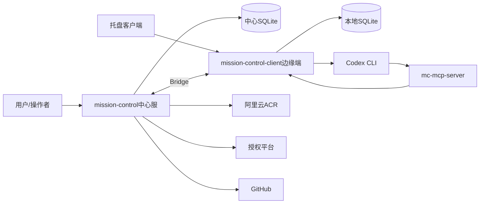
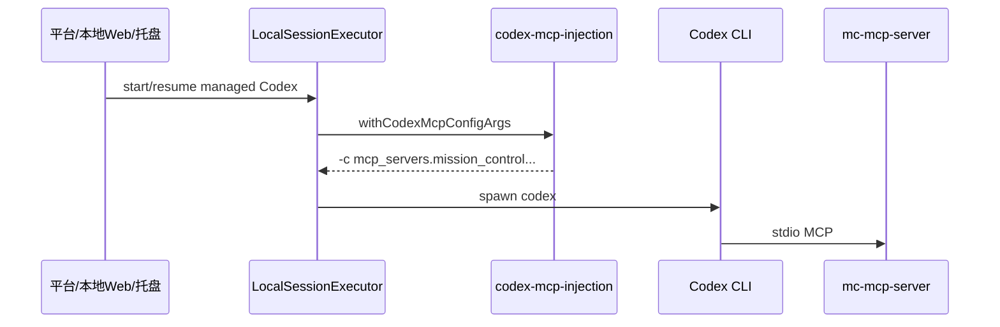
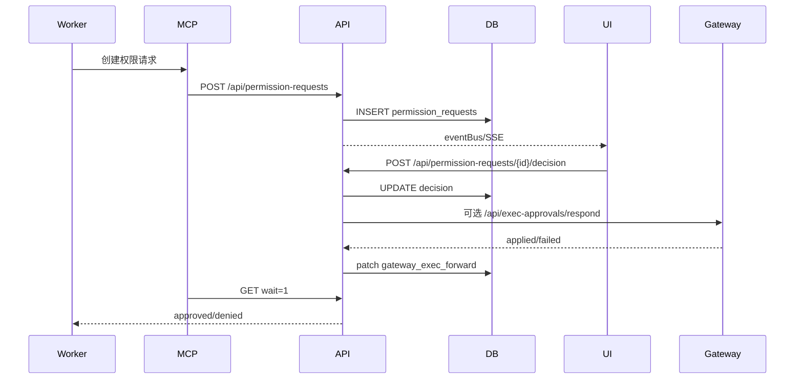

# Agent 指挥仓主架构文档

## 1. 文档控制

| 项 | 内容 |
|----|------|
| 文档状态 | 生产灰度版 |
| 架构版本 | V1.0 |
| 适用产品版本 | 2.1.25 |
| 更新时间 | 2026-07-05 |

本文档是 Agent 指挥仓的唯一主架构文档，用于系统重构、故障排查、发布评审和新工程师/智能体接手。

## 2. 架构目标与约束

目标：

- 中心化管理多机器、多框架、多会话智能体。
- 边缘节点保留本地执行能力，中心负责控制、策略和审计。
- 托管 Codex 会话在用户无感知情况下获得 MCP 审批出口。
- 权限请求、人工值守和本地 CLI 提权必须可审计、可授权、可回滚。
- `/chat` 会话发送链路必须以 transcript 为最终事实源，并用 SSE + fallback poll 双路径保障实时可见。
- 生产 CSP 必须兼容 Next.js/当前客户端脚本注入方式，避免浏览器阻断导致本地 Web 退化为无交互页面。

约束：

- 中心 Docker 不能直接操作用户本机 CLI。
- 用户自己终端启动的 Codex 暂不接管。
- 高/关键风险审批必须保留人类决策。
- GitHub token、registry 密码、平台密钥不得进入代码、镜像和文档。

## 3. 系统上下文

外部系统：

- 授权平台：控制功能订阅。
- GitHub：代码版本和发布追溯。
- 阿里云 ACR：生产镜像仓库。
- Codex/Claude/OpenClaw/Hermes：本地或网关运行时。

## 4. 逻辑架构

中心服务端 `mission-control`：

- 平台 UI 和管理 API。
- 中心数据库和迁移。
- Agent、Session、Task、Audit、Permission Request 管理。
- Bridge Server，接收边缘同步和转发请求。
- Release/download 静态资产承载。
- 发布版本表面校验，发布前阻断服务端、本地 Web、托盘、下载页、manifest、下载包和主文档版本不一致。

边缘客户端 `mission-control-client`：

- 本机运行时探测。
- 本地 Agent/Session 数据库。
- LocalSessionExecutor 启动和续接 CLI。
- Bridge Client，同步状态到中心。
- 托管 Codex MCP 注入。
- 本地权限请求镜像和审批 UI。

托盘客户端：

- 本机常驻入口。
- 启动/配置本地服务。
- 负责启动本地 Web runtime、周期性检查中心 runtime manifest、下载替换 runtime、重启本地服务，并将托盘配置同步到本地 Web。
- 2.1.3 起，托盘配置中的 `enroll_token` 与 `gateway_token` 分离：前者保留用户/租户注册上下文，后者仅用于中心 Bridge WebSocket 认证。

发布资产架构要求：

- 服务端镜像内置 `public/edge-runtime/manifest.json`、`public/edge-tray/manifest.json` 和 `public/project-docs/manifest.json`。
- Edge runtime zip 必须包含 standalone 服务、`.next/static/chunks`、public 静态资源和启动脚本。
- Edge runtime zip 必须排除开发日志、pid、macOS 资源目录、`.DS_Store` 和 `.next/cache`，避免安装包膨胀和用户机器继承构建机日志。
- 托盘 DMG 必须与服务端版本和托盘版本一致，并由 manifest 提供 SHA-256 校验。
- 已安装用户升级依赖服务端 manifest 的 `client_version` 大于本地 `package.json/VERSION`；发布修复必须提升 runtime 版本并随服务端镜像发布 manifest，不能只替换同版本 zip。
- 托盘启动本地 Web 时，健康检查必须同时校验 `/api/status` 返回的运行版本和本地已安装 runtime 版本；旧版本健康进程占用 5101 时，托盘应自动回收该进程再启动当前 runtime。
- 托管 Codex MCP 注入中的 `mcp_servers.<name>.env` 必须生成 TOML inline table，而不是 JSON 字符串；否则 Codex CLI 解析配置时会拒绝启动。
- 托管 Codex 继续已有会话时必须注入 `MC_WORKER_SESSION_ID` 与 `MC_SESSION_KIND`，使 Worker prompt-only 值守求助能解析到正确绑定和会话。
- 本地和服务端 `mc-mcp-server.cjs` 工具面必须一致，至少同时包含 `mc_create_permission_request`、`mc_create_watch_event`、`mc_wait_permission_request`、`mc_decide_permission_request`、`mc_record_worker_human_reply`。
- 人工值守和会话续写可靠通信架构采用云端 Relay、本地 Mailbox、托盘 Supervisor 三层模型。Bridge push 只作为唤醒信号，跨端业务执行以持久消息的 pull/lease/ack/fail 为事实源，客户端离线时 assist/continue 不直接丢失。
- 下载分发层必须从 tray manifest 读取多平台条目并保留固定顺序显示，至少显式展示 `darwin-aarch64` 和 `darwin-x86_64`。当某个平台产物缺失时，API 仍返回占位条目，前端展示“暂未提供”。
- 托盘端口回收层必须区分“托盘当前跟踪的 child 进程”和“仍占用 5101 的孤儿旧 runtime 进程”。后者不能依赖 `process::stop()`，而必须通过端口占用 PID + `cwd` 归属判断执行强制回收。
- macOS 下 `caffeinate -ims node server.js` 与 `next-server` 需要视为同一生命周期单元管理。`stop()` 必须先按 PGID 终止整个进程组，再做端口级补刀，避免只杀掉 `caffeinate` 或只杀掉单个 child。
- 托盘 setup 状态模型包含 `phase/message/progress/detail/downloaded_bytes/total_bytes`，runtime 安装链路通过进度回调实时写入状态并向 setup 页面发送 `setup-status` 事件。
- runtime 升级路径必须区分“无目标版本时的降级可用”和“目标版本明确时的强制升级”。当 manifest 目标版本高于本地版本时，下载、校验、解压、替换任一步失败都不得继续启动旧 runtime。
- `scripts/verify-release-version-surfaces.mjs` 是发布前硬门禁，负责读取各包版本、manifest、下载资产、主文档和关键页面源码，确认生产镜像不会发布错版本或缺失静态资源。

本地会话读取架构：

- Codex 会话列表扫描只读取小文件全文；超过阈值的大 JSONL 只读取头部元数据窗口和尾部统计窗口。
- Codex transcript 读取继续使用按字节游标分页，避免 300MB+ 历史会话拖慢 5101 本地服务。
- 会话列表可接受大文件消息数为近似统计，但不得阻塞本地 Web 可用性、Bridge 心跳和发送接口。

本地会话提交状态架构：

- `POST /api/sessions/continue` 返回 accepted 后，前端输入控件必须立即恢复可用；后台等待态只作为可视提示，不得作为长期发送锁。
- 提交成功后前端必须触发强制 transcript 刷新，并在短时间内追加重试刷新，降低 SSE/后台事件漏达时的可见延迟。
- 当前轮次 transcript 中出现 assistant 可见回复且无未完成工具调用时，前端必须清理等待态和乐观 user message，避免“已回复但仍计时/不可发送”。
- 本地 CLI 提权选择是会话级 UI 偏好，前端以 `session.prefKey` 或 `sessionKind:sessionId` 为 key 写入本地存储；发送消息不得自动清除，切换会话时按会话恢复。

MCP 脚本：

- 以 stdio MCP server 运行。
- 将 Codex 工具调用转为 Mission Control REST API。
- 自动从 `MC_AGENT_ID`、`MC_AGENT_NAME`、`MC_WORKER_SESSION_ID`、`MC_SESSION_KIND` 补齐 Worker 求助上下文。
- 仅托管会话自动注入；不污染全局 Codex 配置。

三端可靠通信：

- 云端 Cloud Relay 保存面向 Edge 的 `edge_messages`，提供 create/lease/ack/fail/cancel/list 状态机，并记录 `edge_message_events`。
- 本地 Web Local Mailbox 包含 inbox/outbox，执行前落库，执行后 ack/fail 云端，重启后可恢复 processing 消息。
- 托盘作为本机 supervisor，负责启动 runtime、健康检查、触发 mailbox drain、展示 backlog。
- 人工值守 `human_watch.assist.requested`、`session.continue.requested`、`permission.decision.requested` 已接入该机制。
- 同一 `client_id + session_kind + session_id` 的 continue/assist 必须串行处理，避免 Worker 会话被并发写入。

## 5. 物理与部署架构

生产部署：

- 服务端镜像：`crpi-c9b9bml2ajb23n5d.cn-shenzhen.personal.cr.aliyuncs.com/1sheng/agentcenter:<version>`
- 常用平台：`linux/amd64`
- 部署方式：Docker/Compose/1Panel。
- 更新方式：`docker compose pull && docker compose up -d --force-recreate`

本地节点：

- 本地 Web 服务默认端口由客户端配置决定。
- 托管 MCP 默认通过 `MC_URL` 指向本地 Web 服务。
- `mission-control-client/scripts/mc-mcp-server.cjs` 默认本地地址为 `http://127.0.0.1:5101`。
- 服务端脚本默认地址为 `http://127.0.0.1:3000`。

## 6. 运行时架构

### 6.1 托管 Codex 启动

核心规则：

- `managedByPlatform=false` 时不注入。
- 注入以进程参数完成，不写用户全局配置。
- 环境变量携带 agentId、agentName、permission mode 和本地 URL。

### 6.2 权限请求审批

## 7. 数据架构

新增核心表：

- `permission_requests`
- `permission_request_events`

关键字段：

- `workspace_id`、`tenant_id`、`client_id`
- `worker_*`、`steward_*`
- `request_type`、`title`、`prompt`
- `risk`：`low`、`medium`、`high`、`critical`
- `status`：`pending`、`approved`、`denied`、`expired`、`cancelled`
- `options_json`、`context_json`
- `selected_option_id`、`decision_reason`
- `decider_type`、`decider_user_id`、`decider_agent_id`
- `created_at`、`updated_at`、`decided_at`、`expires_at`

索引：

- `workspace_id,status,created_at`
- `client_id,worker_local_agent_id,created_at`
- `steward_local_agent_id,created_at`

中心迁移：`065_permission_requests`。
客户端迁移：`054_permission_requests`。

## 8. 安全架构

认证：

- API 使用现有 `requireRole` 鉴权。
- 查看请求需要 `viewer`。
- 创建和决策需要 `operator`。

授权：

- 人工值守和本地 CLI 提权必须受订阅能力控制。
- 本地 Web 的提权订阅校验必须携带用户级 `edge.enroll_token`，中心端从 scoped token 解析用户和租户后调用在线授权；仅有租户 ID 或 Bridge token 不足以判断用户订阅。
- 高/关键风险请求禁止值守 Agent 批准。
- 用户终端自行启动的 Codex 不被自动接管。
- 授权解析统一由 `effective-license.ts` 输出最终有效授权；在线用户中心校验由 `license-verifier.ts` 完成。
- `/api/auth/me` 每次返回当前用户时强制刷新在线授权，`/api/license/status?refresh=1` 用于授权页强制刷新短缓存。
- 本地离线授权只在在线校验错误时降级使用；在线校验明确返回未订阅、过期、实例不匹配、用户不存在或无租户时，禁止使用旧离线授权覆盖。

审计：

- 权限请求和决策持久化。
- Gateway 转发结果写入上下文。
- 本地 CLI 提权记录执行上下文。

密钥：

- GitHub PAT、registry 密码、平台 token 只能保存在本机安全环境。
- 不得写入文档、镜像、日志或提交。

## 9. 集成架构

授权平台：

- 提供 `enableHumanWatch`、`enableLocalCliElevation` 等能力。
- 平台 UI 和 API 都应按授权控制。
- 授权业务标识使用 `mission-control`，授权中心里的 `agentCenter` 是应用/实例展示名，不替代业务 `appId`。
- 用户中心 `/api/internal/verify-access` 返回 `license.entitlements` 和 `license.expiresAt`；业务端兼容旧版顶层 `entitlements/expiresAt`。

MCP：

- 工具由 `mc-mcp-server.cjs` 暴露。
- MCP 工具通过 HTTP 调用本地或中心 API。
- prompt-only `mc_create_watch_event` 调用 `/api/human-watch/assist`：中心拉取 Worker transcript，调用值守 Agent judge，并在 `auto_send` 模式下通过 Bridge `session_continue` 写回 Worker。
- 带 `options` 的 `mc_create_watch_event` 继续兼容 `POST /api/permission-requests`。
- 托管 Codex 自动注入，非托管 Codex 不变。

Gateway/OpenClaw：

- `exec.approval` 与平台权限请求是不同通道。
- 平台决策可映射为 Gateway `approve`、`deny`、`always_allow`。
- 转发失败不回滚平台决策，但必须记录补偿状态。

## 10. 可观测与运维

需要观测：

- Bridge 在线状态。
- 权限请求创建量、审批延迟、超时量。
- Gateway 转发失败量。
- MCP 注入失败和工具调用失败。
- 托盘/Edge 更新发现率和安装成功率。

排查路径：

- MCP 工具不可用：检查 Codex 是否托管启动、启动参数、`MC_URL`、脚本路径。
- 审批不出现：检查 API 鉴权、迁移、eventBus/SSE、store。
- 审批后命令不继续：检查 Worker wait 请求、Gateway forward 状态、会话执行日志。
- 客户端误连账号：检查下载 token、bootstrap 配置、客户端 manifest。

## 11. 架构决策

已接受：

- 托管 Codex 使用进程级 MCP 注入，不写全局配置。
- 平台权限请求作为审批事实源。
- 值守 Agent 可参与低/中风险决策，高/关键风险必须人类批准。
- 三份核心主文档作为重构、追溯和排查的最低文档资产。

已拒绝或延期：

- 暂不接管用户自己终端启动的 Codex。
- 暂不让值守 Agent 直接点击本地弹窗。
- 暂不把聊天回复作为权限审批事实源。

## 12. 发布架构

发布顺序：

1. 更新三份核心主文档。
2. 更新 release notes。
3. 测试和类型检查。
4. 版本号对齐。
5. GitHub commit/push。
6. 同步 Edge/托盘产物。
7. 构建并推送镜像。
8. inspect 镜像 manifest。

硬性约束：

- Git 未推送不得发布镜像。
- 三份核心主文档未更新不得提交。
- 不得把变更代码复用旧版本号发布。
- 不得在服务端仍运行旧镜像/旧 manifest 时宣称已安装客户端升级验证完成；真实验证必须发生在新镜像部署并提供新 `edge-runtime` manifest 之后。
- 托盘 native/setup 代码变更必须同步新的托盘 DMG；否则已安装用户不会获得首次启动进度展示和升级错误文案修复。
