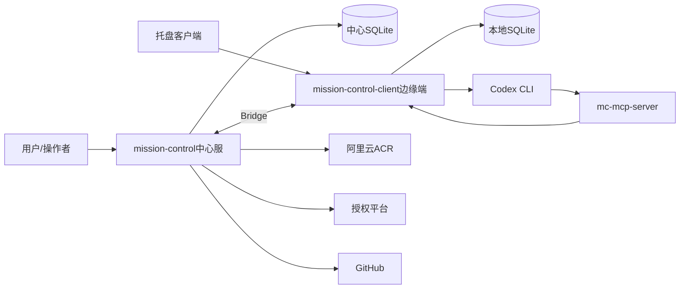
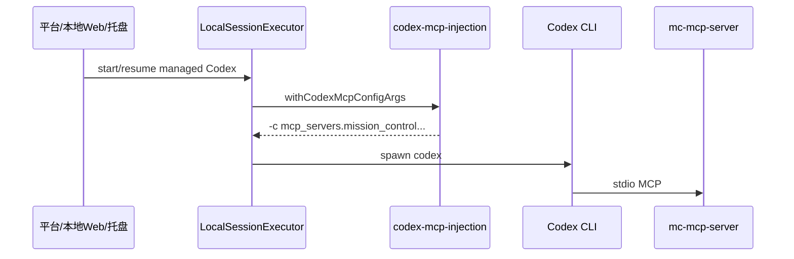
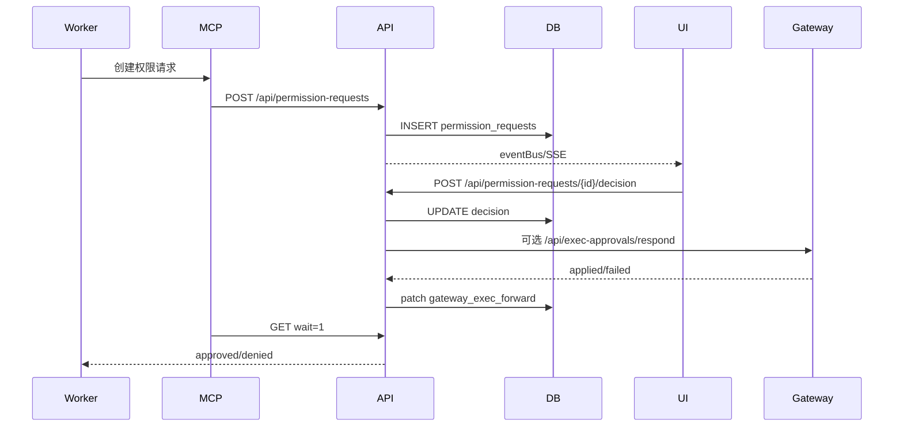

# Agent 指挥仓主架构文档

## 1. 文档控制

| 项 | 内容 |
|----|------|
| 文档状态 | 生产灰度版 |
| 架构版本 | V2.0 |
| 适用产品版本 | 2.1.76 |
| 更新时间 | 2026-07-24 |

本文档是 Agent 指挥仓的唯一主架构文档，用于系统重构、故障排查、发布评审和新工程师/智能体接手。

## 2. 架构目标与约束

目标：

- 中心化管理多机器、多框架、多会话智能体。
- 边缘节点保留本地执行能力，中心负责控制、策略和审计。
- 托管 Codex 会话在用户无感知情况下获得 MCP 审批出口。
- 权限请求、人工值守和本地 CLI 提权必须可审计、可授权、可回滚。
- `/chat` 会话发送链路必须以 transcript 为最终事实源，并用 SSE + fallback poll 双路径保障实时可见。
- 生产 CSP 必须兼容 Next.js/当前客户端脚本注入方式，避免浏览器阻断导致本地 Web 退化为无交互页面。

约束：

- 中心 Docker 不能直接操作用户本机 CLI。
- 用户自己终端启动的 Codex 暂不接管。
- 高/关键风险审批必须保留人类决策。
- GitHub token、registry 密码、平台密钥不得进入代码、镜像和文档。

## 3. 系统上下文

外部系统：

- 授权平台：控制功能订阅。
- GitHub：代码版本和发布追溯。
- 阿里云 ACR：生产镜像仓库。
- Codex/Claude/OpenClaw/Hermes：本地或网关运行时。

## 4. 逻辑架构

中心服务端 `mission-control`：

- 平台 UI 和管理 API。
- 中心数据库和迁移。
- Agent、Session、Task、Audit、Permission Request 管理。
- Bridge Server，接收边缘同步和转发请求。
- Bridge Agent Index 采用增量兼容保护：完整状态包更新 `framework/parent_id/session_key`，旧客户端或手工 `status_push` 省略这些字段时保留中心端已有值，避免人工值守无法解析 Worker 会话类型。
- 2.1.66 起 Agent Inventory 采用 WebSocket 实时推送与 HTTP heartbeat 双通道。Edge 的 `agent.created/updated/deleted/synced/status_changed` 事件触发完整 `agent_status`；中心服务端在 clients-only 模式下用 heartbeat `agent_inventory` 刷新 `sync_agent_index` 兜底。
- 中心生产 Compose 显式设置 `MC_ENABLE_LOCAL_MONITORING=false`。若历史误以本地模式运行并产生 `source=bridge` 持久镜像，中心按同一 `client_id + remote_name` 与索引精确匹配后删除，列表合并层同时抑制重复展示。
- Human Watch Binding 在中心数据库中持久化 `worker_session_kind`。创建、更新、Bridge session_key 同步和迁移回填都应写入该字段；编排器解析 session kind 的优先级为显式 hint、绑定落库值、Agent framework、`sync_sessions`。
- HumanWatchOrchestrator 在值守 judge 前可发起受限记忆检索：优先通过 Bridge 请求 Edge 本地 OpenClaw sqlite/文件记忆，失败时回退中心 `memory_fts`，再把截断后的相关片段拼入 judge prompt 和审计上下文。
- Bridge `steward_judge` 等待窗口必须大于 Edge 本地值守 CLI 执行窗口；2.1.32 起中心等待 11 分钟，避免值守 Agent 慢响应时服务端先判超时。
- Edge `steward_judge` 回复提取必须同时比较最新 assistant 时间戳；2.1.33 起允许值守 Agent 连续多轮返回相同短文本，避免固定分页内 assistant 数量不变时误判为空回复。
- Release/download 静态资产承载。
- 发布版本表面校验，发布前阻断服务端、本地 Web、托盘、下载页、manifest、下载包和主文档版本不一致。

边缘客户端 `mission-control-client`：

- 本机运行时探测。
- 本地 Agent/Session 数据库。
- LocalSessionExecutor 启动和续接 CLI。
- Bridge Client，同步状态到中心。
- Bridge Client 响应中心 `memory_search_request`，在本机记忆库内执行只读检索并返回 `source/path/snippet` 摘要；该接口不上传全量记忆。
- 托管 Codex MCP 注入。
- 本地权限请求镜像和审批 UI。

托盘客户端：

- 本机常驻入口。
- 启动/配置本地服务。
- 负责启动本地 Web runtime、周期性检查中心 runtime manifest、下载替换 runtime、重启本地服务，并将托盘配置同步到本地 Web。
- 2.1.3 起，托盘配置中的 `enroll_token` 与 `gateway_token` 分离：前者保留用户/租户注册上下文，后者仅用于中心 Bridge WebSocket 认证。

发布资产架构要求：

- 服务端镜像内置 `public/edge-runtime/manifest.json`、`public/edge-tray/manifest.json` 和 `public/project-docs/manifest.json`。
- Edge runtime zip 必须包含 standalone 服务、`.next/static/chunks`、public 静态资源和启动脚本。
- Edge runtime zip 必须排除开发日志、pid、macOS 资源目录、`.DS_Store` 和 `.next/cache`，避免安装包膨胀和用户机器继承构建机日志。
- 托盘 DMG 必须与服务端版本和托盘版本一致，并由 manifest 提供 SHA-256 校验。
- 已安装用户升级依赖服务端 manifest 的 `client_version` 大于本地 `package.json/VERSION`；发布修复必须提升 runtime 版本并随服务端镜像发布 manifest，不能只替换同版本 zip。
- 托盘启动本地 Web 时，健康检查必须同时校验 `/api/status` 返回的运行版本和本地已安装 runtime 版本；旧版本健康进程占用 5101 时，托盘应自动回收该进程再启动当前 runtime。
- 托管 Codex MCP 注入中的 `mcp_servers.<name>.env` 必须生成 TOML inline table，而不是 JSON 字符串；否则 Codex CLI 解析配置时会拒绝启动。
- 托管 Codex 继续已有会话时必须注入 `MC_WORKER_SESSION_ID` 与 `MC_SESSION_KIND`，使 Worker prompt-only 值守求助能解析到正确绑定和会话。
- 本地和服务端 `mc-mcp-server.cjs` 工具面必须一致，至少同时包含 `mc_create_permission_request`、`mc_create_watch_event`、`mc_wait_permission_request`、`mc_decide_permission_request`、`mc_record_worker_human_reply`。
- 人工值守和会话续写可靠通信架构采用云端 Relay、本地 Mailbox、托盘 Supervisor 三层模型。Bridge push 只作为唤醒信号，跨端业务执行以持久消息的 pull/lease/ack/fail 为事实源，客户端离线时 assist/continue 不直接丢失。
- 下载分发层必须从 tray manifest 读取多平台条目并保留固定顺序显示，至少显式展示 `darwin-aarch64` 和 `darwin-x86_64`。当某个平台产物缺失时，API 仍返回占位条目，前端展示“暂未提供”。
- 托盘端口回收层必须区分“托盘当前跟踪的 child 进程”和“仍占用 5101 的孤儿旧 runtime 进程”。后者不能依赖 `process::stop()`，而必须通过端口占用 PID + `cwd` 归属判断执行强制回收。
- macOS 下 `caffeinate -ims node server.js` 与 `next-server` 需要视为同一生命周期单元管理。`stop()` 必须先按 PGID 终止整个进程组，再做端口级补刀，避免只杀掉 `caffeinate` 或只杀掉单个 child。
- 托盘 setup 状态模型包含 `phase/message/progress/detail/downloaded_bytes/total_bytes`，runtime 安装链路通过进度回调实时写入状态并向 setup 页面发送 `setup-status` 事件。
- runtime 升级路径必须区分“无目标版本时的降级可用”和“目标版本明确时的强制升级”。当 manifest 目标版本高于本地版本时，下载、校验、解压、替换任一步失败都不得继续启动旧 runtime。
- Runtime 安装、启动恢复和周期监督共用进程内安装互斥锁。安装先在 `runtime.installing-*` 候选目录完成依赖修复与完整性校验，再将当前目录重命名为 `runtime.rollback-*` 并原子启用候选目录；启用后复验失败时恢复 rollback。健康旧 Runtime 在新候选可用前不得删除。
- `scripts/verify-release-version-surfaces.mjs` 是发布前硬门禁，负责读取各包版本、manifest、下载资产、主文档和关键页面源码，确认生产镜像不会发布错版本或缺失静态资源。

本地会话读取架构：

- Codex 会话列表扫描只读取小文件全文；超过阈值的大 JSONL 只读取头部元数据窗口和尾部统计窗口。
- Codex transcript 读取继续使用按字节游标分页，避免 300MB+ 历史会话拖慢 5101 本地服务。
- 会话列表可接受大文件消息数为近似统计，但不得阻塞本地 Web 可用性、Bridge 心跳和发送接口。

本地会话提交状态架构：

- `POST /api/sessions/continue` 返回 accepted 后，前端输入控件必须立即恢复可用；后台等待态只作为可视提示，不得作为长期发送锁。
- 提交成功后前端必须触发强制 transcript 刷新，并在短时间内追加重试刷新，降低 SSE/后台事件漏达时的可见延迟。
- 当前轮次 transcript 中出现 assistant 可见回复且无未完成工具调用时，前端必须清理等待态和乐观 user message，避免“已回复但仍计时/不可发送”。
- 本地 CLI 提权选择是会话级 UI 偏好，前端以 `session.prefKey` 或 `sessionKind:sessionId` 为 key 写入本地存储；发送消息不得自动清除，切换会话时按会话恢复。

MCP 脚本：

- 以 stdio MCP server 运行。
- 将 Codex 工具调用转为 Mission Control REST API。
- 自动从 `MC_AGENT_ID`、`MC_AGENT_NAME`、`MC_WORKER_SESSION_ID`、`MC_SESSION_KIND` 补齐 Worker 求助上下文。
- 仅托管会话自动注入；不污染全局 Codex 配置。

三端可靠通信：

- 云端 Cloud Relay 保存面向 Edge 的 `edge_messages`，提供 create/lease/ack/fail/cancel/list 状态机，并记录 `edge_message_events`。
- 本地 Web Local Mailbox 包含 inbox/outbox，执行前落库，执行后 ack/fail 云端，重启后可恢复 processing 消息。
- 托盘作为本机 supervisor，负责启动 runtime、健康检查、触发 mailbox drain、展示 backlog。
- 人工值守 `human_watch.assist.requested`、`session.continue.requested`、`permission.decision.requested` 已接入该机制。
- 同一 `client_id + session_kind + session_id` 的 continue/assist 必须串行处理，避免 Worker 会话被并发写入。
- `session_kind` 必须随 Human Watch 绑定持久化并参与诊断，避免 sync session 临时缺失时无法构造串行键和 transcript/continue 请求。

人工值守记忆辅助：

- 中心只根据最近 Worker 用户/助手文本构造短查询，不读取全量 transcript 作为记忆查询。
- Edge 侧优先读取 `OPENCLAW_STATE_DIR/memory/*.sqlite` 的 `chunks` 表，兼容常见 `text/content/chunk/chunk_text/body` 与 `path/file_path/source/filename` 列；同时兼容本地文件记忆 FTS。
- 检索结果默认最多 3 条、1200 字符，上限 8 条、3000 字符；配置项为 steward context 的 `include_memory`、`memory_search_limit`、`memory_max_chars`。
- 记忆片段只作为值守 Agent 判断参考，不构成审批事实源；高危审批和当前会话上下文优先级更高。

值守判官回复识别：

- Edge 调用 Codex 值守 Agent judge 后，必须以新增 assistant 消息作为回复有效性依据。
- 连续多轮确认类问题允许值守 Agent 输出相同短回复，例如“继续”；只要 assistant 消息数量增加，就不能因文本重复误判为空回复。
- Edge 值守 Judge 使用专用 10 分钟本地 CLI 执行窗口；同一值守 Agent 已有 Judge 运行时，重复请求必须快速拒绝，不能进入串行队列造成轮询堆积。
- Edge 值守 Judge 对本地 CLI 运行时错误做输出保护。若回复文本明显是缺少模型环境变量、认证失败、API 错误或命令执行失败，Edge 抛出 `Judge session returned runtime error`，中心只记录 `steward_judge_failed`，不创建自动代发内容。
- 若 runtime 没有新增 assistant 消息，仍按 `steward_judge_failed` 留痕，不代发固定模板。

值守绑定会话类型：

- `human_watch_bindings.worker_session_kind` 是 Worker 会话类型的持久字段，取值限制为 `claude-code`、`codex-cli`、`hermes` 或空。
- 新建绑定时优先使用请求体 `worker_session_kind`，其次从 `sync_sessions.session_kind` 按 `client_id + worker_session_id` 回填，最后按 Worker framework 映射。
- Bridge 同步 Worker `session_key` 时必须同时更新 `worker_session_id` 和 `worker_session_kind`。
- 历史数据迁移先按 `sync_sessions` 回填，再按 `sync_agent_index.framework` 回填；仍为空的绑定由诊断页提示重新同步或重建。

## 5. 物理与部署架构

生产部署：

- 服务端镜像：`crpi-c9b9bml2ajb23n5d.cn-shenzhen.personal.cr.aliyuncs.com/1sheng/agentcenter:<version>`
- 常用平台：`linux/amd64`
- 部署方式：Docker/Compose/1Panel。
- 更新方式：`docker compose pull && docker compose up -d --force-recreate`

本地节点：

- 本地 Web 服务默认端口由客户端配置决定。
- 托管 MCP 默认通过 `MC_URL` 指向本地 Web 服务。
- `mission-control-client/scripts/mc-mcp-server.cjs` 默认本地地址为 `http://127.0.0.1:5101`。
- 服务端脚本默认地址为 `http://127.0.0.1:3000`。

## 6. 运行时架构

### 6.1 托管 Codex 启动

核心规则：

- `managedByPlatform=false` 时不注入。
- 注入以进程参数完成，不写用户全局配置。
- 环境变量携带 agentId、agentName、permission mode 和本地 URL。

### 6.2 权限请求审批

## 7. 数据架构

新增核心表：

- `permission_requests`
- `permission_request_events`

关键字段：

- `workspace_id`、`tenant_id`、`client_id`
- `worker_*`、`steward_*`
- `request_type`、`title`、`prompt`
- `risk`：`low`、`medium`、`high`、`critical`
- `status`：`pending`、`approved`、`denied`、`expired`、`cancelled`
- `options_json`、`context_json`
- `selected_option_id`、`decision_reason`
- `decider_type`、`decider_user_id`、`decider_agent_id`
- `created_at`、`updated_at`、`decided_at`、`expires_at`

索引：

- `workspace_id,status,created_at`
- `client_id,worker_local_agent_id,created_at`
- `steward_local_agent_id,created_at`

中心迁移：`065_permission_requests`。
客户端迁移：`054_permission_requests`。

## 8. 安全架构

认证：

- API 使用现有 `requireRole` 鉴权。
- 查看请求需要 `viewer`。
- 创建和决策需要 `operator`。

授权：

- 人工值守和本地 CLI 提权必须受订阅能力控制。
- 本地 Web 的提权订阅校验必须携带用户级 `edge.enroll_token`，中心端从 scoped token 解析用户和租户后调用在线授权；仅有租户 ID 或 Bridge token 不足以判断用户订阅。
- 高/关键风险请求禁止值守 Agent 批准。
- 用户终端自行启动的 Codex 不被自动接管。
- 授权解析统一由 `effective-license.ts` 输出最终有效授权；在线用户中心校验由 `license-verifier.ts` 完成。
- `/api/auth/me` 每次返回当前用户时强制刷新在线授权，`/api/license/status?refresh=1` 用于授权页强制刷新短缓存。
- 本地离线授权只在在线校验错误时降级使用；在线校验明确返回未订阅、过期、实例不匹配、用户不存在或无租户时，禁止使用旧离线授权覆盖。

审计：

- 权限请求和决策持久化。
- Gateway 转发结果写入上下文。
- 本地 CLI 提权记录执行上下文。

密钥：

- GitHub PAT、registry 密码、平台 token 只能保存在本机安全环境。
- 不得写入文档、镜像、日志或提交。

## 9. 集成架构

授权平台：

- 提供 `enableHumanWatch`、`enableLocalCliElevation` 等能力。
- 平台 UI 和 API 都应按授权控制。
- 授权业务标识使用 `mission-control`，授权中心里的 `agentCenter` 是应用/实例展示名，不替代业务 `appId`。
- 用户中心 `/api/internal/verify-access` 返回 `license.entitlements` 和 `license.expiresAt`；业务端兼容旧版顶层 `entitlements/expiresAt`。

MCP：

- 工具由 `mc-mcp-server.cjs` 暴露。
- MCP 工具通过 HTTP 调用本地或中心 API。
- prompt-only `mc_create_watch_event` 调用 `/api/human-watch/assist`：中心拉取 Worker transcript，调用值守 Agent judge，并在 `auto_send` 模式下通过 Bridge `session_continue` 写回 Worker。
- 调用值守 Agent judge 前可注入 `值守记忆检索` 上下文；该上下文来源于 Edge/中心记忆检索，受条数、字符数和审计边界限制。
- 带 `options` 的 `mc_create_watch_event` 继续兼容 `POST /api/permission-requests`。
- 托管 Codex 自动注入，非托管 Codex 不变。

Gateway/OpenClaw：

- `exec.approval` 与平台权限请求是不同通道。
- 平台决策可映射为 Gateway `approve`、`deny`、`always_allow`。
- 转发失败不回滚平台决策，但必须记录补偿状态。

## 10. 可观测与运维

需要观测：

- Bridge 在线状态。
- 权限请求创建量、审批延迟、超时量。
- Gateway 转发失败量。
- MCP 注入失败和工具调用失败。
- 托盘/Edge 更新发现率和安装成功率。

排查路径：

- MCP 工具不可用：检查 Codex 是否托管启动、启动参数、`MC_URL`、脚本路径。
- 审批不出现：检查 API 鉴权、迁移、eventBus/SSE、store。
- 审批后命令不继续：检查 Worker wait 请求、Gateway forward 状态、会话执行日志。
- 客户端误连账号：检查下载 token、bootstrap 配置、客户端 manifest。

## 11. 架构决策

已接受：

- 托管 Codex 使用进程级 MCP 注入，不写全局配置。
- 平台权限请求作为审批事实源。
- 值守 Agent 可参与低/中风险决策，高/关键风险必须人类批准。
- 三份核心主文档作为重构、追溯和排查的最低文档资产。

已拒绝或延期：

- 暂不接管用户自己终端启动的 Codex。
- 暂不让值守 Agent 直接点击本地弹窗。
- 暂不把聊天回复作为权限审批事实源。

## 12. 发布架构

发布顺序：

1. 更新三份核心主文档。
2. 更新 release notes。
3. 测试和类型检查。
4. 版本号对齐。
5. GitHub commit/push。
6. 同步 Edge/托盘产物。
7. 构建并推送镜像。
8. inspect 镜像 manifest。

硬性约束：

- Git 未推送不得发布镜像。
- 三份核心主文档未更新不得提交。
- 不得把变更代码复用旧版本号发布。
- 不得在服务端仍运行旧镜像/旧 manifest 时宣称已安装客户端升级验证完成；真实验证必须发生在新镜像部署并提供新 `edge-runtime` manifest 之后。
- 托盘 native/setup 代码变更必须同步新的托盘 DMG；否则已安装用户不会获得首次启动进度展示和升级错误文案修复。
- 2.1.40 起人工值守编排的 transcript 事件评估延迟与 5 秒空闲阈值对齐；规则只负责判定等待状态，实际代发内容必须交给值守 Agent 判官结合 Worker 上下文生成，避免固定模板回复破坏业务语义。
- 2.1.41 起可靠 Edge 消息的 ack/fail 状态会反写人工值守干预审计；成功 ack 写入 `intervention_completed success`，失败写入 `intervention_skipped edge_message_failed`，避免平台页面只能看到队列 attempt 而看不到最终值守结果。
- 2.1.42 起同一值守人格分为 Reactive Watch Session 和 Goal Supervisor Session。前者处理 Worker 当前等待，后者管理长期 Goal；值守 Agent 不作为普通 Worker 执行业务任务。
- 2.1.43 起 Worker Matcher 以实时 Bridge 连接判断节点可达；带专用 session_key 的 offline/sleeping Agent 视为可恢复候选并降权，索引陈旧只降权。error/disabled、无会话、框架不支持和 human-watch 仍硬拒绝。
- 2.1.43 起旧任务 auto-route 查询显式排除 metadata.goal_id，监督任务只允许 Goal Dispatcher 按依赖、预算、Matcher 和可靠消息链路激活。
- 2.1.44 起监督任务隔离下沉为旧调度器不变量：auto-route 查询与 UPDATE 双重复核，assigned dispatch、stale requeue 和 Aegis review 同样排除 `metadata.goal_id`，避免任何阶段越过 DAG 和 Goal 预算。
- 2.1.45 起该不变量同时应用于中心服务和 Edge runtime 两套调度器；监督监控采用 Bridge 在线状态作为客户端存活权威信号，并在持有 Goal lease 时幂等调用 Goal Dispatcher，使依赖满足的后继节点自动进入可靠消息队列。
- 2.1.46 起旧调度隔离覆盖 `/api/tasks/queue` 的 current/capacity/claim 路径。Worker 的托管 MCP 通过 Edge 代理读取中心 Goal，并用托管进程环境注入且工具参数不可覆盖的 Worker ID 与 session 约束完成接口写入证据；完成事件驱动监督轮询自动激活后继节点。
- 2.1.47 起中心 legacy scheduler 不再只信任 JSON metadata；所有可改变任务状态的查询同时使用 `NOT EXISTS supervision_goal_tasks(task_id)` 关系约束。Edge 因不存储中心 Goal 关系表，仍使用 metadata 隔离。Docker 和 Runtime 打包在 `next build` 前删除 `.next`，确保运行 chunk 与当前源码一致。
- 2.1.48 起中心 legacy scheduler 在 SQL 候选过滤之外增加 mutation 前最终拒绝保护；可靠 mailbox 把中心选定的 `worker_local_agent_id` 写入 Edge 受管 Codex 执行上下文，临时 MCP 配置由平台注入而不修改用户全局 Codex 配置。
- 2.1.49 起依赖等待任务使用 `__supervision_dependency_hold__` 作为结构性锁；Goal Dispatcher 在同一事务内释放、重新判定并立即分派或重新持有，不向 legacy scheduler 暴露 `inbox + assigned_to IS NULL` 窗口。监督 MCP annotations 作为 Codex 非交互审批边界，读取为 read-only，完成提交为 non-destructive 且 idempotent。
- 2.1.50 起 Worker Goal 读取输出为有界 schema 2 快照：任务列表全量保留，大字段不返回，事件仅返回最近 100 条与全量类型计数。legacy scheduler 的隔离是三重不变量：任务来源 `goal-supervisor`、Goal metadata、Goal-task 关系任一命中即拒绝；查询后的 claim/requeue/complete/fail 全部带 compare-and-set，防止长耗时调用或并发 scheduler 用缓存对象覆盖监督状态。
- 2.1.51 起受管续话 MCP 把中心已有的 prompt 指纹幂等语义暴露给 Codex：`mc_continue_session` 为 write/non-destructive/idempotent/closed-world。这样值守可在 `approval_policy=never` 的受管监督会话中继续指定 Worker；session 控制、外部开放写入和高风险权限仍使用原审批边界。
- 2.1.52 起 MCP 续话请求携带不对工具参数暴露的隐藏 Worker 上下文；Edge 仅在 API-key 调用、受管标记、正整数 Worker ID 且 worker session 与目标 session 完全一致时注入临时 MCP 配置。普通浏览器续话保持非受管，避免身份提升。
- 2.1.53 起 Goal Correction Engine 构造的可靠续话消息与初始 Dispatcher 共用 Worker 身份契约：payload 必须包含 `worker_local_agent_id`，不能只在 `agent_ref` 中保存。Edge mailbox 消费后以该字段构造受管运行环境。
- 2.1.54 起 Worker Goal API 使用 schema 3：任务状态保持完整，事件历史以 `by_type` 完整聚合加最近 20 条窗口表达；`history_windowed` 只表示历史窗口，`truncated=false` 表示服务端未截断当前结构化响应。
- 2.1.54 起 Correction Engine 查询必须连接任务当前状态，只对 `assigned|in_progress|review` 自动纠偏。`done` 任务进入独立验收，不再续写 Worker 会话。
- 2.1.55 起本地会话执行器在恢复 Codex/Claude 会话前统一读取 Agent 配置中的 `mc_session_project_path`。持久化会话目录优先于调用方进程 cwd；Claude 在没有持久化目录时仍可回退到 JSONL 发现目录，其他运行时回退到显式 workspace。
- 2.1.56 起 `enqueueLocalSessionPrompt` 会把 mailbox 提供的轻量 Agent 引用刷新为完整本地 Agent 记录，再解析 `mc_session_project_path`，并把同一记录传入执行选项和生命周期事件。该入口与直接绑定 Agent 执行共享同一 cwd 优先级。
- 2.1.57 起 Verifier 将 `goal_task_worker_completed` 作为中心受管完成证明：事件记录前已校验 Goal/task 状态、assigned Worker 和 assigned session，并保留 evidence/action。没有该事件、质量审查或其他平台证据时仍必须转人工。
- 2.1.58 起 Verifier 在 Bridge 调用前构造独立证据索引并压缩证据详情，使用 5900 字符硬上限适配 Edge `steward_judge` 的 6000 字符协议限制。压缩优先保留可引用 ref 和受管完成结构化字段，避免长 resolution 或记忆导致验收请求在 Edge 被拒绝。
- 2.1.59 起 binding 自动停止窗口使用 `max(created_at, updated_at)` 作为当前运行周期基线。重新启用、调整规则或更新绑定会开始新的计时窗口，历史 `auto_stop` 记录继续保留审计。
- 2.1.60 起执行适配器通过 `dispatch-sandbox` 计算 Agent 与 Goal/Task 的工具交集、最低预算和 workspace realpath cwd；相同有效策略覆盖 role bootstrap、resume、新建专属会话和可靠 mailbox。
- 2.1.60 起 migration `071` 为审计增加 Workspace 归属，并在关闭外键的受控事务中重建 Agent 唯一约束；迁移只拒绝新引入的外键违规。migration `072` 增加 Workspace `brand/isolation`。
- 2.1.60 strict 资源判断以中心 SQLite 的 `workspaces`、`sync_clients`、`sync_agent_index`、`sync_sessions` 为权威链。无所有权的本机会话/网关会话失败关闭；归属完整的 Edge Worker 会话继续服务 Human Watch、Goal Supervisor 和权限请求。
- 2.1.60 发布架构新增根级 CodeQL/OSV/Action SHA 检查与 standalone sanitizer。Docker/Edge 打包在复制 public 资产前只保留 Next runtime、消息、OpenAPI、MCP 脚本、systemd template 和 schema.sql。
- 2.1.61 Bridge Agent 镜像注册从 `sync_clients` 读取 Workspace，并在迁移后复合唯一键上事务 upsert；中心模式 inventory 清理也使用同一 Workspace，不再硬编码 Workspace 1。
- 2.1.62 / Tray 3.0.9 将 Runtime 更新入口串行化并采用候选目录校验后的原子切换；修复托盘启动恢复与周期监督并发安装时相互删除下载、解压或目标目录，导致 Edge 只剩旧内存进程且重启后离线的问题。
- 2.1.63 为受管 Claude CLI 的 `start` 与 `resume` 增加进程级临时 MCP 配置注入，与 Codex 共用 `MC_AGENT_ID + MC_WORKER_SESSION_ID + MC_SESSION_KIND` 身份契约。MCP 子进程继承 Runtime `API_KEY` 完成本地 API 鉴权，不写入用户全局 Claude 配置。
- 2.1.66 将 Agent 清单同步从“重连或部分状态事件触发”升级为“所有 Agent 生命周期事件实时推送 + 每分钟 HTTP inventory 兜底”，并恢复生产中心服与本地客户端的模式边界。
- 2.1.67 将可靠消息的 ACK 边界从“已进入本地内存执行队列”后移到“串行 CLI Promise 已完成”。`LocalSessionExecutor` 暴露 completion-aware 入口，Mailbox inbox 在执行期间保持 processing，异常进入 fail/retry/dead-letter，不再产生假 completed。
- 2.1.67 Worker Matcher 同时按 Agent aliases 和任务 metadata 中的 `worker_client_id + target_session` 计算活动负载，Goal Dispatcher 使用单 session 容量 1，防止不同 Agent 索引行共享同一 CLI session 时并发续写。
- 2.1.67 监督 UI 以 `supervision_goal_tasks.assigned_session_id`、Goal `client_id` 和持久化/推导出的 `session_kind` 调用远程 transcript API。该 transcript 是执行过程事实源；普通聊天不承担监督任务日志镜像。
- 2.1.68 / Tray 3.0.10 将在线下载和本机 standalone 兜底统一为“候选复制 -> 依赖补齐 -> 完整校验 -> 原子启用”。下载包在干净 HOME 中真实启动并通过健康接口后才可发布；若下载安装已完成而后处理失败，托盘复验目标版本，禁止再用 traced standalone 覆盖。兜底候选失败时当前 Runtime 保持不变。
- 2.1.69 将 Goal Worker 与普通即时续聊的执行预算分离。中心初次 dispatch 和 correction/retry 显式下发 `execution_timeout_ms=1800000`；Edge Mailbox 夹紧到 10 秒至 2 小时后传入 CLI。未携带字段的普通续聊仍使用 180 秒默认，复杂监督任务不再被 3 分钟误杀，同时保持有界资源使用。
- 2.1.70 将 Runtime ZIP 纳入 Docker 构建上下文契约。`.dockerignore` 先排除历史 ZIP，再精确放行当前版本；发布门禁按当前 `package.json` 版本验证该放行规则，防止镜像只包含 manifest 而缺失 ZIP，导致 Tray 下载 HTML 并因 SHA 不匹配拒绝更新。
- 2.1.71 将阻塞 Goal 的 Worker 恢复收口到 Correction Engine 事务：`retry_task` / `reassign_task` 在创建新的可靠续话消息前，先以 CAS 语义将 `blocked -> running`，同时写入 `goal_status_changed` 审计事件。这保证 Worker 完成接口所要求的 `goal=running + task=in_progress` 不变量。
- 2.1.72 建立“本地 Work 主数据 + 云端监督控制面 + Bridge 实时展示”边界。`agent_detail_response` 返回有界的本地近期任务、活动和工作区文件；中心 Agent 详情将其与 `supervision_events` / `edge_messages` 合并。`sync_agent_index.task_stats_json` 只缓存可重建的任务汇总，不成为任务主表。Work 离线时展示最后汇总或云端控制记录，不伪造本地空数据。
- 2.1.73 `resolveAgentQueryIdentity` 在旧 `agents` 镜像命中后，继续用 `node_id + config.local_agent_id` 解析实时 `sync_agent_index`。因此旧详情 URL、断线后保留的页面状态和新索引卡片共享同一 Edge 权威身份，旧镜像名仅作为监督任务匹配别名。
- 2.1.74 `GET /api/agents/{id}` 复用统一身份解析，不再维护仅识别当前索引数字 ID 的独立分支。主详情、资源标签和任务/活动聚合共享 Workspace 隔离及 Bridge 在线/离线语义。
- 2.1.75 增加 Work 任务投影层。Center 只向当前 Workspace 中在线且宣告 `task_snapshot` 能力的 Edge 请求最多 1000 条任务；Edge 同时返回无截断的按状态统计，列表快照仅缓存 1.5 秒。投影 ID 由 `client_id + local_task_id` 生成稳定负数 ID，并保留原 ID 和客户端身份，防止跨节点及云端 ID 冲突。
- 投影合并以本地 Runtime 为 Work 事实权威。本地 `metadata.remote_task_id` 命中云端控制任务时，保留云端项目/监督元数据但使用本地状态、时间和结果；未命中的云端任务标记为 `cloud_control`。
- Edge 对本地 `task.created/updated/deleted/status_changed` 事件进行 250ms 合并，同步 Agent 任务汇总并发送 `task_snapshot_changed`。Center 仅信任当前 Bridge 连接身份，清理投影快照并广播 `task.projection_changed` SSE，任务页与 Dashboard 再主动拉取完整快照。
- 2.1.76 增加 Work 活动投影层。Edge 的 `activity_snapshot` 同时读取本地 `activities` 表和 Claude/Codex/Hermes 会话扫描结果，将每条会话的最新状态构造成 `session_activity` 里程碑；活动正文和会话状态不写入中心数据库。
- Center 只向当前 Workspace 中在线且宣告 `activity_snapshot` 的 Edge 请求最多 1000 条活动，按 `client_id + local_activity_id` 生成稳定负数 ID，再与云端控制活动全局排序、筛选、分页和聚合统计。客户端失败按节点隔离，不阻断其他 Edge 或云端活动。
- Edge 对 `activity.created`、`session.list.updated` 和 `session.transcript.updated` 使用 1 秒节流通知 `activity_snapshot_changed`。Center 仅信任连接身份，清理 1.5 秒快照并广播带 Workspace 的 `activity.projection_changed`；活动页收到 SSE 后重取，不在事件通知中传输活动正文。
- Tray 3.0.10 使用独立进程生命周期锁串行化 `ensure_running`、`restart` 和 `stop` 的检查/回收/spawn 窗口，避免安装回调与周期恢复同时启动多个 Node 服务；Runtime 安装锁继续只负责文件系统事务，两类锁职责分离。
- Tray 3.0.10 启动阶段执行旧 LaunchAgent 迁移清理：对 `work.1sheng.e-agent-edge.runtime` 执行 launchd bootout/remove/unload，删除 plist 与 `runtime-node.pid`，之后仅由托盘 `CHILD` 和端口归属恢复管理 Node 进程。
- 生产部署将 SQLite 单写者作为硬约束。Docker 元数据已删除但 `containerd-shim/next-server` 仍持卷时，必须按进程文件描述符识别并终止旧实例，再恢复调度。
- Tray 3.0.8 的端口归属判断先使用绝对路径边界，路径存在时再用 canonical 结果补充判断。因 runtime 替换而已删除的 cwd 仍可被识别为 E-Agent 孤儿进程，相邻目录不匹配。
- Goal 控制面由 `supervision_goals`、不可变 `supervision_goal_plans`、`supervision_goal_tasks`、append-only `supervision_events` 和 `supervision_leases` 组成。Planner 只输出 JSON 建议，中心负责 DAG、预算、风险和状态机校验。
- Dispatcher 复用 `tasks` 表，通过 `session.continue.requested` 可靠消息唤醒 Edge Worker；依赖未满足或并发预算不足的任务保持 inbox，不提前进入 Worker 会话。
- Supervision Monitor 每 60 秒运行，单 Goal 使用 55 秒 lease；Correction Engine 只自动执行低风险追问、纠偏和换人，高风险、权限、超预算和无候选 Worker 转人工。
- 独立 Verifier 只接受结构化独立证据引用。`steward_memories` 和 `steward_memory_usage` 保存受控记忆及使用效果；approved 记忆可注入计划、监督、验收和 Reactive Watch，当前会话与安全策略始终优先。
