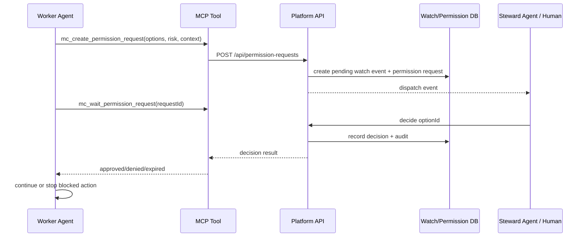
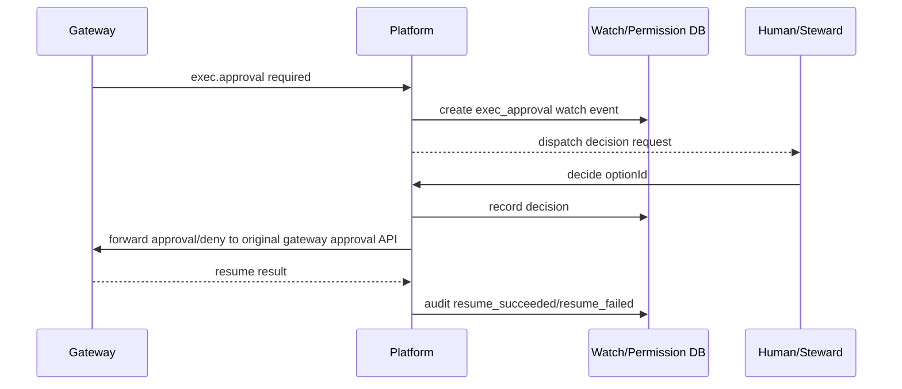
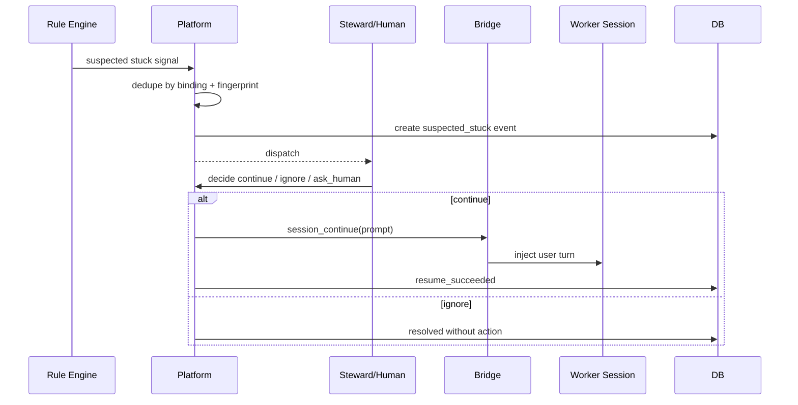

# PRD-人工值守 V2：结构化事件与决策闭环

## 1. 文档信息

| 项 | 内容 |
|----|------|
| 文档状态 | 草案（待评审） |
| 当前版本 | V2.0 |
| 更新时间 | 2026-06-15 |
| 所属产品 | Agent 指挥仓 / E-AgentCenter |
| 适用范围 | `mission-control` 中心服、`mission-control-client` 本地 Web、托盘托管启动会话、Bridge、MCP 工具 |
| 前置版本 | 人工值守 V1 规则编排、权限请求 V1.4、Gateway exec approval 镜像 |

## 2. 背景与问题

当前人工值守已经具备三类基础能力：

- 规则型值守：中心按 L1 空闲、L2 工具卡住、L3 确认关键词判断 Worker 是否需要介入，并通过 Bridge 向 Worker 会话代发 continue。
- 权限请求：`permission_requests` / `permission_request_decisions` 支持结构化选项、状态机、MCP 创建/等待/决策。
- Bridge 同步：中心可向边缘同步权限请求，边缘可回传值守 Agent 的决策，中心可回写 Gateway `exec.approval`。

但当前人工值守仍存在核心缺口：

1. **规则触发不可靠**：靠 transcript 关键词和空闲时间推断“需要人”，容易误判或漏判。
2. **值守事件不统一**：规则干预、权限请求、Gateway exec approval、Worker 卡住、确认选项是分散概念，无法形成统一生命周期。
3. **聊天回复和决策通道混用风险**：值守 Agent 回复“同意”不能等价于选择某个确认选项；必须通过专门接口改变平台状态。
4. **Worker 恢复执行机制不清晰**：不同来源的确认有不同恢复方式：MCP wait 返回、Gateway approval 回写、普通 continue 代发，缺少统一产品说明。
5. **审计链路不完整**：现有 `human_watch_interventions` 记录规则介入，`permission_requests` 记录审批，但无法把“值守事件 -> 决策 -> 回传 -> Worker 恢复”串成一条完整审计链。

## 3. 产品目标

人工值守 V2 的目标是把人工值守从“规则代发”升级为“结构化值守事件 + 决策回传 + 审计闭环”。

核心目标：

1. Worker、平台、Gateway、规则引擎都可以创建统一的 **值守事件**。
2. 每个值守事件都必须有明确的事件类型、风险等级、上下文、候选选项、恢复方式和审计状态。
3. 人类或值守 Agent 只能通过专门决策接口/MCP 工具提交选项，普通聊天回复不得改变事件状态。
4. 平台根据事件来源和恢复方式，把决策回传给 Worker、Gateway 或本地 Web。
5. 全链路可审计：事件创建、分派、值守判断、决策、回传、恢复结果、失败重试都要可查询。
6. 授权控制：人工值守和本地 CLI 提权继续受订阅 entitlement 控制；默认由值守 Agent 判断并通过结构化决策或结构化指令恢复 Worker，只有命中明确定义的高危动作策略时才升级到人类通知与人工审批。

## 4. 非目标

V2 不做以下事情：

1. 不接管用户自己在终端直接启动的 Codex/Claude。只有平台、本地 Web、托盘托管启动的会话自动注入 MCP 并纳入闭环。
2. 不通过屏幕自动点击 CLI/浏览器弹窗。若底层系统没有外部 API，Worker 必须通过 MCP 等待平台决策后自行继续。
3. 不把值守 Agent 的普通自然语言回复解析为审批结果。
4. 不通过值守 Agent 静默批准已定义的高危动作；这类事件必须先通知配置的人工通知地址，并等待人类在 Worker 会话或平台审批入口完成动作。
5. 不废弃规则引擎。规则引擎降级为“事件发现器”，不再作为最终决策依据。

## 5. 核心概念

| 概念 | 说明 |
|------|------|
| 值守事件 `watch_event` | 平台统一承载“需要外部判断/确认/审批/续接”的业务对象 |
| 权限请求 `permission_request` | 值守事件的一种决策载体，已有表和状态机可复用 |
| Worker Agent | 执行业务任务的智能体，会在需要外部选择时创建事件并等待结果 |
| 值守 Agent | 专用判断智能体，接收事件上下文；默认负责判断并通过 MCP/API 提交结构化决策或结构化恢复指令 |
| 人类审批人 | 仅在命中高危动作策略、值守无法判断、策略要求升级时介入；可在 Worker 会话回复或平台 UI 审批 |
| 通知地址 | 值守 Agent 或租户策略中的人工通知目标，可是 webhook、企业 IM、邮件、短信或平台内通知 |
| 恢复方式 `resume_strategy` | 决策后平台如何让 Worker 继续：MCP wait 返回、Gateway approval 回写、Bridge continue、仅通知 |
| 风险等级 | `low`、`medium`、`high`、`critical`，其中是否升级人工以高危动作策略命中为准，不仅按等级判断 |
| 决策选项 | 明确的 option id + label + action，不允许自然语言替代 |
| 审计闭环 | event_created -> dispatched -> decision_submitted -> resume_attempted -> resumed/failed |

## 6. 值守事件类型

### 6.1 Worker 主动确认

Worker 在托管会话中判断需要外部确认时，通过 MCP 创建事件。

典型场景：

- 是否继续删除、覆盖、部署、发送、提交、购买、外呼。
- 是否选择 CLI 弹出的多个选项。
- 是否允许进入提权模式。
- 是否把任务交给下一个 Agent。

触发原理：

- 平台/托盘/本地 Web 启动的托管 Codex 会话会注入平台操作规则。
- 规则要求：需要确认、授权、allow/deny、continue/cancel 或选项选择时，必须调用 `mc_create_permission_request` 并随后 `mc_wait_permission_request`。
- Worker 收到结构化结果后，按被批准的 option 自行继续或停止。

### 6.2 Gateway / 执行审批

Gateway 或底层执行器产生 `exec.approval` 时，由平台镜像为值守事件。

恢复方式：

- 平台决策后必须回写 Gateway 原审批接口。
- 仅更新平台状态但不回写 Gateway，视为未完成。

### 6.3 规则发现的疑似卡住

规则引擎仍可监听 transcript，生成 `suspected_stuck` 类型值守事件。

定位变化：

- V1：规则命中后可直接代发。
- V2：规则命中先创建事件，值守 Agent 或人类再决策是否介入。

默认策略：

- 默认先交给值守 Agent 判断。
- 值守 Agent 可以通过结构化决策选项或结构化指令让平台恢复 Worker。
- 只有命中高危动作策略，或值守 Agent 判断置信度不足时，才调用通知通道推送到配置的人工通知地址，并等待人类处理。
- 人类可以回到 Worker 会话手工回复，也可以在平台值守事件详情中完成审批动作。

### 6.4 平台调度交接

当一个 Agent 完成阶段性任务，需要交给下一个 Agent 或确认是否进入下一阶段时，平台创建 `handoff_approval` 事件。

恢复方式：

- 批准后调度器创建下一任务或发送下一条平台指令。
- 拒绝后停止流水线并记录原因。

## 7. 角色与权限

| 角色 | 能力 |
|------|------|
| Worker Agent | 创建值守事件，等待决策结果，按结构化结果继续或停止 |
| 值守 Agent | 读取被分派事件上下文，默认负责判断、回复结构化指令或提交结构化决策；命中高危动作策略时负责升级通知而不是静默批准 |
| 人类审批人 | 收到高危动作通知后，可回到 Worker 会话回复，或在平台审批入口完成决策 |
| 租户管理员 | 配置值守策略、绑定关系、风险阈值、人工通知地址、配额和审计导出 |
| 平台系统 | 路由事件、执行恢复、超时、重试和审计 |

授权约束：

- `enableHumanWatch=false`：不得创建值守 Agent、绑定值守、分派值守事件。
- `enableLocalCliElevation=false`：本地 CLI 提权事件只能拒绝或提示升级订阅。
- 默认处理链路为值守 Agent 审批；策略命中高危动作清单时升级到人工通知。
- 通知地址未配置时，命中高危动作策略的事件必须停留在平台待审批队列，不得自动通过。
- 风险等级只作为策略输入之一；是否升级人工由高危动作策略决定。系统默认高危动作包括删除、卸载、覆盖、批量修改、生产部署、付款/购买、外部发送、权限提升、密钥/凭证访问和不可逆操作。

## 8. 功能需求

### FR-V2-001 统一值守事件模型

系统必须引入统一值守事件模型，承载以下字段：

- `id`
- `workspace_id`
- `tenant_id`
- `client_id`
- `binding_id`
- `source`：`worker_mcp`、`gateway_exec_approval`、`rule_engine`、`scheduler`、`system`
- `event_type`：`permission_choice`、`exec_approval`、`suspected_stuck`、`handoff_approval`、`human_confirmation`
- `risk`：`low`、`medium`、`high`、`critical`
- `status`：`pending`、`assigned`、`decided`、`resuming`、`resolved`、`failed`、`expired`、`cancelled`
- `title`
- `prompt`
- `options`
- `context`
- `resume_strategy`
- `linked_permission_request_id`
- `linked_gateway_approval_id`
- `notification_targets`
- `notify_status`
- `worker_session_id`
- `created_at`、`updated_at`、`expires_at`

V2 可以复用 `permission_requests` 作为第一阶段实现，但产品概念必须对外统一为“值守事件”。

### FR-V2-002 Worker 主动触发

托管 Worker 会话必须具备以下行为：

1. 平台启动时注入 MCP 和平台操作规则。
2. 当模型判断需要外部确认时，调用 `mc_create_permission_request`。
3. 调用 `mc_wait_permission_request` 阻塞等待结构化决策。
4. 只有 approved 选项才能继续被阻塞动作。
5. denied / expired / cancelled 必须停止对应动作并说明结构化结果。

验收标准：

- Worker 只发聊天文本“是否继续？”不应被视为值守事件。
- Worker 通过 MCP 创建事件后，平台 UI 和值守 Agent 都能看到同一事件。

### FR-V2-003 值守 Agent 决策

值守 Agent 接到事件后必须：

1. 读取事件上下文、选项、风险等级和策略。
2. 默认优先由值守 Agent 判断并选择结构化动作：`approve`、`deny`、`continue_with_prompt`、`ask_human`。
3. 对普通风险可调用 `mc_decide_permission_request` 提交 option，或生成结构化 `bridge_continue` 指令让平台下发给 Worker。
4. 对命中高危动作策略的事件必须选择 `ask_human` 或触发 `notify_human`，平台推送到配置的人工通知地址。
5. 决策必须包含 `optionId` 和 `reason`；结构化恢复指令必须包含恢复方式和 prompt/参数。
6. 平台必须记录 `decider_type=steward_agent` 和 `decider_agent_id`。

### FR-V2-003b 人工通知地址

系统必须支持在值守 Agent 或租户策略中配置人工通知地址：

- `notification_targets[]`
- 支持类型：`platform_inbox`、`webhook`、`email`、`sms`、`enterprise_im`
- 每个 target 包含 `type`、`name`、`url/address`、`enabled`、`risk_threshold`
- 可配置触发条件：`dangerous_action_match`、`confidence_below`、自定义规则表达式；`risk=high/critical` 只作为辅助条件，不能单独作为默认人工审批条件。
- 通知内容必须包含事件标题、风险、Worker、客户端、摘要、平台审批链接和建议动作。

通知后的人工处理方式：

1. 人可以打开平台审批链接，直接选择 option。
2. 人可以回到 Worker 会话手工回复；Worker 或本地托管端必须把这次回复通过 MCP/API 回写平台，形成 `worker_human_reply` 决策来源，平台收到并校验后才把事件标记为审批完成。
3. 人未处理且事件超时，状态转 `expired`，Worker 不继续危险动作。

无论决策入口来自平台 UI、值守 Agent、Worker 会话内的人类回复，最终都必须进入平台统一决策 API，由平台统一写入状态、决策记录和审计轨迹。任何只在 Worker 本地生效、没有回写平台的回复，都不能视为审批完成，避免平台侧长期停留在等待审批状态。

### FR-V2-004 人类审批

平台 UI 必须提供统一待处理值守事件队列：

- 按风险、来源、状态、Worker、客户端节点过滤。
- 展示上下文、选项、推荐值守结论、历史审计。
- 提交决策时调用同一决策 API。
- 决策后状态实时同步给 Worker/边缘。
- Worker 会话内的人类回复也必须以结构化决策回写平台，展示为 `decider_type=human_user`、`decision_source=worker_session_reply`。

### FR-V2-005 决策回传与恢复

平台必须按 `resume_strategy` 执行恢复：

| resume_strategy | 使用场景 | 回传方式 |
|-----------------|----------|----------|
| `mcp_wait_return` | Worker 主动 MCP 创建并等待 | `mc_wait_permission_request` 返回结构化结果 |
| `gateway_exec_approval` | Gateway exec approval | 回写 Gateway 原审批接口 |
| `bridge_continue` | 规则发现的卡住，需要代发提示 | Bridge `session_continue` 写入 Worker 会话 |
| `scheduler_resume` | 多 Agent 调度交接 | 调度器推进下一阶段 |
| `notify_only` | 命中高危动作策略时只提醒人，不恢复执行 | 推送到配置通知地址和平台队列 |

恢复结果必须写审计：

- `resume_attempted`
- `resume_succeeded`
- `resume_failed`

### FR-V2-006 审计闭环

每个值守事件必须有完整审计事件：

- `watch_event_created`
- `watch_event_assigned`
- `decision_requested`
- `decision_submitted`
- `decision_rejected_by_policy`
- `resume_attempted`
- `resume_succeeded`
- `resume_failed`
- `watch_event_expired`
- `watch_event_cancelled`
- `worker_human_reply_received`
- `human_notification_sent`
- `human_notification_failed`
- `human_notification_acknowledged`
- `policy_evaluated`
- `decision_conflict_rejected`

审计必须可按以下维度查询：

- 租户
- Worker
- 值守 Agent
- 客户端节点
- 风险等级
- 事件类型
- 决策人/决策 Agent
- 时间范围

审计要求：

- 审计记录必须 append-only，不允许覆盖历史决策。
- 每次决策必须保存当时的事件上下文快照、风险策略版本、通知目标、决策来源和操作者身份。
- Worker 会话内人工回复如果无法绑定明确用户身份，必须标记为 `human_external`，并在审计中记录来源会话、消息 ID 和待补充身份状态。

### FR-V2-007 规则引擎降级为事件发现器

规则引擎不得直接等价于批准或执行。规则命中后：

1. 创建 `suspected_stuck` 值守事件。
2. 默认分派给值守 Agent；命中高危动作策略或低置信度时再升级给人类。
3. 决策后才允许 `bridge_continue`。

兼容灰度：

- 可保留旧 `auto_send`，但必须标记为 legacy，默认关闭。
- 新租户默认使用事件闭环模式。

### FR-V2-008 超时、重试与幂等

系统必须支持：

- 创建事件幂等 key，避免同一 Worker 重复创建同一事件。
- Worker 会话内人工回复幂等 key，避免本地重试导致重复批准。
- 等待超时后状态转 `expired`。
- 回传失败可重试，重试次数和间隔可配置。
- 同一事件只能有一个最终有效决策。
- 重复决策返回 409，不覆盖原决策。

### FR-V2-009 生产级异常与策略补充

系统还必须覆盖以下异常和策略：

1. **并发决策冲突**：平台 UI、值守 Agent、Worker 会话回复同时到达时，以平台状态机第一个合法最终决策为准，后续决策返回 409 并写 `decision_conflict_rejected` 审计。
2. **过期后回复**：事件已 `expired/cancelled/resolved` 后收到 Worker 回复，不得恢复 Worker，只能归档为 late reply。
3. **通知失败升级**：通知地址不可达时必须重试；重试失败后进入平台待处理队列并产生醒目告警，不得自动通过。
4. **边缘离线重连**：本地 Web/托盘离线期间产生的回复同步必须带事件状态版本；重连后平台重新校验状态，禁止离线旧回复覆盖新决策。
5. **策略优先级**：风险策略配置优先级必须明确，建议为 binding 覆盖 > 值守 Agent 配置 > 租户策略 > 系统默认。
6. **通知地址安全**：webhook、企业 IM、短信等敏感地址需要按密钥处理，不在普通 UI 和日志中明文展示。
7. **可观测性**：必须统计事件量、平均等待时长、通知成功率、恢复成功率、超时率、冲突率和高危人工介入率。
8. **上下文最小化**：通知内容不得泄露完整敏感上下文；完整上下文只能通过登录后的平台审批页查看。

系统默认高危动作清单：

- 删除文件、目录、数据库记录、云资源或生产数据。
- 卸载应用、删除本地服务、清理用户目录、停止关键进程。
- 覆盖已有文件、批量重命名、批量修改配置。
- 生产部署、重启生产服务、变更线上配置。
- 付款、购买、退款、外部转账。
- 对外发送邮件、短信、IM、工单、合同或客户通知。
- 获取、显示、导出、修改密钥、token、密码、证书。
- 本地 CLI 提权、系统权限提升、关闭安全校验。
- 其他由租户管理员配置为不可逆或高影响的动作。

## 9. 关键业务流程

### 9.1 Worker 主动确认流程

### 9.2 Gateway 审批流程

### 9.3 规则发现流程

## 10. 验收标准

1. Worker 主动创建事件后，平台 UI、值守 Agent 和审计中看到的是同一个事件。
2. 值守 Agent 只通过 MCP/API 决策，普通聊天回复不会改变状态。
3. 决策完成后 Worker 的 `mc_wait_permission_request` 能拿到结构化结果。
4. Gateway 审批完成后底层 Gateway 真实恢复或拒绝执行。
5. 规则命中不会直接代发，除非租户显式开启 legacy auto-send。
6. 每个事件都能追溯创建、分派、决策、回传、恢复结果。
7. 默认由值守 Agent 审批并提交结构化决策/指令；命中高危动作策略时必须推送到配置通知地址并等待人类处理。
8. 未开通人工值守的租户不能创建或分派值守事件。
9. 并发决策、过期回复、通知失败、边缘离线重连都有确定状态和审计记录。

## 11. 实施优先级

P0：

- 统一值守事件概念与数据模型。
- 将 `permission_requests` 包装为值守事件 V2 第一实现。
- UI 待处理队列统一展示权限请求、Gateway 审批、规则事件。
- 审计链路串联。

P1：

- 规则引擎改为创建 `suspected_stuck` 事件。
- 值守 Agent 默认处理未命中高危动作策略的事件。
- 回传结果统一状态机。

P2：

- 高级策略：多值守 Agent、投票、升级链、高危动作模板、值守质量评分。
- 企业模式接管终端直接启动的 Codex。
