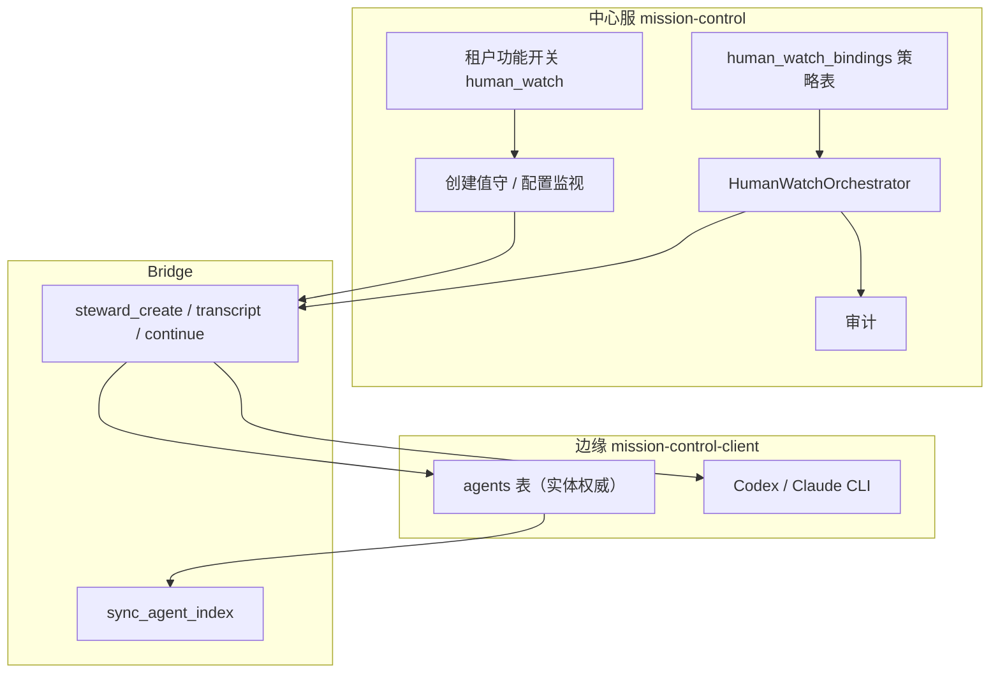

# PRD-人工值守

## 1. 文档信息

| 项 | 内容 |
|----|------|
| 文档状态 | 草案（待评审） |
| 当前版本 | V1.4 |
| 更新时间 | 2026-06-13 |
| 所属产品 | Mission Control（`mission-control` 中心服 + `mission-control-client` 边缘） |
| 关联总需求 | `文档/01-PRD/PRD-通用智能体中枢平台.md` |
| 后续文档 | 架构设计、程序设计、测试用例 — **待本 PRD 评审通过后编写** |

## 2. 背景

用户在边缘节点（Mac）上通过 Codex / Claude 等 CLI 智能体执行长任务时，会话常因以下原因挂起，需要人工介入：

1. Assistant 以问句、选项、确认话术等待用户回复。
2. 工具调用长时间无结果或卡在权限提示；权限提示必须有专门决策通道，不能只靠聊天回复。
3. Gateway 会话存在 `exec.approval` 审批，与聊天代发是不同通道。
4. Worker Agent 弹出确认选项时，值守 Agent 只能“回复建议”，无法把选项选择作为平台状态变更落库并唤醒 Worker。

Mission Control 已具备：智能体 ↔ 本地会话绑定、`/api/sessions/transcript`、`/api/sessions/continue`、Bridge 远程读写、异步 `enqueueLocalSessionPrompt`、聊天页 transcript 轮询/SSE 等能力，但**没有**「监视 Worker 会话 → 规则判定 → 代发续聊」的产品化闭环。

## 3. 问题定义

### 3.1 会话挂起不可恢复

Worker 智能体绑定 CLI 会话后，若用户不在聊天页或中心服查看远程会话，任务可能长时间停滞，无自动续行机制。

### 3.2 与「聊天 UX」混淆

聊天页的「发送中 / 思考状态」面向**人类操作者**；人工值守面向**后台编排**，二者不应共用 UI 状态机。

### 3.3 中心与边缘职责不清

Codex/Claude 会话文件与 CLI 在**边缘**；中心服 Docker 无法直接执行。值守能力必须是**中心策略 + 边缘执行**，不能做成纯中心服功能。

### 3.4 隐藏自动 Agent 可理解性差

早期方案为开关后自动创建 `hidden` Codex Agent，运维可见性差、易与 Worker 会话混淆。需改为**可见的专用值守智能体类型**，规则可配置。

## 4. 产品定位

**人工值守**是面向租户的**中心服高级能力**：在中心开通、选节点、配置「监视哪些 Worker」；**值守 Agent 实体与 CLI 仅在边缘创建**；中心编排经 Bridge 拉 transcript、代发 continue，并留存审计。

为 Worker 配置**专用值守智能体**后，编排监视 Worker 的会话 transcript；规则判定「需要人工确认」时，经 **API 向 Worker 会话注入一条 user 消息**（等同模拟人在聊天框发送），使主任务继续（二期 `exec.approval` 走审批 API）。

| 角色 | 职责 |
|------|------|
| **中心服（控制面）** | 租户功能开关、选 `client_id` 发起创建、监视绑定策略、编排、审计、配额 |
| **边缘 client（执行面）** | 创建值守 Agent、`provision-session`、执行 `enqueueLocalSessionPrompt` / continue |
| **Bridge + sync_agent_index** | Agent 列表镜像、transcript/continue RPC |

- **值守智能体**：可见、可配置；**在指定边缘节点创建**后同步至中心索引；创建时选择 **Claude / Codex** 运行时，列表归对应分组 +「值守」徽标；自有判官会话（L4），**不**绑定 Worker 的 `session_key`。
- **Worker 智能体**：普通干活 Agent；中心配置「启用值守 + 绑定值守 + 同 `client_id`」。

## 5. 目标

1. 支持创建 **人工值守** 专用智能体（`agent_kind` 标识），且创建向导可选择 **Claude / Codex**（与现有 bindable 类型一致），列表展示在对应框架分组下。
2. Worker 智能体可绑定一名值守智能体并启用/关闭值守。
3. 值守智能体详情页提供**与其他 Agent 不同的「值守配置」**，含规则触发、介入模式、监视对象、判官与代发策略。
4. 编排服务按配置执行 L1–L3 规则；命中则代发（可配置）；同卡点指纹去重；可选 30 分钟 LLM 扫漏。
5. **租户未开通时不可使用**；开通后中心 UI 可选客户端节点创建值守，并配置监视关系。
6. 编排服务**部署在中心**（有 license 才运行）；continue / provision **在边缘执行**（Bridge）。
7. **干预留痕（必做）**：每次判定与代发全量写入中心审计库，可查询、可导出，用于排障与问责。

## 6. 非目标（V1）

1. **不**在 V1 实现 Gateway `exec.approval` 自动审批（列为二期）；V1.4 仅实现平台级权限请求与决策 API，作为后续接入 Gateway/OpenClaw/Codex 审批的基础。
2. **不**要求中心服 `centralMode` 下直接 `POST /api/agents` 创建 Agent（仍走边缘或 Bridge）。
3. **不**用值守 Agent 的会话替代 Worker 会话做业务执行。
4. **不**在 V1 做复杂「运行中」双套规则集；采用「未命中规则 ≈ 在活动，命中 ≈ 需介入」+ 30 分钟 LLM 扫漏。
5. **不**在 V1 改造聊天页发送态逻辑（与值守编排解耦）。
6. **不**支持任意普通智能体被选为值守（仅 `human-watch` 类型可选）。

## 7. 用户与角色

| 角色 | 诉求 |
|------|------|
| 租户管理员 | 开通人工值守、在中心选节点创建值守、配置监视 Worker、查看审计 |
| 边缘操作者 | （可选）在本地 client 查看本机值守 Agent；执行由 Bridge 触发 |
| 中心服操作者 | 中心舰队/Worker 详情查看值守状态；依赖 Bridge 在线 |

## 8. 核心概念

| 概念 | 说明 |
|------|------|
| Worker 智能体 | 绑定业务 CLI 会话、执行任务的普通 Agent |
| 值守智能体 | `agent_kind: human_watch` + `framework`（`claude-code` / `codex-cli` 等），专用监视与判官 |
| 运行时类型 | 与普通 Agent 相同，决定判官 CLI、`provision-session` 种类及列表分组（Claude 组 / Codex 组） |
| 判官会话 | 值守 Agent 自有 `session_key`（与所选 framework 一致），仅用于 L4，不参与 Worker 业务 transcript |
| 监视对象 | 值守配置中的 Worker 列表；或 Worker 上的 `watch_agent_id` |
| 卡点指纹 | 末条 assistant 文本 hash / 未完成 tool id；同指纹不重复代发 |
| 介入 | 经 API 向 **Worker 会话** `continue` 一条 **user** 消息（模拟人发送） |
| 控制面 / 执行面 | 策略与编排在中心；Agent 与 CLI 在边缘 |
| `client_id` | 边缘 Bridge 节点标识；创建、监视、代发均不得跨节点 |

## 9. 控制面与执行面（V1.2）



**原则**

1. **创建**：中心发起 → 用户**必选 `client_id`** → Bridge `steward_create`（名称暂定）→ 边缘创建 Agent + `provision-session` → 回传 `local_agent_id` → 刷新 index；**不在中心 `INSERT` 完整 Agent 行**（`centralMode` 下 `POST /api/agents` 为 403）。
2. **监视绑定**：以中心 **`human_watch_bindings`** 为权威（租户级高级配置）；可选同步 Worker `config.watch_agent_id` 到边缘便于展示，**编排以中心为准**。
3. **编排**：仅中心运行（需 license）；经 Bridge 拉 Worker transcript、下发 continue。
4. **禁止**：跨 `client_id` 监视；中心 Docker 内直接跑 Codex/Claude 代发。

## 10. 核心场景

### 场景 1：中心开通并创建值守智能体（主路径）

租户已开通人工值守 → 中心「创建值守智能体」→ **选择客户端节点**（仅 Bridge 在线）→ 选择 Claude/Codex → 名称、soul、工作区 → 中心调 Bridge → **边缘**创建 `agent_kind=human_watch` 并 `provision-session` → 中心 `sync_agent_index` 可见，舰队中该 Agent 在对应类型分组下并带「值守」徽标；判官会话不出现在聊天会话列表。

### 场景 1b：边缘本地创建（可选）

边缘 client 非 `centralMode` 时，可在本地「添加智能体 → 人工值守」创建；若需享受中心编排与统一绑定，仍须在中心为该 `client_id` 登记并开通 license。

### 场景 2：中心配置监视 Worker

中心「人工值守 → 监视配置」或 Worker 详情：选择 **同一 `client_id`** 下的 Worker（来自合并后的 agents/index）→ 绑定值守 Agent（framework 一致）→ 写入 `human_watch_bindings`；编排开始监视该 Worker 的 `session_key` 会话。

### 场景 3：规则命中 → 组上下文 → API 代发

编排拉取 Worker transcript（规则用浅上下文，见 FR-003）→ L1–L3 命中（例：90s 无更新且末条像在确认）且指纹未处理 →（可选）值守判官 session 生成 `reply` 或使用 `prompt_template` → 中心经 Bridge 调用 **`sessions/continue`**，向 Worker 写入 **user** 轮次（模拟人发送）→ Worker CLI 继续执行。

### 场景 4：同卡点不连发

规则持续命中但 transcript 指纹未变 → **不再**代发；Worker 产生新 assistant/user 内容后指纹更新，可对新卡点再介入。

### 场景 5：30 分钟扫漏

自上次介入锚点 T 起 30 分钟内规则均未命中 → 可选触发值守 Agent 的判官会话（Claude/Codex）判断「真在长跑」则不动；「仍卡但规则漏报」则再代发或仅建议（按配置）。

### 场景 6：中心服查看远程 Worker

中心服用户对带 `client_id` 的 Worker 开启值守；编排经 Bridge 拉 transcript、下发 continue；Bridge 离线时 UI 提示不可用，不静默失败。

### 场景 7：关闭值守

Worker 关闭开关或解绑值守 Agent → 编排停止监视；历史审计保留。

## 11. 功能需求

### FR-000 租户与高级服务

1. 人工值守为**中心租户级功能**；未开通租户：中心 UI 不展示创建/绑定，编排不运行，边缘 RPC 拒绝（或需中心签发 token）。
2. 可配置配额：每租户值守 Agent 数量、每值守监视 Worker 数、每小时介入次数（默认建议 10 Worker/值守、6 次/小时）。

### FR-001 值守智能体类型、创建与同步

1. 系统支持 `agent_kind: human_watch`（与 `framework` 正交）。
2. **中心创建（主路径）**：
   - 入口：中心「人工值守 → 创建值守智能体」；
   - **必选 `client_id`**（Bridge 在线节点）；
   - 选择 Claude/Codex → 名称、soul、工作区；
   - 中心 → Bridge `steward_create_request` → 边缘创建 + `provision-session` → 返回 `local_agent_id`、`session_key`；
   - 中心更新策略/索引，舰队可见。
3. **边缘创建（辅路径）**：本地向导同 FR-001 原流程；若仅本地创建未登记中心，不纳入中心编排。
4. 创建向导（中心/边缘 UI 一致）：
   - **第一步**：运行时类型（Claude、Codex，仅已识别类型）；
   - 后续：名称、soul（判官预填）、工作区、provision。
3. 智能体列表展示：
   - 值守 Agent **归入对应 framework 分组**（Claude 组、Codex 组），与普通 Agent 并列；
   - 卡片增加 **「值守」徽标**，可选次要标签「人工值守」；
   - **不**单独占「仅值守」顶层分组（避免与用户对类型的认知割裂）。
4. 编排栏、任务派发等**不可**选择值守 Agent 作为执行对象（`isSelectableOperativeAgent` 排除 `agent_kind: human_watch`）。
5. V1 支持的值守 `framework`：**`claude-code`、`codex-cli`**（与现有 `BINDABLE_SESSION_KINDS` 对齐）；Cursor/OpenCode 等后续扩展。

### FR-002 中心监视绑定（Worker ↔ 值守）

1. **权威存储**：中心表 `human_watch_bindings`（示意字段）：
   - `tenant_id`、`client_id`
   - `worker_ref`（`sync_agent_index.id` 或 `client_id + local_agent_id`）
   - `steward_ref`（同上）
   - `enabled`、`mode`（`auto_send` | `suggest_only`）
   - `rules_override`（JSON，可选）
2. **中心 UI**：按 `client_id` 筛选 Worker 列表；为 Worker 选择值守 Agent；支持在值守详情配置 `watch_targets[]`（多 Worker）。
3. 下拉过滤：同 `client_id`；`human-watch` 类型；`framework` 与 Worker 会话 kind 一致。
4. 校验：租户已开通；Bridge 在线；禁止跨节点；禁止值守与 Worker 共用 `session_key`。
5. **可选镜像**：保存时 Bridge 同步 Worker `config.human_watch_enabled`、`watch_agent_id` 到边缘（展示用）；**编排读中心 bindings**。

### FR-003 值守智能体专用配置（值守 Tab）

仅在值守 Agent 详情展示「值守配置」，普通 Agent 不展示。配置项包括：

**监视对象**

- 多选 Worker 智能体（`watch_targets[]`）。
- 每项可覆盖：`mode`（`auto_send` | `suggest_only`）、`enabled`。

**触发规则（默认继承，可被 Worker 项覆盖）**

| 配置键 | 说明 | 默认建议 |
|--------|------|----------|
| `enabled` | 规则总开关 | true |
| `grace_after_prompt_seconds` | 发送/代发后静默期 | 30 |
| `idle_timeout_seconds` | transcript 无更新超时 (L1) | 90 |
| `stuck_signals` | `pending_tool` / `confirmation_text` (L2/L3) | 两者 |
| `confirmation_patterns` | 关键词/正则列表 | 可配置 |
| `require_combination` | 需 L1 ∧ (L2 ∨ L3) | true |
| `exclude_if_tool_active_within_seconds` | 近期有 tool 活动则排除 | 120 |

**介入行为**

| 配置键 | 说明 |
|--------|------|
| `default_mode` | `auto_send` / `suggest_only` |
| `fingerprint_dedupe` | 同卡点只代发一次，默认 true |
| `max_interventions_per_hour` | 限流 |
| `llm_sweep_enabled` | 30 分钟扫漏开关 |
| `llm_sweep_interval_minutes` | 默认 30 |

**判官与代发**

| 配置键 | 说明 |
|--------|------|
| `llm_enabled` | 是否启用 L4（值守 Agent 自有 Claude/Codex 判官会话） |
| `prompt_template` | 无 L4 时的固定代发文案 |

**上下文窗口**（`config.steward.context`，规则与判官分层）

| 配置键 | 默认 | 说明 |
|--------|------|------|
| `mode` | `since_last_user_turn` | 从本轮最后一条 user 起；可选 `since_last_intervention` |
| `rules_lookback_messages` | 12 | 仅 L1–L3 规则用 |
| `summary_max_messages` | 24 | 判官/L4 消息条数上限 |
| `summary_max_chars` | 32000 | 判官总字符上限 |
| `tool_result_max_chars` | 2000 | 单条 tool_result 截断 |
| `include_thinking` | false | 是否送入 thinking 块 |

拉取 transcript 时 API `limit` 可大于判官用量（如 80）；**组装给判官时再按上表裁剪**。

配置存储：值守规则主体在边缘 `agents.config.steward`（边缘创建时写入）；中心 bindings 可覆盖 `rules_override`。架构设计阶段定稿同步策略。

### FR-003b 代发机制（模拟人发送）

### FR-009 权限请求与选项决策闭环（V1.4）

当 Worker Agent 遇到“需要选择确认项”的场景，系统必须创建结构化权限请求，而不是只发一条聊天消息。

**权限请求对象**

- 表：`permission_requests`
- 状态：`pending`、`approved`、`denied`、`expired`、`cancelled`
- 风险：`low`、`medium`、`high`、`critical`
- 选项：`options[]`，每个选项包含 `id`、`label`、`action`（`approve` / `deny` / `ask_human`）
- 关联：`client_id`、Worker、本次 session、值守 Agent、binding、tenant/workspace

**决策入口**

```http
POST /api/permission-requests/{id}/decision
```

请求体：

```json
{
  "optionId": "approve_readonly",
  "reason": "只允许读取当前项目目录",
  "deciderType": "steward_agent",
  "deciderAgentId": "steward-9"
}
```

**规则**

1. 普通消息回复只能解释或建议，不能直接改变权限状态。
2. Worker 继续执行必须依赖 `permission_requests.status` 的状态变更。
3. 平台必须校验请求仍为 `pending`、未过期、`optionId` 属于本请求。
4. 值守 Agent 可审批 `low` / `medium` 风险；`high` / `critical` 风险只能拒绝或转人工，不允许自动批准。
5. 每次决策写入 `permission_request_decisions` 审计表，并广播 `permission.decided` 事件。
6. 后续 MCP 工具 `decide_permission_request` 必须调用同一 API，不允许另建旁路。

**验收**

- 创建权限请求后，人类或值守 Agent 可通过专门 API 选择选项。
- 重复决策被拒绝。
- 非法 `optionId` 被拒绝。
- 高风险请求不能被值守 Agent 自动批准。

1. 介入**必须**经现有发消息 API，向 **Worker** 会话写入 **user** 轮次，**不是**改 assistant 历史，**不是**值守会话代劳业务。
2. **推荐**：`POST /api/sessions/continue` + `kind`/`id`/`prompt`/`client_id` → 边缘 `enqueueLocalSessionPrompt`（与聊天页一致）。
3. **可选**：`POST /api/agents/message`（Worker 名 + `session_key`）；值守优先纯文本 continue，避免多余 `Message from` 前缀。
4. **Gateway Worker**：`POST /api/chat/messages`（`forward: true` + `sessionKey`）；V1 以 CLI Worker 为主。
5. 判官（L4）流程：Worker 摘要 → prompt **值守判官 session** → 得到短 `reply` → **仅** `continue` 进 Worker；不把整包上下文重复写入 Worker。
6. Phase 1 无 L4：规则命中 → 直接 `prompt_template` → `continue`。

### FR-004 编排服务（中心）

1. **`HumanWatchOrchestrator` 仅部署在中心**；租户 license 开启后运行。
2. 输入：中心 `human_watch_bindings` + 值守 `config.steward`（经 Bridge 拉取或缓存）。
3. 触发源：`session.transcript.updated` / Bridge `edge_transcript_changed` + 对活跃 binding 的兜底轮询（远程会话在 SSE 连接时仍建议 5s 级 transcript 拉取）。
4. 对每个 binding：`client_id` + Worker `session_key` → Bridge `session_transcript` → 规则（浅上下文）→ 决策。
5. 命中且指纹/限流通过 → 组 `reply` → Bridge `session_continue` 进 **Worker**。
6. `suggest_only`：写中心通知/活动流，不 `continue`。
7. 审计写入中心库。

### FR-005 规则语义（V1）

1. **未命中任何规则** → 视为在活动，不介入。
2. **命中** → 视为需人工确认 → 按 `default_mode` 执行（V1 以实现 `auto_send` 为主）。
3. **指纹去重**：非「时间冷却」；transcript 变化后指纹重置方可再发。
4. **30 分钟 LLM 扫漏**：仅监视中会话；须满足「近期有活动 + 自锚点 T 起规则未命中」等前置（详见架构）。

### FR-006 UI 可见性

| 位置 | 行为 |
|------|------|
| 智能体列表 | 值守 Agent 在 **Claude/Codex 等对应分组下** 展示，带「值守」徽标 |
| Worker 详情 | 开关 + 选择值守 |
| 值守详情 | 值守配置 Tab |
| 聊天会话列表 | **不展示** 值守专用判官会话（Claude/Codex 皆过滤） |
| Worker 聊天页 | 仅显示 Worker 绑定；可选只读「值守：XXX」 |
| 绑定下拉 | 不含 hidden 非值守 Agent；不含值守自身 |

### FR-007 Bridge 与 RPC（待架构细化）

| RPC / API | 方向 | 说明 |
|-----------|------|------|
| `steward_create_request` | 中心 → 边缘 | 创建值守 Agent + provision |
| `steward_config_update` | 中心 → 边缘 | 更新 `config.steward` |
| `session_transcript_request` | 中心 → 边缘 | 已有；拉 Worker transcript |
| `session_continue_request` | 中心 → 边缘 | 已有；代发 user 消息 |
| `steward_judge_request`（Phase 2） | 中心 → 边缘 | 值守判官 session 跑 L4 |

1. 所有 RPC 须带 `client_id`；目标节点 Bridge 离线则失败并 surfaced 到 UI。
2. Agent 列表同步沿用 `sync_agent_index` / 心跳上报，不新增全量 DB 复制。
3. 边缘不得在未授权租户下创建 `human_watch`（需中心 token 或配置同步）。

### FR-008 干预留痕（审计，Phase 1 必做）

人工值守的每次**判定**与**执行**均须留痕，不可仅写应用日志。留痕是安全、排障、误报追责的**关键能力**。

#### 8.1 须记录的事件类型

| 事件 `event_type` | 何时写入 | 说明 |
|-------------------|----------|------|
| `rule_evaluated` | 每次编排评估 Worker（可采样：仅 `decision≠noop` 或全量，**默认全量**） | 记录规则命中详情、是否 noop |
| `intervention_attempt` | 决定代发/建议前 | 拟发送内容摘要、模式 `auto_send`/`suggest_only` |
| `intervention_completed` | continue API 返回后 | 成功/失败、Bridge 错误码 |
| `intervention_skipped` | 指纹去重、限流、Bridge 离线 | 跳过原因 |
| `llm_sweep` | Phase 2 扫漏执行后 | 扫漏结论 stuck / running |

#### 8.2 存储（中心权威）

- 专用表 **`human_watch_interventions`**（append-only，禁止 UPDATE/DELETE 业务接口）。
- **不**仅依赖 `activities` 流（可作可选镜像到活动流，但结构化查询以专用表为准）。
- 字段（示意）：

| 字段 | 说明 |
|------|------|
| `id` | 自增主键 |
| `tenant_id` / `workspace_id` | 租户隔离 |
| `client_id` | 边缘节点 |
| `binding_id` | 关联 `human_watch_bindings` |
| `worker_ref` / `steward_ref` | Agent 引用（index id + 名称快照） |
| `worker_session_id` | Worker `session_key` |
| `event_type` | 上表 |
| `decision` | `noop` / `auto_send` / `suggest_only` / `skipped` |
| `rules_hit` | JSON：命中的 L1/L2/L3 明细 |
| `fingerprint` | 卡点指纹 |
| `prompt_preview` | 代发/建议正文前 500 字符 |
| `prompt_sha256` | 全文哈希（便于去重比对） |
| `outcome` | `success` / `failed` / `skipped` |
| `error_message` | 失败原因 |
| `bridge_request_id` | 关联 Bridge RPC（若有） |
| `llm_sweep` | 0/1 |
| `created_at` | Unix 时间 |

#### 8.3 API 与 UI

1. `GET /api/human-watch/interventions?worker_ref=&client_id=&since=&limit=` — 分页查询（默认最近 50，最大 200）。
2. Worker 详情 / 值守详情：**「干预记录」** Tab 或折叠面板，时间倒序。
3. 中心管理员：`GET /api/export?type=human_watch_interventions&format=csv`（Phase 1 可与 JSON 二选一，CSV 可 Phase 1.1）。
4. 保留策略：默认 **90 天**（租户可配置，架构阶段定）。

#### 8.4 非功能

1. **写入与代发解耦**：continue 失败也须写 `intervention_completed`（`outcome=failed`）。
2. **幂等**：同一 `fingerprint` + `event_type=intervention_completed` + `success` 仅一条（防重试重复）。
3. **性能**：异步批量写 acceptable，但延迟 **&lt; 2s** 可查。
4. **隐私**：`prompt_preview` 可受租户策略脱敏（Phase 2）；V1 全量存 preview。

#### 8.5 验收（留痕专项）

1. 规则命中并代发成功 → 至少 1 条 `intervention_completed` + 可关联 `rule_evaluated`。
2. 指纹去重跳过 → 有 `intervention_skipped`（`reason=fingerprint_duplicate`）。
3. Bridge 离线 → 有 `intervention_skipped`（`reason=bridge_offline`），**无**假成功记录。
4. Worker 详情可查看最近 20 条；中心导出/列表 API 返回正确租户数据。

## 12. 非功能需求

| 类别 | 要求 |
|------|------|
| 可靠性 | 代发失败可重试；须幂等（指纹去重） |
| 性能 | 单 Worker 规则评估 < 200ms（不含 LLM）；LLM 仅命中或扫漏时调用 |
| 安全 | 代发内容受租户策略约束；审计不可篡改（append-only） |
| 成本 | 默认规则不调用 L4；扫漏 30min/会话上限 |
| 兼容 | 与现有 `session_key` 绑定、by-session、continue 兼容 |

## 13. 配置优先级

1. 中心 `human_watch_bindings.rules_override`（若存在）。
2. 值守 Agent `config.steward.rules`（边缘，经 Bridge 读）。
3. 中心 `watch_targets[]` 项级覆盖（若启用多 Worker 配置）。
4. 系统默认模板。

## 14. 分期

### Phase 0 — 控制面与创建

- 租户功能开关 + `human_watch_bindings` 表
- 中心「选 client 创建值守」+ Bridge `steward_create`
- `sync_agent_index` 展示 + 舰队徽标
- 列表/聊天会话过滤判官 session

### Phase 1 — 中心编排 + 模板代发 + **干预留痕**（MVP）

- 中心 `HumanWatchOrchestrator` L1–L3
- Bridge continue 代发 + 指纹去重
- `prompt_template`；上下文 `rules_lookback` / 判官裁剪常量
- **`human_watch_interventions` 表 + 写入 + 查询 API + Worker/值守详情 UI**
- 无 L4

### Phase 2 — 判官 LLM + 扫漏

- 值守判官 L4（Claude/Codex 依 framework）
- 30 分钟扫漏
- `suggest_only` 通知 UI

### Phase 3 — 审批与策略

- `exec.approval` 联动
- 中心租户级策略、配额

## 15. 验收标准（V1 / Phase 1）

1. 未开通租户无法创建/绑定；开通后中心可选 `client_id` 创建 Claude/Codex 值守，边缘实际落库，中心舰队可见且带值守徽标；聊天列表无判官 session。
2. 中心 `human_watch_bindings` 可为同节点 Worker 绑定值守；跨 `client_id` 保存被拒绝。
3. Codex Worker 仅可绑 Codex 值守；framework 不一致被拒绝。
4. Bridge 离线时中心 UI 提示，编排不代发。
5. 规则命中 → 中心经 Bridge `continue` → Worker transcript 出现新 **user** 消息；与人工在聊天框发送等价。
6. 同卡点不重复代发；新回合可再代发。
7. 值守 Agent 不可被选为编排执行对象。
8. **干预留痕**：代发/跳过/失败均可查；Worker 详情最近 20 条；字段含 client_id、规则命中、指纹、结果（见 FR-008.5）。

## 16. 风险与依赖

| 风险 | 缓解 |
|------|------|
| 误报代发带偏任务 | 组合规则 + 指纹 + `suggest_only` 可选；审计 |
| CLI 权限挂起 transcript 不变 | 超时规则 + 30min 扫漏；文档说明局限 |
| 中心无法创建 Agent | Bridge 创建/更新 RPC |
| Token 成本 | L4 默认关；扫漏可关 |

**依赖**：Bridge `session_transcript` / `session_continue`、Worker `session_key`、边缘 `enqueueLocalSessionPrompt`。

## 17. 开放问题（评审待定）

1. `suggest_only` 通知呈现位置（通知中心 vs Worker 详情）。
2. 单值守 Agent 监视 Worker 数量上限（建议默认 10）。
3. Phase 2 是否扩展 Cursor / OpenCode 值守类型。
4. 边缘本地创建是否必须经中心登记才纳入编排（建议：是）。
5. `human_watch_bindings` 与边缘 `agents.config` 双写的一致性强同步还是最终一致（建议：中心权威 + 异步镜像）。

## 18. 修订记录

| 版本 | 日期 | 说明 |
|------|------|------|
| V1.0 | 2026-05-19 | 初稿：专用值守 Agent + Worker 绑定 + 值守 Tab 规则配置 |
| V1.1 | 2026-05-19 | 值守 Agent 可选 Claude/Codex 运行时，列表归对应类型分组 + 值守徽标；Worker 绑定须 framework 一致 |
| V1.2 | 2026-05-19 | 控制面/执行面分离；中心高级服务+选 client 创建；`human_watch_bindings`；中心编排；上下文窗口与 API 代发（模拟 user）；Bridge RPC 清单 |
| V1.3 | 2026-05-19 | FR-008 强化：干预留痕 Phase 1 必做；`human_watch_interventions` 表、事件类型、API/UI、验收 |
