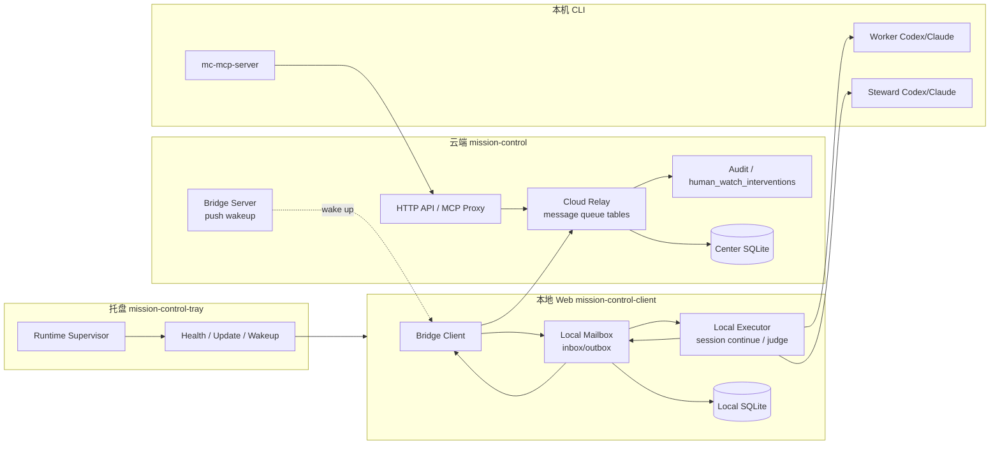
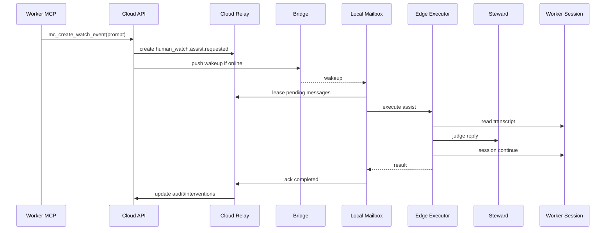
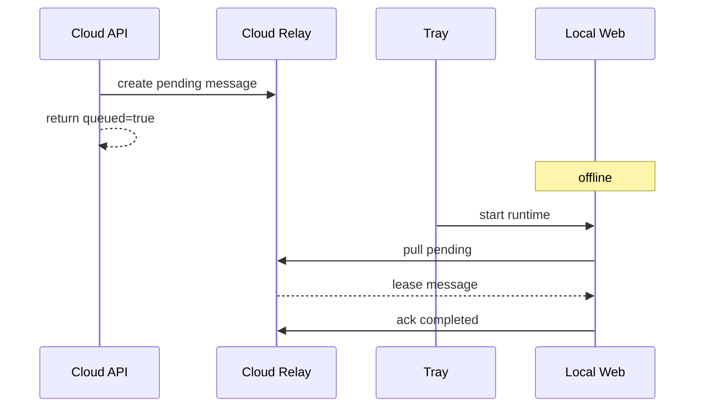
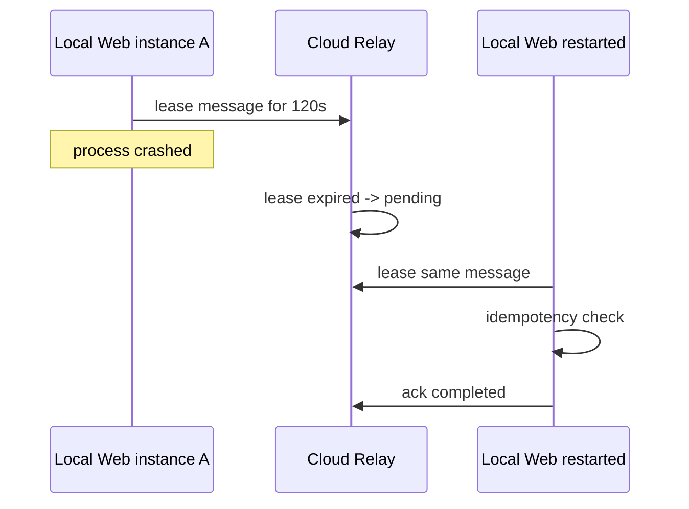

# 架构设计-人工值守-三端协同通信优化

## 1. 设计目标

建立云端服务端、本地 Web/Edge、托盘客户端之间的可靠通信架构，使人工值守、权限审批和会话续写不再依赖 Bridge 实时在线。架构采用“云端持久 relay + 本地 mailbox + 托盘 supervisor”的三层模型。

## 2. 总体架构



核心原则：

1. 云端是跨端消息事实源。
2. 本地 Web 是执行事实源。
3. 托盘是本机进程 supervisor，不直接处理业务消息。
4. Bridge push 只负责唤醒；消息是否处理以 pull/lease/ack 为准。
5. 同一 Worker session 的写入必须串行。

## 3. 模块边界

### 3.1 Cloud Relay

位置：`mission-control`。

职责：

- 接收人工值守、权限决策、session continue 等跨端消息。
- 维护 `edge_messages` 状态机。
- 提供 message create / lease / ack / fail / cancel API。
- 按 client/session/agent 做幂等与串行控制。
- 与 `human_watch_interventions`、`permission_requests` 建立追踪关系。

不负责：

- 不直接读取本机 CLI 文件。
- 不直接执行 Codex/Claude。
- 不把消息 payload 中的 token 原样落库。

### 3.2 Local Mailbox

位置：`mission-control-client`。

职责：

- 周期性从 Cloud Relay 拉取目标 `client_id` 的消息。
- 将消息保存到本地 `local_message_inbox`。
- 领取后执行本地动作。
- 将执行结果写入 `local_message_outbox`。
- 网络恢复后上传 outbox 并 ack 云端。

不负责：

- 不做租户授权最终裁决。
- 不生成云端全局 message_id。

### 3.3 Tray Supervisor

位置：`mission-control-tray`。

职责：

- 启动本地 Web runtime。
- 保证本地 Web 版本满足中心 manifest。
- 监测本地 Web health。
- 触发本地 mailbox drain。
- 展示连接状态和 backlog。

不负责：

- 不直接执行人工值守 judge。
- 不直接写 Worker session。

### 3.4 Bridge

Bridge 继续保留：

- 在线连接状态。
- 实时 push 唤醒。
- 原有 transcript/continue RPC 的兼容路径。

新增约束：

- 对接入可靠消息的链路，Bridge 不作为唯一事实源。
- 客户端收到 push 后必须调用 relay pull，不直接信任 push payload 执行业务。

## 4. 数据架构

### 4.1 云端表 `edge_messages`

建议字段：

```sql
CREATE TABLE edge_messages (
  id TEXT PRIMARY KEY,
  schema_version INTEGER NOT NULL DEFAULT 1,
  workspace_id INTEGER NOT NULL,
  tenant_id INTEGER NOT NULL,
  client_id TEXT NOT NULL,
  direction TEXT NOT NULL,
  type TEXT NOT NULL,
  status TEXT NOT NULL,
  correlation_id TEXT NOT NULL,
  idempotency_key TEXT NOT NULL,
  agent_ref_json TEXT,
  session_ref_json TEXT,
  payload_json TEXT NOT NULL,
  result_json TEXT,
  lease_owner TEXT,
  lease_expires_at INTEGER,
  attempt_count INTEGER NOT NULL DEFAULT 0,
  max_attempts INTEGER NOT NULL DEFAULT 5,
  next_attempt_at INTEGER,
  last_error_code TEXT,
  last_error_message TEXT,
  created_at INTEGER NOT NULL,
  updated_at INTEGER NOT NULL,
  completed_at INTEGER,
  cancelled_at INTEGER
);
```

索引：

```sql
CREATE UNIQUE INDEX idx_edge_messages_idempotency
  ON edge_messages(tenant_id, client_id, idempotency_key);

CREATE INDEX idx_edge_messages_pull
  ON edge_messages(client_id, status, next_attempt_at, created_at);

CREATE INDEX idx_edge_messages_correlation
  ON edge_messages(correlation_id, created_at);
```

### 4.2 云端表 `edge_message_events`

记录状态变化：

- `message_id`
- `event_type`
- `from_status`
- `to_status`
- `detail_json`
- `created_at`

用于审计和排障。

### 4.3 本地表 `local_message_inbox`

字段：

- `message_id`
- `client_id`
- `type`
- `status`
- `payload_json`
- `idempotency_key`
- `lease_expires_at`
- `received_at`
- `started_at`
- `completed_at`
- `last_error`

### 4.4 本地表 `local_message_outbox`

字段：

- `id`
- `message_id`
- `type`
- `payload_json`
- `status`
- `attempt_count`
- `next_attempt_at`
- `created_at`
- `sent_at`

## 5. 消息执行流程

### 5.1 人工值守 assist



### 5.2 离线补偿



### 5.3 Lease 超时重试



## 6. 幂等与串行

### 6.1 幂等键

建议规则：

| 类型 | 幂等键 |
|------|--------|
| `human_watch.assist.requested` | `assist:{binding_id}:{worker_session_id}:{fingerprint}` |
| `session.continue.requested` | `continue:{client_id}:{session_kind}:{session_id}:{content_hash}` |
| `permission.decision.requested` | `permission-decision:{request_id}:{selected_option_id}` |

### 6.2 串行键

`serial_key = client_id + ":" + session_kind + ":" + session_id`

Cloud Relay 只允许同一个 `serial_key` 同时存在一个 `leased` 的 continue/assist 执行消息。

## 7. Capability 握手

客户端连接云端时上报：

```json
{
  "client_id": "mc-edge-xxx",
  "runtime_version": "2.1.19",
  "tray_version": "0.1.0",
  "capabilities": {
    "reliable_mailbox": true,
    "human_watch_assist_v2": true,
    "permission_decision_relay": true,
    "serial_session_continue": true
  },
  "mailbox": {
    "pending": 0,
    "processing": 0,
    "failed": 0,
    "outbox": 0
  }
}
```

云端根据 capability 选择：

- 新客户端：走 relay + mailbox。
- 旧客户端：保留实时 Bridge RPC，失败时返回离线错误。

## 8. 兼容策略

1. 所有新增 API 使用 `/api/edge/messages/*` 前缀，不破坏旧接口。
2. `/api/human-watch/assist` 增加 `delivery_mode`：
   - `sync`：旧行为，尝试实时执行。
   - `queue`：只入队。
   - `auto`：优先队列，在线立即唤醒。
3. 旧客户端不支持 mailbox 时，服务端仍按 2.1.18 行为返回 503。
4. 支持 mailbox 的客户端离线时返回 `queued=true`。

## 9. 安全架构

- Cloud Relay API 使用现有 `requireRole` 或 Edge scoped token。
- Edge pull/ack 必须校验 `client_id` 与 token 绑定。
- 消息 payload 必须做字段白名单，不允许透传 token。
- 高风险权限审批仍由 `permission_requests` API 强制校验。
- `human_watch.assist.requested` 执行前再次校验 binding 是否启用。

## 10. 可观测与排障

新增 UI/API 诊断字段：

- `client.connected`
- `bridge.connected`
- `runtime.healthy`
- `mailbox.pending`
- `mailbox.leased`
- `mailbox.failed`
- `mailbox.dead_letter`
- `last_pull_at`
- `last_ack_at`
- `last_error`

排障映射：

| 现象 | 优先检查 |
|------|----------|
| assist 返回 queued 但不执行 | 客户端 mailbox pull、托盘 runtime、Bridge token |
| 重复回复 | idempotency key、本地 execution log、serial lock |
| 只服务端有消息，本地无记录 | Edge pull 鉴权、client_id 绑定 |
| 本地执行成功但云端仍 pending | local outbox 上传、ack API、网络 |
| dead letter 增长 | payload schema、客户端版本、授权状态 |

## 11. 发布策略

分阶段：

1. Phase A：云端表/API + UI 只读诊断。
2. Phase B：本地 mailbox pull/ack + 托盘触发 drain。
3. Phase C：人工值守 assist 接入 relay。
4. Phase D：permission decision 和 session continue 接入 relay。
5. Phase E：默认启用，旧实时 RPC 作为 fallback。

