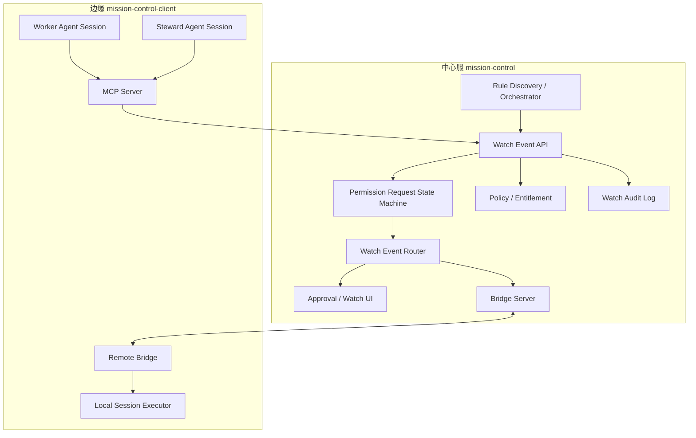
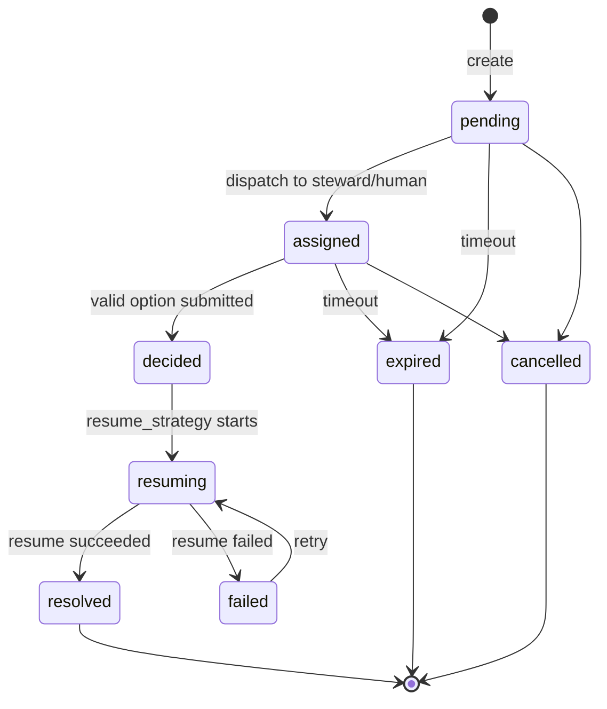

# 架构设计-人工值守 V2：结构化事件与决策闭环

## 1. 设计目标

人工值守 V2 的架构目标是把现有规则干预、权限请求、Gateway 执行审批和值守 Agent 判断统一到同一条状态机：

```text
事件创建 -> 事件分派 -> 决策提交 -> 决策校验 -> 回传恢复 -> 审计归档
```

设计原则：

1. 中心服是值守事件和审计的权威。
2. 边缘端负责执行 Worker 会话、MCP 工具、本地恢复动作。
3. Worker 必须通过 MCP/API 主动创建结构化事件，不能靠自然语言回复完成审批。
4. 规则引擎只负责发现疑似卡点，不负责最终决策。
5. 所有恢复动作必须有明确外部接口或 Worker 自行继续，平台不做屏幕点击式自动化。

## 2. 现有能力复用评估

| 现有能力 | 当前状态 | V2 复用方式 |
|----------|----------|-------------|
| `permission_requests` | 已有创建、等待、决策、状态机 | 作为 V2 `watch_event` 的第一类实现 |
| `permission_request_decisions` | 已有决策记录 | 继续记录结构化 option 决策 |
| MCP 工具 | 已有 `mc_create_permission_request` / `mc_wait_permission_request` / `mc_decide_permission_request` | Worker 与值守 Agent 的主通道 |
| 托管会话规则注入 | 已有平台操作规则 | 继续要求托管 Worker 在需要确认时调用 MCP |
| Bridge 同步 | 已有 `permission_request_sync` / `permission_decision_sync` | 中心和边缘状态同步 |
| Gateway 回写 | 已有 permission decision -> exec approval forward | 作为 `gateway_exec_approval` 恢复策略 |
| `human_watch_interventions` | 已有规则干预审计 | V2 可迁移为 watch event audit 或作为兼容视图 |
| `human-watch-orchestrator` | 规则评估 + continue 代发 | 改为事件发现与分派，不直接代发 |

## 3. 目标逻辑架构



## 4. 数据模型

### 4.1 第一阶段：复用 permission_requests

短期不必立即新增 `watch_events` 表，可用 `permission_requests.context_json` 承载 watch event 元数据：

```json
{
  "watch_event": {
    "source": "worker_mcp",
    "event_type": "permission_choice",
    "resume_strategy": "mcp_wait_return",
    "linked_gateway_approval_id": null,
    "notification_targets": ["platform_inbox:ops", "webhook:security"],
    "notify_status": "not_required",
    "fingerprint": "client:agent:session:hash",
    "dispatch": {
      "steward_agent_id": "agent-123",
      "assigned_at": 1781500000
    }
  }
}
```

优点：

- 直接复用现有 API、MCP、状态机和单测。
- 先把产品闭环跑通，降低迁移风险。

缺点：

- 审计事件粒度不够完整。
- `permission_requests` 名称不能覆盖所有值守事件语义。

### 4.2 第二阶段：新增 watch_events / watch_event_audit

建议新增：

```sql
CREATE TABLE watch_events (
  id TEXT PRIMARY KEY,
  workspace_id INTEGER NOT NULL,
  tenant_id INTEGER,
  client_id TEXT,
  binding_id INTEGER,
  source TEXT NOT NULL,
  event_type TEXT NOT NULL,
  risk TEXT NOT NULL,
  status TEXT NOT NULL,
  title TEXT NOT NULL,
  prompt TEXT NOT NULL,
  options_json TEXT NOT NULL,
  context_json TEXT,
  resume_strategy TEXT NOT NULL,
  linked_permission_request_id TEXT,
  linked_gateway_approval_id TEXT,
  worker_sync_index_id INTEGER,
  worker_local_agent_id INTEGER,
  worker_name TEXT,
  worker_session_id TEXT,
  steward_sync_index_id INTEGER,
  steward_local_agent_id INTEGER,
  steward_name TEXT,
  selected_option_id TEXT,
  decision_reason TEXT,
  decision_source TEXT,
  decision_idempotency_key TEXT,
  policy_version TEXT,
  event_version INTEGER NOT NULL DEFAULT 1,
  decider_type TEXT,
  decider_user_id INTEGER,
  decider_agent_id TEXT,
  decided_at INTEGER,
  expires_at INTEGER,
  created_at INTEGER NOT NULL DEFAULT (unixepoch()),
  updated_at INTEGER NOT NULL DEFAULT (unixepoch())
);

CREATE TABLE watch_event_audit (
  id INTEGER PRIMARY KEY AUTOINCREMENT,
  event_id TEXT NOT NULL,
  workspace_id INTEGER NOT NULL,
  tenant_id INTEGER,
  event_name TEXT NOT NULL,
  actor_type TEXT,
  actor_id TEXT,
  status_from TEXT,
  status_to TEXT,
  detail_json TEXT,
  created_at INTEGER NOT NULL DEFAULT (unixepoch())
);
```

迁移策略：

- V2.1：保留 `permission_requests`，新增 `watch_events` 与其 1:1 link。
- V2.2：UI 和 API 切到 `/api/watch-events`。
- V2.3：`human_watch_interventions` 变成兼容查询视图或仅保留历史。

## 5. 状态机



状态约束：

- `pending/assigned` 才能提交决策。
- `decided/resolved/failed/expired/cancelled` 不接受第二个最终决策。
- 决策写入必须带状态条件或 `event_version` 乐观锁，避免并发覆盖。
- 默认由值守 Agent 先判断并提交结构化决策或结构化恢复指令。
- 命中高危动作策略时，值守 Agent 不直接恢复 Worker，而是触发通知并将事件转入人工处理。
- `ask_human` / `notify_human` 不算最终批准，可把事件重新分派给人类。
- 人类在 Worker 会话内回复后，Worker 或本地托管端必须调用平台决策 API 或发送 `worker_human_reply_sync`，由平台校验并写入最终决策；本地聊天回复本身不直接改变平台状态。

## 6. API 设计

### 6.1 创建值守事件

第一阶段复用：

```http
POST /api/permission-requests
```

建议新增兼容 API：

```http
POST /api/watch-events
```

请求：

```json
{
  "source": "worker_mcp",
  "event_type": "permission_choice",
  "risk": "medium",
  "title": "确认是否执行部署",
  "prompt": "Worker 准备执行生产部署，需要确认。",
  "options": [
    { "id": "approve", "label": "允许部署", "action": "approve" },
    { "id": "deny", "label": "取消部署", "action": "deny" },
    { "id": "ask_human", "label": "转人工", "action": "ask_human" }
  ],
  "resume_strategy": "mcp_wait_return",
  "client_id": "client-1",
  "worker_session_id": "codex-session-id",
  "context": {
    "command": "deploy production",
    "diff_summary": "..."
  }
}
```

### 6.2 提交决策

第一阶段复用：

```http
POST /api/permission-requests/{id}/decision
```

建议新增：

```http
POST /api/watch-events/{id}/decision
```

请求：

```json
{
  "optionId": "approve",
  "reason": "变更已检查，风险可接受",
  "deciderType": "human_user",
  "decisionSource": "platform_ui",
  "idempotencyKey": "decision:event:user:message"
}
```

### 6.3 等待结果

Worker MCP 继续复用：

```http
GET /api/permission-requests/{id}?wait=1&timeout_ms=300000
```

未来可提供：

```http
GET /api/watch-events/{id}?wait=1
```

### 6.4 审计查询

```http
GET /api/watch-events
GET /api/watch-events/{id}
GET /api/watch-events/{id}/audit
GET /api/watch-events/export?format=csv
```

### 6.5 Worker 会话内人工回复同步

当命中高危动作策略的事件通知到人后，人可能不打开平台审批页，而是直接回到 Worker 会话回复。该路径仍然必须经过平台统一决策入口：

```http
POST /api/watch-events/{id}/worker-human-reply
```

请求体建议：

```json
{
  "clientNodeId": "edge-xxx",
  "sessionId": "sess-xxx",
  "messageId": "msg-xxx",
  "replyText": "批准执行，只处理 /tmp/build-cache",
  "selectedOptionId": "approve",
  "operatorUserId": "user-xxx",
  "observedAt": "2026-06-15T10:00:00.000Z",
  "eventVersion": 3,
  "idempotencyKey": "worker-reply:sess-xxx:msg-xxx"
}
```

平台处理规则：

- 校验事件仍处于可决策状态。
- 校验 `clientNodeId/sessionId` 与事件绑定的 Worker 一致。
- 将回复归档为 `decision_source=worker_session_reply`。
- 写入 `decider_type=human_user`；若无法识别人类身份，则写入 `decider_type=human_external` 并要求后续补全身份。
- 统一调用决策状态机，产生 `decision_submitted`、`decision_validated`、`resume_attempted` 等审计。
- 将最终决策通过 Bridge/MCP/Gateway 同步给 Worker，避免平台和 Worker 状态分叉。
- 若事件版本已变化、事件已过期或已有最终决策，返回 409/410，并把回复归档为 late/conflict audit，不恢复 Worker。

## 7. Bridge 协议

现有协议继续可用：

- `permission_request_sync`
- `permission_decision_sync`
- `worker_human_reply_sync`

建议新增事件语义协议：

```json
{
  "type": "watch_event_sync",
  "event": { "...": "..." },
  "timestamp": 1781500000000
}
```

```json
{
  "type": "watch_decision_sync",
  "eventId": "we_123",
  "optionId": "approve",
  "reason": "checked by steward",
  "deciderAgentId": "steward-1"
}
```

兼容策略：

- V2.0 继续使用 permission request sync。
- V2.1 在消息中增加 `watch_event` 包装字段。
- V2.2 再引入专用 watch event sync。

## 8. MCP 工具设计

现有工具继续保留：

- `mc_create_permission_request`
- `mc_wait_permission_request`
- `mc_decide_permission_request`

建议新增别名工具，降低模型理解成本：

- `mc_create_watch_event`
- `mc_wait_watch_event`
- `mc_decide_watch_event`

工具语义必须保持一致：

- create：创建结构化事件。
- wait：等待最终状态。
- decide：提交 optionId。

托管 Worker 启动规则必须包含：

```text
当你需要人类确认、授权、允许/拒绝、继续/取消或选择某个选项时，
必须调用 mc_create_watch_event 或 mc_create_permission_request，
然后调用 wait 工具等待结构化结果。
不要把普通聊天回复当作决策结果。
```

值守 Agent 启动规则必须包含：

```text
你只能通过 mc_decide_watch_event 或 mc_decide_permission_request 提交决策。
不要只在聊天中回复“同意/拒绝”。
默认由你判断事件并提交结构化决策或结构化恢复指令。
遇到删除、卸载、覆盖、生产部署、付款、外部发送、密钥访问、提权等高危动作，
或无法确定时，必须选择 notify_human/ask_human，
由平台推送到配置通知地址，并等待人类在 Worker 或平台完成处理。
```

## 9. 恢复执行设计

### 9.1 MCP wait 返回

适用于 Worker 主动创建的事件。

实现方式：

- Worker 调 `mc_wait_permission_request`。
- 平台决策后 wait 返回完整 request。
- Worker 检查 `status` 和 `selected_option_id`。
- Worker 自行继续被阻塞动作。

优点：

- 不需要平台理解具体 CLI 弹窗。
- 不需要屏幕点击。
- 最符合 Codex/Claude 托管会话能力边界。

### 9.2 Gateway approval 回写

适用于 Gateway `exec.approval`。

实现方式：

- Gateway approval 镜像为 permission request。
- 决策后 `forwardPermissionDecisionToExecApproval` 调用 Gateway 原审批通道。
- 回写结果进入审计。

### 9.3 Bridge continue

适用于规则发现的卡住事件。

实现方式：

- 规则创建事件。
- 决策 option 是 `continue_with_prompt`。
- 平台通过 Bridge `session_continue` 向 Worker 会话写入 user prompt。

限制：

- 只适合“继续对话/补充说明”，不适合底层权限弹窗。

### 9.4 Scheduler resume

适用于多 Agent 交接。

实现方式：

- 决策批准后调度器创建下一任务或触发下一 Agent。
- 审计记录关联任务 ID 和目标 Agent ID。

## 10. 安全策略

默认策略：

| 条件 | 人类 | 值守 Agent | 系统自动 |
|------|------|------------|----------|
| 未命中高危动作策略 | 可处理 | 默认处理 | 默认不可 |
| 值守 Agent 低置信度 | 通知后处理 | 只能转人工/补充建议 | 不可 |
| 命中高危动作策略 | 必须处理 | 只能通知/建议/转人工 | 不可 |
| 租户显式配置可由值守处理的 high 级事件 | 可处理 | 可处理 | 不可 |

强制要求：

- 所有 approve 必须记录 optionId。
- 所有拒绝和转人工必须记录 reason。
- 命中高危动作策略的事件必须推送到配置的人工通知地址；通知地址缺失时进入平台待审批队列并阻断恢复。
- 风险等级不单独决定是否人工审批；高危动作策略命中才是默认人工审批条件。
- 租户未授权时 API 返回 403，且不创建事件。
- 决策 API 必须做 workspace/tenant 隔离。

系统默认高危动作策略：

- `delete`：删除文件、目录、数据库记录、云资源、生产数据。
- `uninstall`：卸载应用、删除本地服务、停止关键守护进程。
- `overwrite`：覆盖已有文件、批量修改或批量重命名。
- `production_change`：生产部署、重启生产服务、修改线上配置。
- `payment`：付款、购买、退款、转账。
- `external_send`：发送邮件、短信、企业 IM、客户通知、合同。
- `secret_access`：读取、导出、修改密钥、token、密码、证书。
- `privilege_escalation`：本地 CLI 提权、系统权限提升、关闭安全校验。

## 10.1 人工通知通道

通知通道作为 `WatchNotificationService`：

```text
WatchEventRouter -> RiskPolicy -> WatchNotificationService -> platform inbox / webhook / email / sms / enterprise IM
```

配置来源：

- 单个 binding 覆盖通知地址。
- 值守 Agent 专属通知地址。
- 租户默认通知地址。
- 系统默认兜底策略。

配置优先级：binding 覆盖 > 值守 Agent 配置 > 租户策略 > 系统默认。

通知 payload：

```json
{
  "eventId": "we_123",
  "risk": "critical",
  "title": "生产删除操作确认",
  "worker": "Codex CLI / node-a",
  "summary": "Worker 准备执行 rm -rf ...",
  "approvalUrl": "https://agent.1sheng.work/human-watch/events/we_123",
  "recommendedAction": "ask_human"
}
```

通知结果必须写入审计：`human_notification_sent`、`human_notification_failed`、`human_notification_acknowledged`。

通知失败处理：

- 按配置重试，默认指数退避。
- 多目标通知时分别记录每个 target 的结果。
- 全部失败后事件仍保持人工待处理，并在平台队列显示高优先级告警。
- 通知 target 的 URL/token/address 必须脱敏存储和脱敏日志输出。

## 10.2 可观测性指标

必须输出以下指标，用于生产排查和 SLA：

- `watch_events_created_total`
- `watch_events_pending_total`
- `watch_event_decision_latency_seconds`
- `watch_event_resume_latency_seconds`
- `watch_notification_success_total`
- `watch_notification_failed_total`
- `watch_decision_conflict_total`
- `watch_event_expired_total`
- `watch_event_resume_failed_total`
- `watch_high_risk_human_intervention_total`

## 11. 与现有规则型人工值守的迁移关系

当前 V1 规则方案：

```text
规则命中 -> 判官生成 prompt -> Bridge continue -> human_watch_interventions
```

V2 目标方案：

```text
规则命中 -> 创建 suspected_stuck watch event -> 分派 -> 决策 -> Bridge continue -> watch_event_audit
```

迁移步骤：

1. 保留现有规则面板，但将文案从“自动介入”调整为“自动发现疑似卡住”。
2. 新增模式开关：
   - `event_driven` 默认。
   - `legacy_auto_send` 仅灰度兼容。
3. `human-watch-orchestrator` 命中规则时先创建事件。
4. 旧 `human_watch_interventions` 写入兼容记录，主审计写入 `watch_event_audit`。

## 12. 改动评估

| 模块 | 改动 | 风险 | 缓解 |
|------|------|------|------|
| DB | 新增 watch event/audit 或扩展 context | 中 | 第一阶段复用 permission_requests，降低迁移 |
| API | 新增 watch-events 包装接口 | 中 | 复用现有 permission request 服务层 |
| MCP | 新增 watch event 工具别名和 prompt 规则 | 中 | 保留旧工具名兼容 |
| Orchestrator | 规则从直接代发改成创建事件 | 中 | legacy 开关灰度 |
| UI | 待处理队列统一展示 | 中 | 复用 permission request UI |
| Bridge | 增加 watch event sync 语义 | 低 | 先复用 permission_request_sync |
| 审计 | 打通事件全生命周期 | 中 | append-only audit，避免覆盖历史 |

## 13. 实施拆解

P0：文档和模型落定

- 明确 PRD 和架构。
- 评审字段、状态机、风险策略。
- 标注现有规则方案为 V1 legacy。

P1：最小实现

- 在现有 `permission_requests.context_json` 增加 `watch_event` 元数据。
- API 响应增加 watch event 视图。
- UI 待审批队列按“值守事件”展示。
- 审计补充 decision/resume 事件。

P2：规则事件化

- `human-watch-orchestrator` 命中规则后创建 `suspected_stuck`。
- 决策后才执行 `bridge_continue`。
- 旧 auto-send 只作为兼容模式。

P3：专用表和完整审计

- 新增 `watch_events` / `watch_event_audit`。
- 迁移 permission request link。
- 导出和报表切到新审计。

P4：企业增强

- 高危双人审批。
- 值守 Agent 评分。
- 值守策略模板。
- 显式接管终端 Codex。

## 14. 测试策略

必须新增或调整测试：

1. Worker MCP 创建事件并 wait 到 approved。
2. 值守 Agent 通过 MCP 决策 low/medium。
3. 值守 Agent 遇到高危动作策略命中时触发人工通知；未命中时默认由值守 Agent 审批。
4. 普通聊天回复不改变事件状态。
5. Gateway exec approval 镜像事件后，决策能回写 Gateway。
6. 规则命中只创建事件，不直接 continue。
7. 决策后 bridge_continue 成功/失败都有审计。
8. 同 fingerprint 疑似卡住事件幂等去重。
9. 租户未授权时不能创建事件。
10. UI 展示事件、决策、恢复状态一致。

## 15. 生产验收

生产级验收必须满足：

- 文档、接口、测试用例与实现一致。
- 至少覆盖 Worker MCP、Gateway approval、规则发现三条路径。
- 每条路径都有审计闭环。
- 高风险策略不可绕过。
- 旧规则 auto-send 关闭时不会偷偷代发。
- 已安装本地 Web/托盘托管启动的 Worker 能自动获得 MCP 工具和操作规则。
