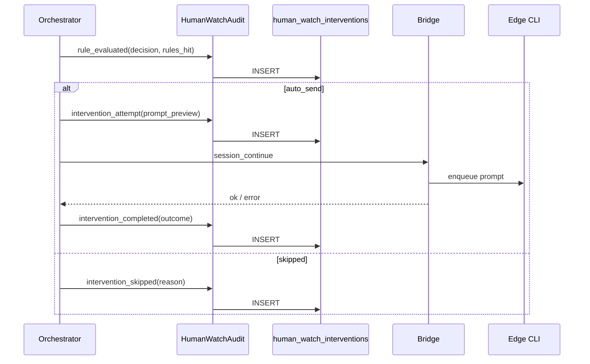

# 框架设计-人工值守

## 1. 设计目标

在中心服实现租户级「人工值守」控制面：边缘创建值守 Agent、中心配置监视绑定、中心编排代发；**每次判定与介入必须写入 `human_watch_interventions` 留痕**。

## 2. 部署形态

| 组件 | 部署位置 |
|------|----------|
| `human_watch_bindings`、`human_watch_interventions` | 中心 SQLite |
| `HumanWatchOrchestrator` | 中心进程（随 Next 或独立 worker） |
| 值守 Agent 实体、`provision-session`、`continue` | 边缘 client |
| Bridge RPC | 中心 `bridge-server` ↔ 边缘 `remote-server-bridge` |

## 3. 模块边界

### 3.1 HumanWatchPolicy（中心）

- 租户开关、bindings CRUD、license/配额校验。

### 3.2 HumanWatchOrchestrator（中心）

- 订阅 transcript 事件 + 定时扫描活跃 bindings。
- 拉 transcript → `human-watch-rules` 评估 → 指纹/限流 → 调 Bridge continue。
- **每个分支调用 `HumanWatchAudit.log(...)`**（不可省略）。

### 3.3 HumanWatchAudit（中心，关键）

- `log(event)` → INSERT `human_watch_interventions`。
- 提供 `list(filters)` 供 API/UI。
- 幂等键：`(binding_id, fingerprint, event_type, outcome)` 对 completed 类事件。

### 3.4 BridgeSteward（中心 → 边缘）

- `steward_create`、`session_transcript`、`session_continue`（已有 continue/transcript 复用）。
- RPC 响应带 `request_id` 写入审计。

### 3.5 EdgeSteward（边缘）

- 创建 `agent_kind=human_watch`、provision、执行 continue。
- 可选：边缘只执行，**不写**干预主库（避免双源）。

### 3.6 UI

- 中心：创建值守（选 client）、bindings、**干预记录**列表。
- Worker/值守详情：干预记录 Tab。

## 4. 干预留痕数据流



## 5. 表关系（示意）

```text
tenants (已有)
  └── human_watch_bindings
        └── human_watch_interventions (1:N 按 binding + 时间)
```

## 6. 与现有系统关系

| 现有 | 关系 |
|------|------|
| `sync_agent_index` | Worker/值守引用 |
| `session_continue` Bridge | 代发执行 |
| `activities` | 可选二次写入 `human_watch.*` 类型供活动流展示，**非主存储** |
| `audit` export | 扩展 `type=human_watch_interventions` |

## 7. 风险

| 风险 | 缓解 |
|------|------|
| 高频 rule_evaluated 撑库 | 默认全量；后续可加「仅 decision≠noop」配置 |
| 代发成功但写库失败 | 写库失败打 error 日志 + 告警；编排重试写 audit（幂等） |

## 8. 修订

| 版本 | 日期 | 说明 |
|------|------|------|
| V1.0 | 2026-05-19 | 初稿；干预留痕为 Phase 1 硬依赖 |
