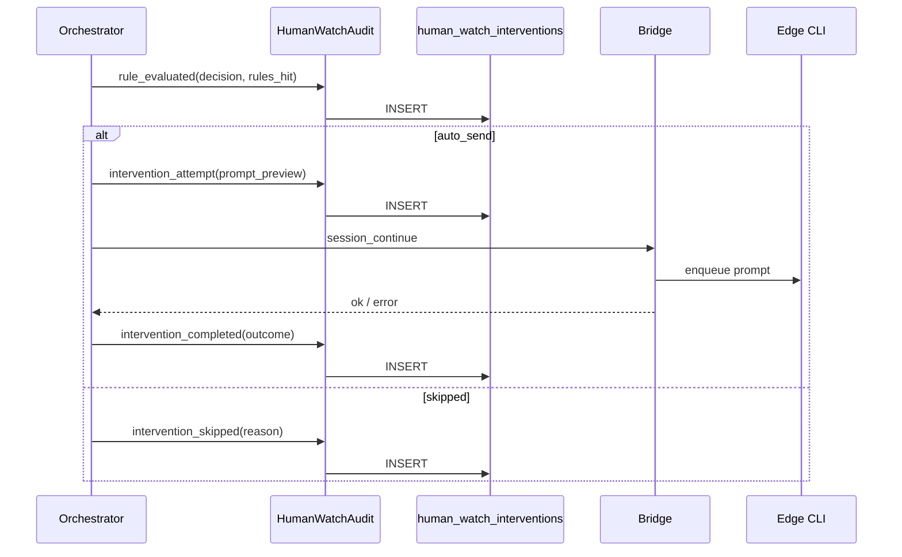
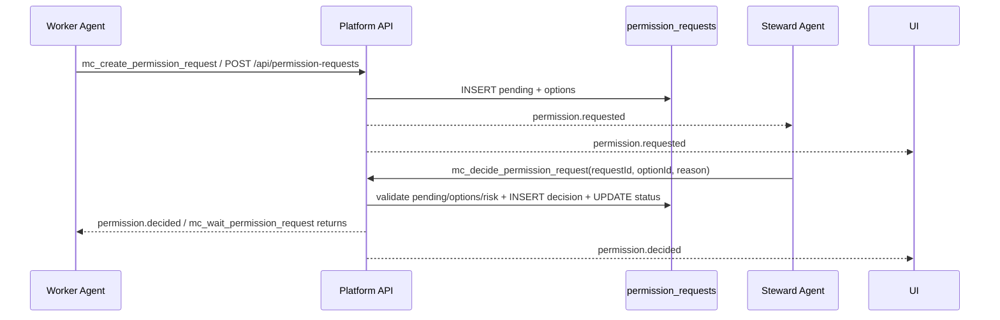
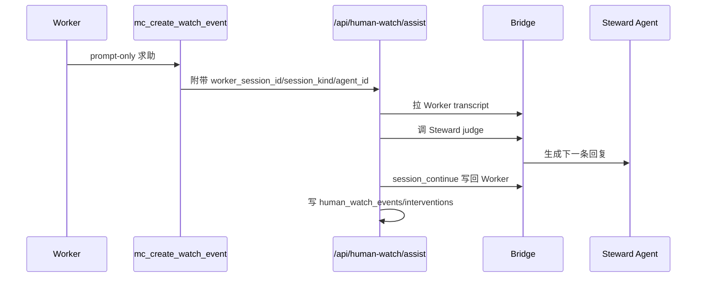

# 框架设计-人工值守

## 1. 设计目标

在中心服实现租户级「人工值守」控制面：边缘创建值守 Agent、中心配置监视绑定、中心编排代发；**每次判定与介入必须写入 `human_watch_interventions` 留痕**。V1.4 增加平台级权限请求与选项决策闭环，解决“只能回复消息、不能代替选择确认项”的问题。V1.6 增加记忆辅助判断，值守 Agent 在回复前可读取受限检索片段，但不能把记忆当作审批事实源。V1.7 持久化 Worker `session_kind`，避免绑定存在但编排阶段无法定位本地会话类型。

## 2. 部署形态

| 组件 | 部署位置 |
|------|----------|
| `human_watch_bindings`、`human_watch_interventions` | 中心 SQLite |
| `permission_requests`、`permission_request_decisions` | 中心 SQLite；边缘可保留同构表用于本地离线/后续同步 |
| `HumanWatchOrchestrator` | 中心进程（随 Next 或独立 worker） |
| 值守 Agent 实体、`provision-session`、`continue` | 边缘 client |
| Bridge RPC | 中心 `bridge-server` ↔ 边缘 `remote-server-bridge` |

## 3. 模块边界

### 3.1 HumanWatchPolicy（中心）

- 租户开关、bindings CRUD、license/配额校验。

### 3.2 HumanWatchOrchestrator（中心）

- 订阅 transcript 事件 + 定时扫描活跃 bindings。
- 拉 transcript → `human-watch-rules` 评估 → 指纹/限流 → 调 Bridge continue。
- 默认节流为每个 binding 每 24 小时 60 次成功介入；30 秒 grace 和 fingerprint 去重仍用于抑制重复同一等待。
- 调用值守 judge 前按最近 Worker 上下文构造短查询，优先通过 Edge Bridge 检索本地记忆，失败时回退中心 FTS；检索片段随 judge prompt 注入并写入事件上下文。
- 解析 Worker 会话类型时优先使用绑定落库 `worker_session_kind`，其次才从 Agent framework 或 `sync_sessions` 推断。
- **每个分支调用 `HumanWatchAudit.log(...)`**（不可省略）。

### 3.3 HumanWatchAudit（中心，关键）

- `log(event)` → INSERT `human_watch_interventions`。
- 提供 `list(filters)` 供 API/UI。
- 幂等键：`(binding_id, fingerprint, event_type, outcome)` 对 completed 类事件。

### 3.4 BridgeSteward（中心 → 边缘）

- `steward_create`、`session_transcript`、`session_continue`、`memory_search`（已有 continue/transcript 复用）。
- RPC 响应带 `request_id` 写入审计。

### 3.5 EdgeSteward（边缘）

- 创建 `agent_kind=human_watch`、provision、执行 continue。
- 可选：边缘只执行，**不写**干预主库（避免双源）。

### 3.6 UI

- 中心：创建值守（选 client）、bindings、**干预记录**列表。
- Worker/值守详情：干预记录 Tab。

### 3.7 PermissionRequests（中心，V1.4）

- `createPermissionRequest(input)`：创建 `pending` 请求，包含可选项、风险、Worker/值守上下文。
- `decidePermissionRequest(input)`：按 `optionId` 决策，事务内校验状态、过期时间、合法选项，并写 `permission_request_decisions`。
- `GET /api/permission-requests`：按 workspace/tenant/status/client/agent 查询。
- `POST /api/permission-requests`：Worker、平台或测试工具创建结构化请求。
- `POST /api/permission-requests/{id}/decision`：人类或值守 Agent 选择选项。
- `GET /api/permission-requests/{id}?wait=1`：Worker 或边缘运行时等待结构化决策结果；事件优先、轮询兜底。
- MCP 工具：`mc_decide_permission_request`，内部只调用同一决策 API。
- 事件：`permission.requested`、`permission.decided`。

## 4. 干预留痕数据流



## 5. 表关系（示意）

```text
tenants (已有)
  └── human_watch_bindings
        └── human_watch_interventions (1:N 按 binding + 时间)
```

`human_watch_bindings.worker_session_kind` 与 `worker_session_id` 一起描述 Worker 会话定位。创建绑定、更新绑定、Bridge session_key 同步和历史迁移都必须写入或回填该字段。

## 6. 与现有系统关系

| 现有 | 关系 |
|------|------|
| `sync_agent_index` | Worker/值守引用 |
| `session_continue` Bridge | 代发执行 |
| `activities` | 可选二次写入 `human_watch.*` 类型供活动流展示，**非主存储** |
| `audit` export | 扩展 `type=human_watch_interventions` |
| 聊天消息 | 只能承载解释和通知；不能作为权限状态变更依据 |
| MCP 工具 | `mc_create_permission_request` 创建请求；`mc_wait_permission_request` 等待结果；`mc_decide_permission_request` 封装同一个决策 API |
| Bridge | 中心向边缘同步 `permission_request_sync`；边缘向中心回传 `permission_decision_sync`；中心再回写 Gateway 执行审批 |

## 7. 权限决策数据流（V1.4）



**关键约束**

1. 值守 Agent 不直接点击 UI，也不靠普通回复消息修改状态。
2. `high` / `critical` 风险不允许 `steward_agent` 自动批准。
3. Worker 恢复执行必须监听或轮询 `permission_requests.status`；当前可通过 `mc_wait_permission_request` 或等待 API 获取结构化结果。
4. 中心为权限请求权威；边缘镜像请求状态。边缘值守 Agent 若先调用本机决策 API，会通过 Bridge 回传中心，由中心状态机最终裁决。
5. 如果请求来自 Gateway `exec.approval`，决策完成后必须调用 Gateway 原审批响应接口，避免只改平台状态、不恢复底层执行。

## 8. Worker 主动求助闭环（2.1.18）

当 Worker 已经回复用户但需要继续获得确认、澄清或用户风格回复时，不应再把 `mc_create_watch_event` 当成普通审批请求别名。2.1.18 后该工具在未传 `options` 时进入主动值守回复闭环：



关键约束：

1. 带 `options` 的调用仍创建结构化 `permission_requests`。
2. prompt-only 调用必须解析到启用的 binding、Worker 会话 id 和会话类型。
3. 平台托管 Codex 继续会话时注入 `MC_WORKER_SESSION_ID`、`MC_SESSION_KIND`，MCP 脚本自动补齐上下文。
4. `awaiting_user_response` 属于默认卡住信号，覆盖“你希望/哪个/还是/是否/?”等等待用户回复话术。

## 9. 改动评估

### 8.1 可靠 Mailbox 下的值守 Judge Session 补齐（2.1.20）

可靠 Mailbox 执行 `human_watch.assist.requested` 时，值守 Agent 不能假设已经存在 `session_key`。历史创建的 human-watch agent 可能只有 `agent_kind=human_watch` 和 soul/config，但没有 dedicated judge session。2.1.20 后本地 Edge runtime 在执行 judge 时统一走 bound local-agent execution：

1. 若 steward 已有有效 `session_key`，直接复用该 dedicated session。
2. 若 steward 没有 `session_key`，自动创建并 bootstrap dedicated judge session。
3. 若 steward session 失效或角色定义变化，由 bound executor 触发 re-provision。
4. 成功取得 steward reply 后，Mailbox 再把该回复通过 session continue 写回 Worker session 并 ack 云端消息。

这保证云端可靠投递、边缘本地 judge、Worker 写回三段链路不因历史 steward 数据缺少 `session_key` 而永久失败。

### 8.2 Edge Runtime Native ABI 发布门禁（2.1.20）

Edge runtime zip 内包含 `better-sqlite3` native 模块。发布包必须与 installed tray 启动 runtime 使用的 Node ABI 兼容，否则本地 DB 健康检查会失败并导致 Mailbox API 500。2.1.20 起 runtime 打包流程增加：

1. `pnpm rebuild better-sqlite3`，按当前发布 Node 版本重建 native 模块。
2. 打包前在源码依赖中执行 `require('better-sqlite3')`。
3. staging 后在 runtime bundle 中再次执行 `require('better-sqlite3')`。
4. 任一 ABI 校验失败即终止发布。

### 8.3 值守记忆辅助判断（2.1.30）

值守 Agent 不具备天然“全局知道所有项目经验”的能力。2.1.30 的落地方式是检索增强：

1. 中心从 Worker 最近 user/assistant 文本构造查询。
2. 中心通过 Bridge `memory_search_request` 请求 Edge 本地检索 OpenClaw sqlite 记忆和文件记忆。
3. Edge 只返回 `source/path/snippet` 摘要，不上传完整记忆库。
4. Edge 超时或无结果时，中心回退自身 `memory_fts` 检索。
5. HumanWatchOrchestrator 将结果拼入 `值守记忆检索` prompt 区块，并保存到 `human_watch_events.context_json.steward_memory_context`。

边界：

- 默认 3 条、1200 字符，上限 8 条、3000 字符。
- steward context 可配置 `include_memory=false` 关闭，也可调 `memory_search_limit`、`memory_max_chars`。
- 记忆片段只辅助判断；当前会话、安全规则、高危审批限制优先。

### 8.4 值守判官重复短回复识别（2.1.31）

值守 Agent 对确认类问题经常会连续输出相同短回复，例如“继续”。Edge 不能只用“最新 assistant 文本是否等于上一轮”判断是否产生了新回复，否则连续两次同样判断会被误判为 `Judge session returned empty reply`。

2.1.31 起，Edge 判官读取逻辑同时比较 assistant 消息数量：只要值守会话新增了 assistant 消息，即使文本与上一轮相同，也视为有效 judge reply，并交给中心继续执行自动代发。

### 8.5 值守 Judge 长耗时与重复请求保护（2.1.32）

生产验证发现，值守 Agent 使用本地 CLI 生成回复时可能超过 180 秒，且中心 60 秒轮询会在上一轮 Judge 未结束时继续发起新请求，导致 Edge 侧同一值守 Agent 串行队列堆积，最终表现为 `Timed out waiting for steward_judge`。

2.1.32 起做三层保护：

1. Edge 值守 Judge 调用本地 CLI 使用 10 分钟专用执行窗口，不影响普通 Worker 会话默认 180 秒超时。
2. 中心 Bridge `steward_judge` 等待窗口调整为 11 分钟，保证服务端晚于 Edge 本地执行器超时。
3. Edge 对同一值守 Agent 的并发 Judge 请求做 in-flight 去重：已有 Judge 运行时，新请求立即返回 `Steward judge already running for this agent`，避免排队风暴。
4. Bridge 心跳 stale 窗口调整为 5 分钟，降低长耗时本地推理期间误断连接的概率。

### 8.6 值守 Judge 重复短回复时间戳识别（2.1.33）

生产小范围验证发现，值守 Agent 已连续输出 `继续`，但长会话 transcript 固定分页窗口滚动后，Edge 读取到的 assistant 数量可能保持不变；若同时只用文本差异判断，本轮新增的 `继续` 会被误判为 `Judge session returned empty reply`。

2.1.33 起，Edge 在读取 Codex transcript 时同时记录最新 assistant `timestamp`。只要最新 assistant 时间戳晚于基线，就判定为本轮新增回复，即使文本仍是 `继续`，也会返回给中心继续自动代发。

| 模块 | 改动 | 风险 | 缓解 |
|------|------|------|------|
| DB migration | 新增两张表 | 低；只新增表和索引 | `IF NOT EXISTS`，不改旧表 |
| API | 新增权限请求和决策路由 | 中；需鉴权和状态校验 | `requireRole`、事务、状态机单测 |
| 值守 Agent | 后续通过 MCP 调用决策 API | 中；模型可能只回复消息 | bootstrap prompt + 工具强约束 + 平台 fallback |
| Worker 执行器 | 后续等待 `permission.decided` 恢复 | 中；涉及阻塞/超时 | 分阶段接入，先 API 自测 |
| UI | 后续展示待审批队列 | 低 | 复用现有 Approvals 视觉模式 |

## 10. 风险

| 风险 | 缓解 |
|------|------|
| 高频 rule_evaluated 撑库 | 默认全量；后续可加「仅 decision≠noop」配置 |
| 代发成功但写库失败 | 写库失败打 error 日志 + 告警；编排重试写 audit（幂等） |
| 值守 Agent 误批高危操作 | 平台强制禁止 `steward_agent` 批准 `high/critical` |
| 回复消息被误当审批 | 决策只认 API/MCP 工具，不解析普通聊天作为状态变更 |

## 11. 修订

| 版本 | 日期 | 说明 |
|------|------|------|
| V1.0 | 2026-05-19 | 初稿；干预留痕为 Phase 1 硬依赖 |
| V1.1 | 2026-06-13 | 增加权限请求与选项决策闭环设计 |
| V1.2 | 2026-06-21 | 2.1.17：风险判断架构调整为"worker 只报告需要确认、不判风险，值守侧用预定义规则统一裁定危险动作并据此设置通知优先级"；`requeueStaleTasks` 与值守事件状态解耦问题修复（看门狗会先查 pending 审批再判超时）；新增 judge 建议 vs 人工最终决策的一致性审计字段（纯记录，不接入自动学习/Prompt 调整）；高优先级事件新增 webhook 出口（`human_watch.event.high`） |
| V1.3 | 2026-07-05 | 2.1.18：补齐 Worker prompt-only MCP 主动求助闭环，值守 judge 回复可通过 Bridge 自动续写回 Worker；新增 `awaiting_user_response` 规则信号与托管 Codex 会话上下文注入 |
| V1.4 | 2026-07-05 | 2.1.19：人工值守主动回复支持可靠 mailbox 投递；Edge 离线时 queued，恢复后本地 Mailbox 调用值守 judge 并继续写回 Worker，云端审计可按 `message_id/correlation_id` 追踪 |
| V1.5 | 2026-07-05 | 2.1.20：可靠 Mailbox 执行值守 judge 时自动补齐历史 steward dedicated session；Edge runtime 发布增加 `better-sqlite3` native ABI 校验 |
| V1.6 | 2026-07-07 | 2.1.30：增加值守记忆辅助判断；中心通过 Bridge 检索 Edge 本地记忆，回退中心 FTS，并把受限片段注入 judge prompt 与审计上下文 |
| V1.7 | 2026-07-07 | 2.1.31：修复值守判官连续输出相同短回复时被误判为空，确保确认类自动代发闭环可继续 |
| V1.8 | 2026-07-07 | 2.1.32：增加值守 Judge 长耗时、Bridge 心跳和重复请求去重保护，避免生产轮询堆积导致值守超时 |
| V1.9 | 2026-07-07 | 2.1.33：按 assistant 时间戳识别重复短回复，修复 `继续` 被误判为空回复 |
