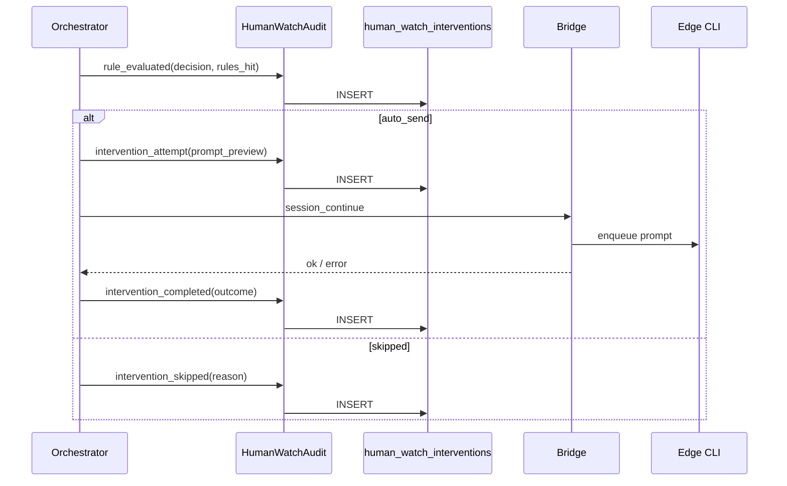
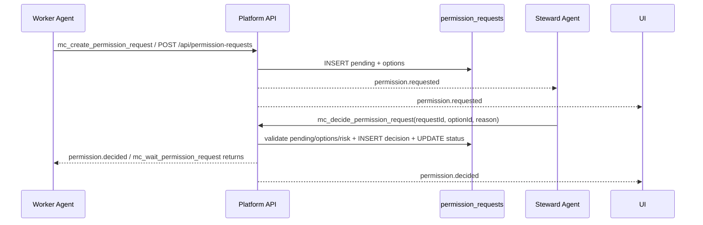

# 框架设计-人工值守

## 1. 设计目标

在中心服实现租户级「人工值守」控制面：边缘创建值守 Agent、中心配置监视绑定、中心编排代发；**每次判定与介入必须写入 `human_watch_interventions` 留痕**。V1.4 增加平台级权限请求与选项决策闭环，解决“只能回复消息、不能代替选择确认项”的问题。

## 2. 部署形态

| 组件 | 部署位置 |
|------|----------|
| `human_watch_bindings`、`human_watch_interventions` | 中心 SQLite |
| `permission_requests`、`permission_request_decisions` | 中心 SQLite；边缘可保留同构表用于本地离线/后续同步 |
| `HumanWatchOrchestrator` | 中心进程（随 Next 或独立 worker） |
| 值守 Agent 实体、`provision-session`、`continue` | 边缘 client |
| Bridge RPC | 中心 `bridge-server` ↔ 边缘 `remote-server-bridge` |

## 3. 模块边界

### 3.1 HumanWatchPolicy（中心）

- 租户开关、bindings CRUD、license/配额校验。

### 3.2 HumanWatchOrchestrator（中心）

- 订阅 transcript 事件 + 定时扫描活跃 bindings。
- 拉 transcript → `human-watch-rules` 评估 → 指纹/限流 → 调 Bridge continue。
- **每个分支调用 `HumanWatchAudit.log(...)`**（不可省略）。

### 3.3 HumanWatchAudit（中心，关键）

- `log(event)` → INSERT `human_watch_interventions`。
- 提供 `list(filters)` 供 API/UI。
- 幂等键：`(binding_id, fingerprint, event_type, outcome)` 对 completed 类事件。

### 3.4 BridgeSteward（中心 → 边缘）

- `steward_create`、`session_transcript`、`session_continue`（已有 continue/transcript 复用）。
- RPC 响应带 `request_id` 写入审计。

### 3.5 EdgeSteward（边缘）

- 创建 `agent_kind=human_watch`、provision、执行 continue。
- 可选：边缘只执行，**不写**干预主库（避免双源）。

### 3.6 UI

- 中心：创建值守（选 client）、bindings、**干预记录**列表。
- Worker/值守详情：干预记录 Tab。

### 3.7 PermissionRequests（中心，V1.4）

- `createPermissionRequest(input)`：创建 `pending` 请求，包含可选项、风险、Worker/值守上下文。
- `decidePermissionRequest(input)`：按 `optionId` 决策，事务内校验状态、过期时间、合法选项，并写 `permission_request_decisions`。
- `GET /api/permission-requests`：按 workspace/tenant/status/client/agent 查询。
- `POST /api/permission-requests`：Worker、平台或测试工具创建结构化请求。
- `POST /api/permission-requests/{id}/decision`：人类或值守 Agent 选择选项。
- `GET /api/permission-requests/{id}?wait=1`：Worker 或边缘运行时等待结构化决策结果；事件优先、轮询兜底。
- MCP 工具：`mc_decide_permission_request`，内部只调用同一决策 API。
- 事件：`permission.requested`、`permission.decided`。

## 4. 干预留痕数据流



## 5. 表关系（示意）

```text
tenants (已有)
  └── human_watch_bindings
        └── human_watch_interventions (1:N 按 binding + 时间)
```

## 6. 与现有系统关系

| 现有 | 关系 |
|------|------|
| `sync_agent_index` | Worker/值守引用 |
| `session_continue` Bridge | 代发执行 |
| `activities` | 可选二次写入 `human_watch.*` 类型供活动流展示，**非主存储** |
| `audit` export | 扩展 `type=human_watch_interventions` |
| 聊天消息 | 只能承载解释和通知；不能作为权限状态变更依据 |
| MCP 工具 | `mc_create_permission_request` 创建请求；`mc_wait_permission_request` 等待结果；`mc_decide_permission_request` 封装同一个决策 API |
| Bridge | 中心向边缘同步 `permission_request_sync`；边缘向中心回传 `permission_decision_sync`；中心再回写 Gateway 执行审批 |

## 7. 权限决策数据流（V1.4）



**关键约束**

1. 值守 Agent 不直接点击 UI，也不靠普通回复消息修改状态。
2. `high` / `critical` 风险不允许 `steward_agent` 自动批准。
3. Worker 恢复执行必须监听或轮询 `permission_requests.status`；当前可通过 `mc_wait_permission_request` 或等待 API 获取结构化结果。
4. 中心为权限请求权威；边缘镜像请求状态。边缘值守 Agent 若先调用本机决策 API，会通过 Bridge 回传中心，由中心状态机最终裁决。
5. 如果请求来自 Gateway `exec.approval`，决策完成后必须调用 Gateway 原审批响应接口，避免只改平台状态、不恢复底层执行。

## 8. 改动评估

| 模块 | 改动 | 风险 | 缓解 |
|------|------|------|------|
| DB migration | 新增两张表 | 低；只新增表和索引 | `IF NOT EXISTS`，不改旧表 |
| API | 新增权限请求和决策路由 | 中；需鉴权和状态校验 | `requireRole`、事务、状态机单测 |
| 值守 Agent | 后续通过 MCP 调用决策 API | 中；模型可能只回复消息 | bootstrap prompt + 工具强约束 + 平台 fallback |
| Worker 执行器 | 后续等待 `permission.decided` 恢复 | 中；涉及阻塞/超时 | 分阶段接入，先 API 自测 |
| UI | 后续展示待审批队列 | 低 | 复用现有 Approvals 视觉模式 |

## 9. 风险

| 风险 | 缓解 |
|------|------|
| 高频 rule_evaluated 撑库 | 默认全量；后续可加「仅 decision≠noop」配置 |
| 代发成功但写库失败 | 写库失败打 error 日志 + 告警；编排重试写 audit（幂等） |
| 值守 Agent 误批高危操作 | 平台强制禁止 `steward_agent` 批准 `high/critical` |
| 回复消息被误当审批 | 决策只认 API/MCP 工具，不解析普通聊天作为状态变更 |

## 10. 修订

| 版本 | 日期 | 说明 |
|------|------|------|
| V1.0 | 2026-05-19 | 初稿；干预留痕为 Phase 1 硬依赖 |
| V1.1 | 2026-06-13 | 增加权限请求与选项决策闭环设计 |
| V1.2 | 2026-06-21 | 2.1.17：风险判断架构调整为"worker 只报告需要确认、不判风险，值守侧用预定义规则统一裁定危险动作并据此设置通知优先级"；`requeueStaleTasks` 与值守事件状态解耦问题修复（看门狗会先查 pending 审批再判超时）；新增 judge 建议 vs 人工最终决策的一致性审计字段（纯记录，不接入自动学习/Prompt 调整）；高优先级事件新增 webhook 出口（`human_watch.event.high`） |
