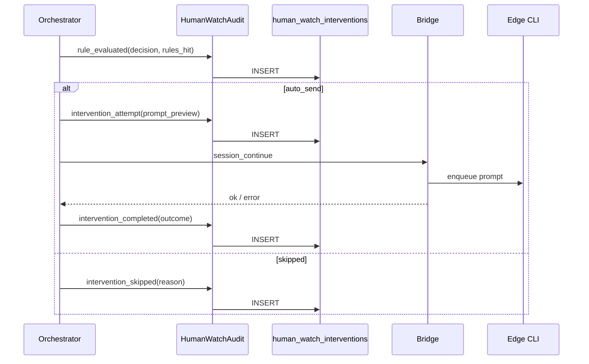
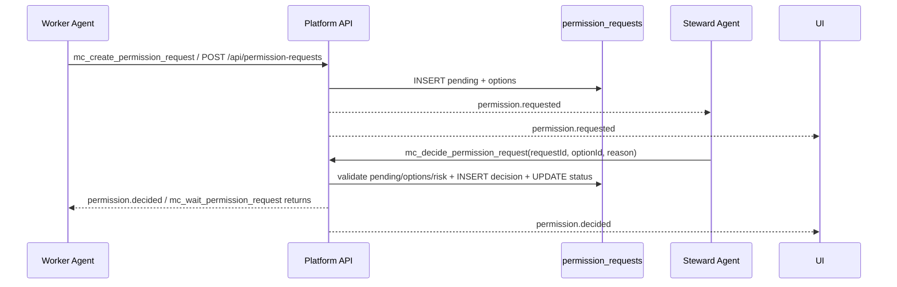
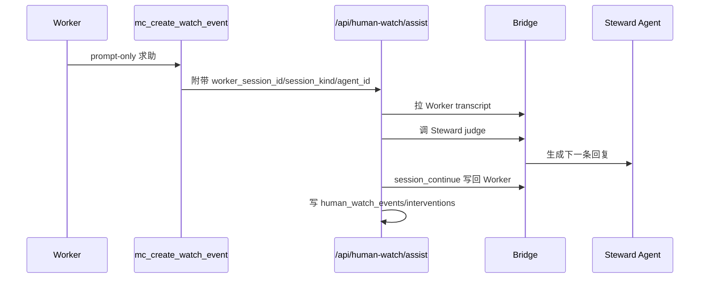

# 框架设计-人工值守

## 1. 设计目标

在中心服实现租户级「人工值守」控制面：边缘创建值守 Agent、中心配置监视绑定、中心编排代发；**每次判定与介入必须写入 `human_watch_interventions` 留痕**。V1.4 增加平台级权限请求与选项决策闭环。V1.6 增加受限记忆辅助判断。V2.2 增加 5 秒小范围验证触发、内容化确认回复和自动停止。V3.0 增加 Goal Supervisor。2.1.60 增加分发沙箱和 strict Workspace 所有权链，合法 Edge Worker 仍可参与值守与监督。

## 2. 部署形态

| 组件 | 部署位置 |
|------|----------|
| `human_watch_bindings`、`human_watch_interventions` | 中心 SQLite |
| `permission_requests`、`permission_request_decisions` | 中心 SQLite；边缘可保留同构表用于本地离线/后续同步 |
| `HumanWatchOrchestrator` | 中心进程（随 Next 或独立 worker） |
| 值守 Agent 实体、`provision-session`、`continue` | 边缘 client |
| Bridge RPC | 中心 `bridge-server` ↔ 边缘 `remote-server-bridge` |

## 3. 模块边界

### 3.1 HumanWatchPolicy（中心）

- 租户开关、bindings CRUD、license/配额校验。

### 3.2 HumanWatchOrchestrator（中心）

- 订阅 transcript 事件 + 定时扫描活跃 bindings。
- 拉 transcript → `human-watch-rules` 评估 → 指纹/限流 → 调 Bridge continue。
- 默认小范围验证触发为 5 秒空闲、prompt grace 为 0；生产可按租户规则调整。
- 默认节流保留 24 小时窗口，生产小范围验证可把额度调高为有限值；不得把安全阀改成无限循环。
- 调用值守 judge 前按最近 Worker 上下文构造短查询，优先通过 Edge Bridge 检索本地记忆，失败时回退中心 FTS；检索片段随 judge prompt 注入并写入事件上下文。
- Worker 明确要求 `回答后说/回复后说` 时，judge prompt 必须要求值守 Agent 先回答实际问题，再在末尾带上确认词；不能只输出固定“确认”或“继续”。
- 每个 binding 可通过 `rules_override.auto_stop` 配置自动停止，按成功介入次数、运行时长或限流次数禁用当前 binding，并记录 `auto_stop`。
- 解析 Worker 会话类型时优先使用绑定落库 `worker_session_kind`，其次才从 Agent framework 或 `sync_sessions` 推断。
- **每个分支调用 `HumanWatchAudit.log(...)`**（不可省略）。

### 3.3 HumanWatchAudit（中心，关键）

- `log(event)` → INSERT `human_watch_interventions`。
- 提供 `list(filters)` 供 API/UI。
- 幂等键：`(binding_id, fingerprint, event_type, outcome)` 对 completed 类事件。

### 3.4 BridgeSteward（中心 → 边缘）

- `steward_create`、`session_transcript`、`session_continue`、`memory_search`（已有 continue/transcript 复用）。
- RPC 响应带 `request_id` 写入审计。

### 3.5 EdgeSteward（边缘）

- 创建 `agent_kind=human_watch`、provision、执行 continue。
- 可选：边缘只执行，**不写**干预主库（避免双源）。
- 2.1.66 起值守 Agent 与普通 Agent 共用双通道 Inventory：本地创建、更新、删除、同步和状态变化立即发送完整 `agent_status`；HTTP heartbeat 携带 inventory 作为断线兜底，避免值守 Agent 已创建但中心无法绑定。

### 3.6 UI

- 中心：创建值守（选 client）、bindings、**干预记录**列表。
- Worker/值守详情：干预记录 Tab。

### 3.7 PermissionRequests（中心，V1.4）

- `createPermissionRequest(input)`：创建 `pending` 请求，包含可选项、风险、Worker/值守上下文。
- `decidePermissionRequest(input)`：按 `optionId` 决策，事务内校验状态、过期时间、合法选项，并写 `permission_request_decisions`。
- `GET /api/permission-requests`：按 workspace/tenant/status/client/agent 查询。
- `POST /api/permission-requests`：Worker、平台或测试工具创建结构化请求。
- `POST /api/permission-requests/{id}/decision`：人类或值守 Agent 选择选项。
- `GET /api/permission-requests/{id}?wait=1`：Worker 或边缘运行时等待结构化决策结果；事件优先、轮询兜底。
- MCP 工具：`mc_decide_permission_request`，内部只调用同一决策 API。
- 事件：`permission.requested`、`permission.decided`。

### 3.8 Goal Supervisor（中心，V3.0）

- Planner：值守生成结构化 DAG，中心校验 logical key、依赖、风险、预算和验收标准。
- Worker Matcher：排除 human-watch、离线、无 session、框架不支持和超容量 Worker，再按能力、框架、负载、历史结果和本地性评分。
- Dispatcher：复用 tasks 和可靠 session continue；依赖未完成的任务保持 inbox。
- Monitor/Correction：55 秒 lease + 60 秒 watchdog，异常事件幂等触发追问、纠偏、重试、换人、重规划或人工升级。
- Verifier：Worker 自报不是独立证据；测试、指标、产物或质量评审必须逐条支持成功标准。
- Memory：candidate 默认不可检索；approved 记忆受作用域、有效期、字符数和使用结果约束。

## 4. 干预留痕数据流



## 5. 表关系（示意）

```text
tenants (已有)
  └── human_watch_bindings
        └── human_watch_interventions (1:N 按 binding + 时间)
```

`human_watch_bindings.worker_session_kind` 与 `worker_session_id` 一起描述 Worker 会话定位。创建绑定、更新绑定、Bridge session_key 同步和历史迁移都必须写入或回填该字段。

## 6. 与现有系统关系

| 现有 | 关系 |
|------|------|
| `sync_agent_index` | Worker/值守引用 |
| `session_continue` Bridge | 代发执行 |
| `activities` | 可选二次写入 `human_watch.*` 类型供活动流展示，**非主存储** |
| `audit` export | 扩展 `type=human_watch_interventions` |
| 聊天消息 | 只能承载解释和通知；不能作为权限状态变更依据 |
| MCP 工具 | `mc_create_permission_request` 创建请求；`mc_wait_permission_request` 等待结果；`mc_decide_permission_request` 封装同一个决策 API |
| Bridge | 中心向边缘同步 `permission_request_sync`；边缘向中心回传 `permission_decision_sync`；中心再回写 Gateway 执行审批 |

## 7. 权限决策数据流（V1.4）



**关键约束**

1. 值守 Agent 不直接点击 UI，也不靠普通回复消息修改状态。
2. `high` / `critical` 风险不允许 `steward_agent` 自动批准。
3. Worker 恢复执行必须监听或轮询 `permission_requests.status`；当前可通过 `mc_wait_permission_request` 或等待 API 获取结构化结果。
4. 中心为权限请求权威；边缘镜像请求状态。边缘值守 Agent 若先调用本机决策 API，会通过 Bridge 回传中心，由中心状态机最终裁决。
5. 如果请求来自 Gateway `exec.approval`，决策完成后必须调用 Gateway 原审批响应接口，避免只改平台状态、不恢复底层执行。

## 8. Worker 主动求助闭环（2.1.18）

当 Worker 已经回复用户但需要继续获得确认、澄清或用户风格回复时，不应再把 `mc_create_watch_event` 当成普通审批请求别名。2.1.18 后该工具在未传 `options` 时进入主动值守回复闭环：



关键约束：

1. 带 `options` 的调用仍创建结构化 `permission_requests`。
2. prompt-only 调用必须解析到启用的 binding、Worker 会话 id 和会话类型。
3. 平台托管 Codex 继续会话时注入 `MC_WORKER_SESSION_ID`、`MC_SESSION_KIND`，MCP 脚本自动补齐上下文。
4. `awaiting_user_response` 属于默认卡住信号，覆盖“你希望/哪个/还是/是否/?”等等待用户回复话术。

## 9. 改动评估

### 8.1 可靠 Mailbox 下的值守 Judge Session 补齐（2.1.20）

可靠 Mailbox 执行 `human_watch.assist.requested` 时，值守 Agent 不能假设已经存在 `session_key`。历史创建的 human-watch agent 可能只有 `agent_kind=human_watch` 和 soul/config，但没有 dedicated judge session。2.1.20 后本地 Edge runtime 在执行 judge 时统一走 bound local-agent execution：

1. 若 steward 已有有效 `session_key`，直接复用该 dedicated session。
2. 若 steward 没有 `session_key`，自动创建并 bootstrap dedicated judge session。
3. 若 steward session 失效或角色定义变化，由 bound executor 触发 re-provision。
4. 成功取得 steward reply 后，Mailbox 再把该回复通过 session continue 写回 Worker session 并 ack 云端消息。

这保证云端可靠投递、边缘本地 judge、Worker 写回三段链路不因历史 steward 数据缺少 `session_key` 而永久失败。

### 8.2 Edge Runtime Native ABI 发布门禁（2.1.20）

Edge runtime zip 内包含 `better-sqlite3` native 模块。发布包必须与 installed tray 启动 runtime 使用的 Node ABI 兼容，否则本地 DB 健康检查会失败并导致 Mailbox API 500。2.1.20 起 runtime 打包流程增加：

1. `pnpm rebuild better-sqlite3`，按当前发布 Node 版本重建 native 模块。
2. 打包前在源码依赖中执行 `require('better-sqlite3')`。
3. staging 后在 runtime bundle 中再次执行 `require('better-sqlite3')`。
4. 任一 ABI 校验失败即终止发布。

### 8.3 值守记忆辅助判断（2.1.30）

值守 Agent 不具备天然“全局知道所有项目经验”的能力。2.1.30 的落地方式是检索增强：

1. 中心从 Worker 最近 user/assistant 文本构造查询。
2. 中心通过 Bridge `memory_search_request` 请求 Edge 本地检索 OpenClaw sqlite 记忆和文件记忆。
3. Edge 只返回 `source/path/snippet` 摘要，不上传完整记忆库。
4. Edge 超时或无结果时，中心回退自身 `memory_fts` 检索。
5. HumanWatchOrchestrator 将结果拼入 `值守记忆检索` prompt 区块，并保存到 `human_watch_events.context_json.steward_memory_context`。

边界：

- 默认 3 条、1200 字符，上限 8 条、3000 字符。
- steward context 可配置 `include_memory=false` 关闭，也可调 `memory_search_limit`、`memory_max_chars`。
- 记忆片段只辅助判断；当前会话、安全规则、高危审批限制优先。

### 8.4 值守判官重复短回复识别（2.1.31）

值守 Agent 对确认类问题经常会连续输出相同短回复，例如“继续”。Edge 不能只用“最新 assistant 文本是否等于上一轮”判断是否产生了新回复，否则连续两次同样判断会被误判为 `Judge session returned empty reply`。

2.1.31 起，Edge 判官读取逻辑同时比较 assistant 消息数量：只要值守会话新增了 assistant 消息，即使文本与上一轮相同，也视为有效 judge reply，并交给中心继续执行自动代发。

### 8.5 值守 Judge 长耗时与重复请求保护（2.1.32）

生产验证发现，值守 Agent 使用本地 CLI 生成回复时可能超过 180 秒，且中心 60 秒轮询会在上一轮 Judge 未结束时继续发起新请求，导致 Edge 侧同一值守 Agent 串行队列堆积，最终表现为 `Timed out waiting for steward_judge`。

2.1.32 起做三层保护：

1. Edge 值守 Judge 调用本地 CLI 使用 10 分钟专用执行窗口，不影响普通 Worker 会话默认 180 秒超时。
2. 中心 Bridge `steward_judge` 等待窗口调整为 11 分钟，保证服务端晚于 Edge 本地执行器超时。
3. Edge 对同一值守 Agent 的并发 Judge 请求做 in-flight 去重：已有 Judge 运行时，新请求立即返回 `Steward judge already running for this agent`，避免排队风暴。
4. Bridge 心跳 stale 窗口调整为 5 分钟，降低长耗时本地推理期间误断连接的概率。

### 8.6 值守 Judge 重复短回复时间戳识别（2.1.33）

生产小范围验证发现，值守 Agent 已连续输出 `继续`，但长会话 transcript 固定分页窗口滚动后，Edge 读取到的 assistant 数量可能保持不变；若同时只用文本差异判断，本轮新增的 `继续` 会被误判为 `Judge session returned empty reply`。

2.1.33 起，Edge 在读取 Codex transcript 时同时记录最新 assistant `timestamp`。只要最新 assistant 时间戳晚于基线，就判定为本轮新增回复，即使文本仍是 `继续`，也会返回给中心继续自动代发。

### 8.7 值守 Judge 运行时错误保护（2.1.37）

生产小范围验证中，绑定修复后 Codex 值守 Agent 被成功调用，但本地 Edge 进程缺少模型运行环境，Judge 输出 `Missing environment variable` 文本。2.1.37 后 Edge 在 `runStewardJudgeOnEdge` 末端识别明显 CLI/模型运行时错误：

1. 缺少环境变量、API/认证失败、命令执行失败等文本不允许作为值守回复。
2. Edge 抛出 `Judge session returned runtime error`，中心按 `steward_judge_failed` 留痕。
3. 自动代发必须停止，不得污染 Worker 会话；运维人员通过本地模型环境或切换可用值守 Agent 恢复能力。

### 8.8 Edge Bridge bootstrap 重连保护（2.1.39）

生产小范围验证发现，本地托盘会周期性把 bootstrap/config 写入 Edge Web runtime。旧逻辑在 `/api/edge/apply-bootstrap` 和 `/api/edge/import-tray-config` 每次写入后都调用 `restartRemoteBridge()`，即使只有 `edge.enrolled_at` 或重复同值变化，也会中断中心到 Edge 的 websocket。人工值守评估在此期间请求 `session_transcript` 时会表现为 `Timed out waiting for transcript from client`。

2.1.39 起，Edge 将配置写入和 Bridge 生命周期解耦：

1. 所有 tray settings 仍照常落库，保证 UI 和诊断信息最新。
2. 只有 `gateway.server_url`、`gateway.token`、`device.client_id` 的值实际变化时才重启 Bridge。
3. `edge.enrolled_at`、`edge.hostname`、`gateway.client_name` 等非连接关键字段不触发重连。
4. 审计日志记录 `bridge_reconnect`，用于区分配置同步与真实 Bridge 重连。

该改动不改变中心 Bridge 协议，仅降低本地 Edge 连接抖动，保证 Human Watch 需要拉取 Worker transcript 和调用 steward judge 时有稳定 RPC 通道。

### 8.9 5 秒值守、内容化确认回复与自动停止（2.1.40）

2.1.40 面向生产小范围验证收敛三类问题：

1. 触发速度：中心默认 `idle_timeout_seconds=5`、`idle_timeout_with_stuck_seconds=5`、`grace_after_prompt_seconds=0`，UI 保存阈值允许到 5 秒。
2. 回复质量：`回答后说/回复后说` 不再被当作只需确认的短回复，`inferWorkerNeed` 会把它标记为“需要值守先回答问题再确认”，judge prompt 明确禁止只输出 `确认` 或跳过问题。
3. 测试停止：binding 的 `rules_override.auto_stop` 支持 `max_successful_interventions`、`max_runtime_seconds`、`max_rate_limited_skips`。编排器在评估前、限流后和成功介入后检查停止条件，命中后禁用 binding 并写入 `human_watch_interventions(event_type=auto_stop)`。

2.1.59 起，运行时长从 binding 最近一次启用/配置更新开始计算。重新启用已自动停止的老 binding 会开启新窗口，不再因首次创建时间久远而立即再次停用。

`auto_stop` 是绑定级保护，不影响其他 Worker/值守绑定。它的目标是结束测试闭环和减少 `rule_evaluated noop` 审计噪声，而不是替代限流、指纹去重或高危审批限制。

### 8.10 目标监督 Worker 可恢复匹配与调度隔离（2.1.43）

生产真实 Goal 验证发现，Edge Bridge 保持在线时，专用 Worker Agent 可能显示 offline，但其 session_key 仍可由可靠 session continue 恢复。Worker Matcher 调整为：

1. Bridge 实时连接是节点可达性的权威事实，sync_agent_index.updated_at 陈旧只降低评分。
2. offline/sleeping 且有专用 session_key 的非值守 Agent 可作为降权候选。
3. error/disabled、无会话、框架不支持、human-watch 和客户端离线仍硬拒绝。
4. no_eligible_worker 事件保存候选数量和逐 Agent rejected reason。
5. metadata.goal_id 存在的监督子任务不进入旧任务 auto-route，只能由 Goal Dispatcher 按 DAG 和预算激活。

### 8.11 监督任务全阶段隔离与孤儿 runtime 回收（2.1.44 / Tray 3.0.8）

2.1.43 生产 Goal 证明 Worker Matcher 已能恢复 offline 专用会话，但也暴露两个更深的竞态：

1. 依赖未完成的监督任务仍可在后续 scheduler tick 中被旧 auto-route 抢占，随后 assigned dispatcher 反复回退 OpenClaw。
2. 托盘替换 runtime 目录时，旧 `next-server` 可成为 PPID=1 的孤儿进程。旧 cwd 路径已不存在时 `canonicalize()` 失败，导致归属判断误拒绝回收，新 runtime 持续 `EADDRINUSE` 。

修正后的不变量：

- `metadata.goal_id` 不仅在 auto-route SELECT 中排除，还在 UPDATE compare-and-set、assigned dispatch、stale requeue 和 Aegis review 中排除。
- Goal Dispatcher 是监督任务从 inbox 进入 in_progress 的唯一通道；旧 scheduler 即使看到被污染的 assigned 任务也不执行。
- 托盘对 cwd 先做绝对路径边界判断，再在可用时做 canonical 判断；删除的 runtime cwd 仍属于 E-Agent，`runtime-old` 等相邻目录不属于。

### 8.12 双调度面隔离与持续 Goal Dispatcher（2.1.45）

2.1.44 的新生产 Goal 证明中心 bundle 已包含监督任务过滤，但 Edge runtime 仍保留独立的 legacy scheduler 副本。Edge 收到同步任务后可绕过中心过滤执行 auto-route，并把失败状态同步回中心。同时监督监控器仅依据陈旧 agent index 判断 Worker 离线，未采用 Worker Matcher 已使用的 Bridge 实时可达性。

2.1.45 将以下规则提升为跨形态不变量：

1. Server 与 Edge runtime 的 auto-route、assigned dispatch、stale requeue、Aegis review 全部排除 `metadata.goal_id`；auto-route UPDATE 再次原子复核。
2. Bridge 客户端在线时，可恢复专用会话的 Worker 不因 agent index 的 offline/stale 状态触发离线纠偏。
3. 监督监控器在持有 55 秒 Goal lease 时幂等调用 Goal Dispatcher；前置任务完成后，依赖满足的后继节点自动进入 `session.continue.requested`，无需人工重复点击。
4. Goal Dispatcher 仍是唯一允许监督任务从 inbox 进入 in_progress 的组件，legacy scheduler 不参与 DAG 激活或验收。

### 8.13 Worker 中心证据提交与任务队列隔离（2.1.46）

2.1.45 生产 Goal `925630ce-802e-4217-a7f0-9101cf33c8f0` 证明 Worker 能收到根任务并产出版本证据，但 Worker 只查询 Edge 本机 SQLite，无法看到中心 Goal 任务；同时 `/api/tasks/queue` 未纳入旧调度隔离，依赖任务被旧节点认领后失败。

2.1.46 增加两条受控数据通道：

1. 托管 MCP 的 `mc_get_supervision_goal` 经 Edge 同源代理读取中心 Goal、依赖任务与事件，中心密钥不进入 Worker CLI 参数。
2. `mc_complete_supervision_task` 提交 outcome、resolution 与结构化 evidence；中心校验 Goal、workspace/tenant、绑定 Worker 和 session 后写入 `goal_task_worker_completed`。
3. Worker prompt 明确禁止用本机 tasks 表为空推断中心任务不存在，并要求完成工具返回 `ok=true`。
4. Server/Edge `/api/tasks/queue` 的 current、capacity、claim 三个查询全部排除 `metadata.goal_id`。

### 8.14 紧凑 Goal 快照与 legacy 原子隔离（2.1.50）

2.1.49 生产 Goal 首次证明受管 Worker 能完成中心查询、真实命令和 MCP 证据提交，但原始 Goal/event payload 携带大 metadata/evidence/action，工具传输在中间截断；任务进入 `in_progress` 超过 10 分钟后，legacy stale scheduler 仍可将其改回 `assigned`。

2.1.50 将两个保护下沉为运行时不变量：

1. Worker Goal API 只返回完成当前判断必需的全量任务状态与最近事件，事件原始大字段保留在中心审计库、不进入 MCP 传输。
2. 监督任务由 `created_by=goal-supervisor`、`metadata.goal_id`、`supervision_goal_tasks` 三个独立信号识别，任一命中都禁止 legacy 处理。
3. legacy 状态认领、stale 重排、执行成功和执行失败写回均使用携带三重条件的 compare-and-set；若任务在查询后被监督接管，旧执行结果只记警告且不覆盖状态。

### 8.15 受管值守续话授权（2.1.51）

2.1.50 生产 Goal 已能完整读取中心状态且未发生 legacy 污染，但值守监督会话调用 `mc_continue_session` 时，工具因缺少 MCP annotations 被非交互 Codex 取消。该取消发生在 Edge 续话消息创建前，所以 Worker 未执行命令，不能用“已投递根任务”替代闭环证据。

2.1.51 为该工具声明 write/non-destructive/idempotent/closed-world。幂等性来自中心 `/api/sessions/continue` 对 client、kind、session 和 prompt 指纹的可靠消息去重；重复调用不会重复注入同一 prompt。此声明只覆盖向已存在受管会话发送 follow-up，不适用于 session terminate、任意命令执行或高风险审批。

### 8.16 受管身份跨续话继承（2.1.52）

2.1.51 生产证明续话获批不等于 Worker 可完成任务：本地 MCP 调用 Edge `/api/sessions/continue` 后，新一轮默认按普通会话启动，未继承 Worker ID 和临时监督 MCP。2.1.52 由 MCP 进程从受管环境构造隐藏上下文，Edge 仅在 API-key、受管标记、Worker ID 和同 session 四项同时满足时继承；浏览器请求保持非受管。会话列表和 transcript 读取增加只读 annotations，终止控制不变。

### 8.17 纠偏消息 Worker 身份契约（2.1.53）

2.1.52 生产恢复证明初始 dispatch 和 Correction Engine 存在 payload 差异：两者都在 `agent_ref` 保存 Worker 6，但 Edge mailbox 实际从 `payload.worker_local_agent_id` 构造 `MC_AGENT_ID`，而 retry/correct payload 缺失该字段。2.1.53 将纠偏消息与初始 dispatch 对齐，并用回归测试固化 `session_id + session_kind + worker_local_agent_id` 三元契约。

### 8.18 Edge Runtime 原子升级（2.1.62 / Tray 3.0.9）

人工值守和 Goal Supervisor 都依赖 Edge Bridge 常驻。2.1.61 已安装用户升级中，托盘启动恢复与周期监督可同时进入 Runtime 安装流程，共用下载、解压和目标目录；后进入线程可能删除先进入线程刚安装的 Runtime，导致本地只剩已删除 cwd 上的旧内存进程，重启后 Bridge 离线。

2.1.62 将所有 Runtime 安装/恢复入口收敛到同一进程内互斥锁。新版本先复制到独立候选目录，在候选目录完成依赖修复、版本和静态资源校验；只有候选完全有效后才将当前目录改名为 rollback 并原子启用。启用后复验失败立即恢复旧目录。该约束保证更新失败不会把可用 Edge 变成空 Runtime，也避免值守链路因客户端升级竞争条件中断。

### 8.19 Claude 受管会话 MCP 注入（2.1.63）

受管 Codex 已通过命令级配置注入平台 MCP，但 Claude start/resume 原先只注入提示词和环境身份，未向 Claude CLI 注册 MCP Server。模型因此能理解“应调用 `mc_create_watch_event`”，却只能尝试同名 Bash 命令，中心不会收到任何值守事件。

2.1.63 在每次受管 Claude start/resume 时生成仅对当前进程有效的 `--mcp-config` JSON，注册本地 stdio `mc-mcp-server.cjs`，并传递 Worker ID、Worker session、session kind 与权限模式。MCP 子进程从父 Runtime 环境继承 `API_KEY`；不把密钥写入命令参数，也不修改 `~/.claude` 全局配置。未受管 Claude 调用保持原行为。

### 8.20 可靠完成与监督过程可见性（2.1.67）

Mailbox 不再把 prompt 入队当作业务完成。`session.continue.requested` 和 `human_watch.assist.requested` 通过 session 串行 Promise 等待本轮 CLI 结束，成功后 ACK，异常后 fail；inbox processing 状态覆盖真实执行窗口。同一 `client_id + session_id` 的活动监督任务容量固定为 1。

中心监督页面通过任务关系中的 session、Goal client 和 session kind 读取 Edge transcript。页面每 5 秒刷新活动任务，展示最后变化、5 分钟无变化告警及真实对话/工具过程。普通 `/chat` 不复制监督日志，只在用户主动打开任务过程时读取。

### 8.21 Runtime 兜底安装保护（2.1.68 / Tray 3.0.10）

生产排查确认 `2.1.67` 中心 ZIP、干净解压和托盘候选目录均包含 58 个 Next compiled server 文件，但最终目录只剩 traced standalone 的 3 个文件。原因是在线安装完成后的错误进入本机 fallback，fallback 在自身校验前覆盖当前目录，校验失败后留下损坏 Runtime，`5101` 因缺少 `app-route-turbo.runtime.prod.js` 无法服务，监督消息因此无法到达 Worker。

3.0.10 将 fallback 改为独立候选目录：复制 standalone、补齐项目 Next compiled 文件、静态资源和依赖链接后先完整校验，再原子替换。在线目标版本已完整启用时，即使配置保存等后处理报错也直接保留该版本，不再降级。Runtime 打包新增干净解压及真实 `server.js` 健康启动门禁。

真实安装复测同时发现安装完成回调与周期 Supervisor 可并发执行 `CHILD` 检查和 Node spawn，健康服务虽最终可用，但多个失败进程反复记录 `EADDRINUSE`。3.0.10 增加进程生命周期锁，将 ensure/restart/stop 的检查、回收和启动串行化；文件安装仍由独立 Runtime 安装锁保护。

进一步核验确认持续的重复启动还来自历史 `work.1sheng.e-agent-edge.runtime` KeepAlive LaunchAgent。新托盘在启动最前置阶段自动 bootout/remove/unload 该旧任务并删除 plist/PID，不读取或打印其中的敏感环境变量；Node 生命周期由托盘单一接管。

### 8.22 Goal Worker 有界执行超时（2.1.69）

生产受控重试证明 2.1.68 已正确将可靠消息保持为 processing，但复杂分镜任务在 CLI 真实执行到 180 秒时被普通续聊超时终止。2.1.69 不改变 ACK/fail 边界，只在 Goal 初次 dispatch 和 correction/retry 消息中下发 `execution_timeout_ms=1800000`。Edge 对远端值进行 10 秒至 2 小时的本地夹紧，避免错误配置无界占用资源。普通聊天和未携带字段的旧中心消息仍保持 180 秒兼容行为。

### 8.23 Runtime ZIP 镜像制品契约（2.1.70）

2.1.69 首次镜像发布时 `.dockerignore` 仍只放行历史 2.1.66 ZIP，导致新 manifest 进入镜像而 2.1.69 ZIP 未进入。Next 对缺失静态文件返回 HTML fallback，Tray 以 SHA 不匹配正确拒绝安装。2.1.70 将 `.dockerignore` 精确放行当前版本 ZIP，并在发布表面门禁中核对该规则，使“版本、manifest、本地 ZIP、Docker 上下文”成为一个不可分割的发布单元。

### 8.24 阻塞 Goal 的 Worker 恢复（2.1.71）

生产受控验证中，Worker 运行 519 秒并写出完整分镜文件，但 Goal 仍保留历史超时升级后的 `blocked` 状态，导致完成 MCP 因 Goal 不是 `running` 而拒绝正常的 `in_progress -> done`。2.1.71 在 Correction Engine 中将 `retry_task` / `reassign_task` 视为值守对阻塞的恢复决策：在同一事务内先执行 `blocked -> running`、写入值守主体的状态审计事件，再生成可靠 Worker 消息。完成 API 的严格状态门禁保持不变。

| 模块 | 改动 | 风险 | 缓解 |
|------|------|------|------|
| DB migration | 新增两张表 | 低；只新增表和索引 | `IF NOT EXISTS`，不改旧表 |
| API | 新增权限请求和决策路由 | 中；需鉴权和状态校验 | `requireRole`、事务、状态机单测 |
| 值守 Agent | 后续通过 MCP 调用决策 API | 中；模型可能只回复消息 | bootstrap prompt + 工具强约束 + 平台 fallback |
| Worker 执行器 | 后续等待 `permission.decided` 恢复 | 中；涉及阻塞/超时 | 分阶段接入，先 API 自测 |
| UI | 后续展示待审批队列 | 低 | 复用现有 Approvals 视觉模式 |

## 10. 风险

| 风险 | 缓解 |
|------|------|
| 高频 rule_evaluated 撑库 | 默认全量；后续可加「仅 decision≠noop」配置 |
| 代发成功但写库失败 | 写库失败打 error 日志 + 告警；编排重试写 audit（幂等） |
| 值守 Agent 误批高危操作 | 平台强制禁止 `steward_agent` 批准 `high/critical` |
| 回复消息被误当审批 | 决策只认 API/MCP 工具，不解析普通聊天作为状态变更 |

## 11. 修订

| 版本 | 日期 | 说明 |
|------|------|------|
| V1.0 | 2026-05-19 | 初稿；干预留痕为 Phase 1 硬依赖 |
| V1.1 | 2026-06-13 | 增加权限请求与选项决策闭环设计 |
| V1.2 | 2026-06-21 | 2.1.17：风险判断架构调整为"worker 只报告需要确认、不判风险，值守侧用预定义规则统一裁定危险动作并据此设置通知优先级"；`requeueStaleTasks` 与值守事件状态解耦问题修复（看门狗会先查 pending 审批再判超时）；新增 judge 建议 vs 人工最终决策的一致性审计字段（纯记录，不接入自动学习/Prompt 调整）；高优先级事件新增 webhook 出口（`human_watch.event.high`） |
| V1.3 | 2026-07-05 | 2.1.18：补齐 Worker prompt-only MCP 主动求助闭环，值守 judge 回复可通过 Bridge 自动续写回 Worker；新增 `awaiting_user_response` 规则信号与托管 Codex 会话上下文注入 |
| V1.4 | 2026-07-05 | 2.1.19：人工值守主动回复支持可靠 mailbox 投递；Edge 离线时 queued，恢复后本地 Mailbox 调用值守 judge 并继续写回 Worker，云端审计可按 `message_id/correlation_id` 追踪 |
| V1.5 | 2026-07-05 | 2.1.20：可靠 Mailbox 执行值守 judge 时自动补齐历史 steward dedicated session；Edge runtime 发布增加 `better-sqlite3` native ABI 校验 |
| V1.6 | 2026-07-07 | 2.1.30：增加值守记忆辅助判断；中心通过 Bridge 检索 Edge 本地记忆，回退中心 FTS，并把受限片段注入 judge prompt 与审计上下文 |
| V1.7 | 2026-07-07 | 2.1.31：修复值守判官连续输出相同短回复时被误判为空，确保确认类自动代发闭环可继续 |
| V1.8 | 2026-07-07 | 2.1.32：增加值守 Judge 长耗时、Bridge 心跳和重复请求去重保护，避免生产轮询堆积导致值守超时 |
| V1.9 | 2026-07-07 | 2.1.33：按 assistant 时间戳识别重复短回复，修复 `继续` 被误判为空回复 |
| V2.0 | 2026-07-08 | 2.1.37：增加值守 Judge 运行时错误保护，防止 CLI/模型环境错误被当作自动回复代发 |
| V2.1 | 2026-07-08 | 2.1.39：增加 Edge Bridge bootstrap 重连保护，避免托盘重复同步配置导致生产 transcript RPC 超时 |
| V2.2 | 2026-07-08 | 2.1.40：增加 5 秒值守触发、内容化确认回复和绑定级自动停止，避免小范围验证慢触发、机械回复和无限测试循环 |
| V2.3 | 2026-07-15 | 2.1.43：增加目标监督 Worker 可恢复匹配、实时 Bridge 权威判断和旧任务调度隔离 |
| V2.4 | 2026-07-15 | 2.1.44 / Tray 3.0.8：监督任务隔离扩展到旧调度全阶段，修复 runtime 目录替换后孤儿进程归属误判 |
| V2.5 | 2026-07-15 | 2.1.45：补齐 Server/Edge 双调度面隔离、Bridge 在线权威判定和依赖任务自动激活 |
| V2.6 | 2026-07-15 | 2.1.46：增加 Worker 中心 Goal MCP 查询/完成接口，并隔离 `/api/tasks/queue` |
| V2.7 | 2026-07-16 | 2.1.47：中心 legacy scheduler 增加 supervision_goal_tasks 关系隔离，Docker/Runtime 改为干净 Next 构建 |
| V2.8 | 2026-07-16 | 2.1.48：监督 mailbox 传递受管 Worker 身份并注入 MCP；legacy scheduler 增加 mutation 前最终拒绝 |
| V2.9 | 2026-07-16 | 2.1.49：依赖任务增加事务内 hold assignee 结构性锁；监督 MCP 工具增加准确 annotations 以支持非交互 Codex |
| V3.0 | 2026-07-16 | 2.1.50：Worker Goal 改为 schema 2 紧凑快照；legacy scheduler 增加来源标记与全写回 compare-and-set |
| V3.1 | 2026-07-16 | 2.1.51：受管 `mc_continue_session` 增加非破坏、幂等、平台内闭环 annotations |
| V3.2 | 2026-07-16 | 2.1.52：受管 Worker 身份跨同 session 续话继承；只读会话监督 annotations |
| V3.3 | 2026-07-16 | 2.1.53：Correction Engine 续话 payload 补齐 Worker ID，与初始 dispatch 共用受管身份契约 |
| V3.4 | 2026-07-16 | 2.1.55：Codex/Claude 恢复统一优先使用 `mc_session_project_path`，仓库型目标不再落入 Runtime cwd |
| V3.5 | 2026-07-16 | 2.1.56：Mailbox 续话在队列入口刷新完整 Agent 记录，持久化项目 cwd 贯穿排队和执行 |
| V3.6 | 2026-07-16 | 2.1.57：Verifier 读取中心校验后的受管完成事件，区分平台证明与普通 Worker 自述 |
| V3.7 | 2026-07-16 | 2.1.58：Goal 验收提示词增加 5900 字符预算、证据索引和关键字段优先压缩 |
| V3.8 | 2026-07-17 | 2.1.59：重新启用 binding 时重置自动停止运行时长窗口 |
| V3.9 | 2026-07-22 | 2.1.62 / Tray 3.0.9：Runtime 安装入口互斥，候选校验后原子切换，失败恢复旧版本 |
| V4.0 | 2026-07-22 | 2.1.63 / Tray 3.0.9：Claude 受管 start/resume 临时注入平台 MCP，并继承 Runtime API 鉴权 |
| V4.1 | 2026-07-23 | 2.1.67：可靠 ACK 后移到 CLI 完成；监督单 session 互斥并提供远程 transcript 过程视图 |
| V4.2 | 2026-07-23 | 2.1.68 / Tray 3.0.10：Runtime fallback 候选校验、原子启用和干净包真实启动门禁 |
| V4.3 | 2026-07-23 | 2.1.69：Goal Worker 初次分派和纠偏/重试使用 30 分钟有界执行窗口，Edge 保留 2 小时硬上限 |
| V4.4 | 2026-07-23 | 2.1.70：Runtime ZIP 纳入 Docker 上下文和 release-surface 一致性门禁 |
| V4.5 | 2026-07-23 | 2.1.71：blocked Goal 重试/换人时事务恢复 running，保留 Worker 完成状态门禁 |
| V4.6 | 2026-07-24 | 2.1.72：Work 执行事实以 Edge 为主，中心实时读取并与值守/监督事件合并；中心仅缓存任务数汇总 |
